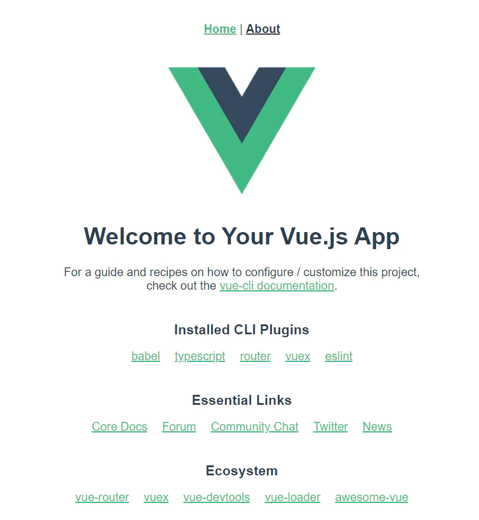

# 002.Vue3.0+TypeScript脚手架搭建项目

## ⚙️ Build

### 全局安装 vue-cli 脚手架

```shell
npm i @vue/cli -g
```

### 初始化 vue 项目

命令为：`vue create ${project-name}`

创建一个项目名为`vue-next-demo`的 vue 项目

```
 vue create vue-next-demo
```

输完命令后如下图：


### 配置 vue 项目

- [ ] quick-vue-next-typescript(babel,typescript,router,vuex)
      该配置为上一次保存的配置，第一次配置无此选项,可忽略

- [ ] default(babel,eslint)
      默认配置

- [x] Manually select features
      需要手动选择配置

#### Manually select features

在这里我们选择手动配置，即`Manually select features`


上下键切换选项，`<space>`是选择，`<a>`为全选，`<i>`为反选

- [x] Babel
- [x] TypeScript
- [x] Router
- [x] Vuex
- [ ] CSS Pre processors
- [x] Linter / Formatter
- [ ] Unit Testing
- [ ] E2E Testing


选中以上配置后回车

#### Use class-style component syntax

- [x] 是否使用 class 风格的组件语法


#### Use Babel alongside TypeScript

- [x] 是否使用 babel 做转义


#### Use history mode for router

- [ ] 路由是否使用历史模式

这里不选，默认为 Hash Router

#### Pick a linter / formatter config

选择哪个自动格式化代码检测

- [ ] ESLint with error prevention only

- [ ] ESLint + Airbnb config [Airbnb JavaScript Style Guide](https://github.com/airbnb/javascript)

- [ ] ESLint + Standard config standardjs

- [ ] ESLint + Prettier

- [x] TSLint (deprecated)


#### Pick additional lint features

选择语法检查方式

- [x] Lint on save 保存就检测
- [ ] Lint and fix on commit 用户 commit 时检测


#### Where do you prefer placing config for Babel, ESLint, etc.?

配置文件放哪

- [x] In dedicate config files 在专用配置文件中

- [ ] In package.json 在 package.json 文件中


#### Save this as a preset for future projects?

- [x] 是否将以上这些保存为未来项目的配置

若是，则下次搭建项目时会出现本次保存的配置


选中后输入你要保存的配置名称


最后等待数分钟，便可完成项目的配置


### 升级为 vue3.x 项目

```
cd vue-next-demo
// 升级
vue add vue-next
```


### 启动 vue 项目

package.json


- npm run serve
- npm run build
- npm run lint

```
cd vue-next-demo
// 启动项目
npm run serve
```



## ❓ Problem

[Vue3.0+vue-cli-plugin-vue-next 填坑记](Vue3.0+vue-cli-plugin-vue-next填坑记.md)

## 🔗 Links

- [vue3.x 结合 typescript 初体验](https://juejin.im/post/5ec78ec451882543345e7fb9)

- [使用 vue-cli3 搭建 Vue+TypeScript 项目 框架搭建一](https://juejin.im/post/5e69de93f265da570c75453e)

- [Vue 组合式 API](https://composition-api.vuejs.org/zh/api.html#setup)

- [Vue3.0+vue-router-next+vuex4.0+typescript 项目搭建](https://blog.csdn.net/qq_24182885/article/details/105841669)

- [Vue + typescript 挖坑记](https://segmentfault.com/a/1190000018372308)

**Hidden Icon**
✨🐛📦🔨👉🌈🎨✅📝💄🌱🔰🆙🛡⚙️🌍🖥⌨️🤝❤️💚⚡🔌🧳💪🎯❓👬🎁💿📖🧐🤔👽🎉🔧
