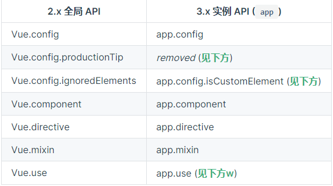
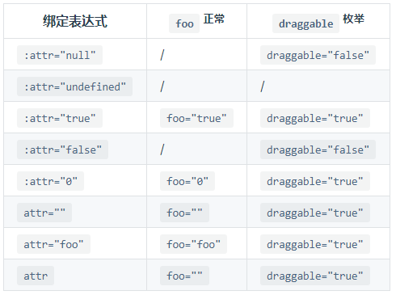
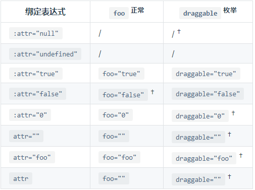
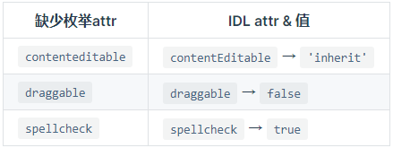
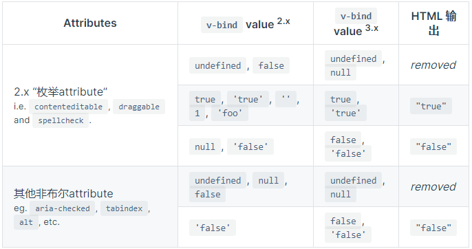

# 005.vue2.x-migrates-to-vue3.0

## Notable New Features

### [Composition API](https://v3.vuejs.org/guide/composition-api-introduction.html#why-composition-api)

### [Teleport](https://v3.vuejs.org/guide/teleport.html)

Teleport（以前称为 Portal）是将子节点渲染到 DOM 谱系之外的 DOM 节点中的安全通道，例如弹出窗口甚至是模式。

```html
<body>
  <div id="app" style="position: relative;">
    <h3>Tooltips with Vue 3 Teleport</h3>
    <div>
      <modal-button></modal-button>
    </div>
  </div>
</body>
```

```css
.modal {
  position: absolute;
  top: 0;
  right: 0;
  bottom: 0;
  left: 0;
  background-color: rgba(0, 0, 0, 0.5);
  display: flex;
  flex-direction: column;
  align-items: center;
  justify-content: center;
}

.modal div {
  display: flex;
  flex-direction: column;
  align-items: center;
  justify-content: center;
  background-color: white;
  width: 300px;
  height: 300px;
  padding: 5px;
}
```

```javascript
const app = Vue.createApp({});

app.component('modal-button', {
  template: `
    <button @click="modalOpen = true">
        Open full screen modal! (With teleport!)
    </button>

    <teleport to="body">
      <div v-if="modalOpen" class="modal">
        <div>
          I'm a teleported modal!
          (My parent is "body")
          <button @click="modalOpen = false">
            Close
          </button>
        </div>
      </div>
    </teleport>
  `,
  data() {
    return {
      modalOpen: false,
    };
  },
});
```

- 在 Vue components 中使用

```javascript
const app = Vue.createApp({
  template: `
    <h1>Root instance</h1>
    <parent-component />
  `,
});

app.component('parent-component', {
  template: `
    <h2>This is a parent component</h2>
    <teleport to="#endofbody">
      <child-component name="John" />
    </teleport>
  `,
});

app.component('child-component', {
  props: ['name'],
  template: `
    <div>Hello, {{ name }}</div>
  `,
});
```

In this case, even when child-component is rendered in the different place, it will remain a child of parent-component and will receive a name prop from it.

This also means that injections from a parent component work as expected, and that the child component will be nested below the parent component in the Vue Devtools, instead of being placed where the actual content moved to.

- 对同一个目标使用多次`teleport`

多个`<teleport>`组件可以将它们的内容挂载到相同的目标元素,这个顺序将是一个简单的附加—稍后的挂载将位于目标元素中较早的挂载之后。

```html
<teleport to="#modals">
  <div>A</div>
</teleport>
<teleport to="#modals">
  <div>B</div>
</teleport>

<!-- result-->
<div id="modals">
  <div>A</div>
  <div>B</div>
</div>
```

- to 必须是一个有效的查询选择器，或一个 HTMLElement(如果在浏览器环境中使用)。指定<teleport>内容将在其中移动的目标元素

```html
<!-- ok -->
<teleport to="#some-id" />
<teleport to=".some-class" />
<teleport to="[data-teleport]" />

<!-- Wrong -->
<teleport to="h1" />
<teleport to="some-string" />
```

- disabled 可以用来禁用`<teleport>`功能，这意味着它的插槽内容不会移动到任何地方，而是呈现在您在周围父组件中指定`<teleport>`的地方。

```html
<teleport to="#popup" :disabled="displayVideoInline">
  <video src="./my-movie.mp4">
</teleport>
```

tips: 这将移动实际的 `DOM` 节点，而不是销毁和重新创建，并且还将保持任何组件实例是活动的。所有有状态 `HTML` 元素(比如一个正在播放的视频)将保持它们的状态。

### [Fragments](https://v3.vuejs.org/guide/migration/fragments.html)

- vue2.x

```html
<!-- Layout.vue -->
<template>
  <div>
    <header>...</header>
    <main>...</main>
    <footer>...</footer>
  </div>
</template>
```

- vue3.0

In 3.x, components now can have multiple root nodes! However, this does require developers to explicitly define where attributes should be distributed.

```html
<template>
  <header>...</header>
  <main v-bind="$attrs">...</main>
  <footer>...</footer>
</template>
```

### [Emits Component Option](https://v3.vuejs.org/guide/component-custom-events.html)

- Event Names

```javascript
this.$emit('myEvent');
```

```html
<!-- Won't work -->
<my-component @my-event="doSomething"></my-component>
```

由于事件名称永远不会在 `JavaScript` 中用作变量或属性名称，因此没有理由使用 `camelCase` 或 `PascalCase`。另外，`v-on` 内模板 `DOM` 事件监听器会自动转化成小写（由于 `HTML` 的不区分大小写），因此`@myEvent` 将成为 `@myevent` 让 `myEvent` 不可能听。

对事件名称使用 `kebab-case`。

- Defining Custom Events

```javascript
app.component('custom-form', {
  emits: ['in-focus', 'submit'],
});
```

如果 `click` 在 `emits` 选项中定义了本地事件（例如），它将被组件中的事件覆盖，而不是被视为本地侦听器。

- Validate Emitted Events

```javascript
app.component('custom-form', {
  emits: {
    // No validation
    click: null,

    // Validate submit event
    submit: ({ email, password }) => {
      if (email && password) {
        return true;
      } else {
        console.warn('Invalid submit event payload!');
        return false;
      }
    },
  },
  methods: {
    submitForm() {
      this.$emit('submit', { email, password });
    },
  },
});
```

- v-model arguments

```html
<my-component v-model:foo="bar"></my-component>
```

```javascript
const app = Vue.createApp({});

app.component('my-component', {
  props: {
    foo: String,
  },
  template: `
    <input
      type="text"
      :value="foo"
      @input="$emit('update:foo', $event.target.value)">
  `,
});
```

- Multiple v-model bindings

```html
<user-name
  v-model:first-name="firstName"
  v-model:last-name="lastName"
></user-name>
```

```javascript
const app = Vue.createApp({});

app.component('user-name', {
  props: {
    firstName: String,
    lastName: String,
  },
  template: `
    <input
      type="text"
      :value="firstName"
      @input="$emit('update:firstName', $event.target.value)">

    <input
      type="text"
      :value="lastName"
      @input="$emit('update:lastName', $event.target.value)">
  `,
});
```

- Handling v-model modifiers

```html
<my-component v-model.capitalize="bar"></my-component>
```

```javascript
app.component('my-component', {
  props: {
    modelValue: String,
    modelModifiers: {
      default: () => ({}),
    },
  },
  template: `
    <input type="text"
      :value="modelValue"
      @input="$emit('update:modelValue', $event.target.value)">
  `,
  created() {
    console.log(this.modelModifiers); // { capitalize: true }
  },
});
```

现在我们已经设置好道具，我们可以检查`modelModifiers`对象键并编写一个处理程序来更改发射的值。在下面的代码中，无论何时`<input />`元素触发`input`事件，我们都将大写字符串。

```html
<div id="app">
  <my-component v-model.capitalize="myText"></my-component>
  {{ myText }}
</div>
```

```javascript
const app = Vue.createApp({
  data() {
    return {
      myText: '',
    };
  },
});

app.component('my-component', {
  props: {
    modelValue: String,
    modelModifiers: {
      default: () => ({}),
    },
  },
  methods: {
    emitValue(e) {
      let value = e.target.value;
      if (this.modelModifiers.capitalize) {
        value = value.charAt(0).toUpperCase() + value.slice(1);
      }
      this.$emit('update:modelValue', value);
    },
  },
  template: `<input
    type="text"
    :value="modelValue"
    @input="emitValue">`,
});

app.mount('#app');
```

对于`v-model`带有参数的绑定，生成的 prop 名称将为`arg + "Modifiers"`：

```html
<my-component v-model:foo.capitalize="bar"></my-component>
```

```javascript
app.component('my-component', {
  props: ['foo', 'fooModifiers'],
  template: `
    <input type="text"
      :value="foo"
      @input="$emit('update:foo', $event.target.value)">
  `,
  created() {
    console.log(this.fooModifiers); // { capitalize: true }
  },
});
```

### [createRenderer API 从 @vue/runtime-core 创建自定义渲染器](https://github.com/vuejs/vue-next/tree/master/packages/runtime-core)

@vue/runtime-core

> This package is published only for typing and building custom renderers. It is NOT meant to be used in applications.

For full exposed APIs, see `src/index.ts`. You can also run `yarn build runtime-core --types` from repo root, which will generate an API report at `temp/runtime-core.api.md`.

Building a Custom Renderer

```javascript
import { createRenderer } from '@vue/runtime-core';

const { render, createApp } = createRenderer({
  patchProp,
  insert,
  remove,
  createElement,
  // ...
});

// `render` is the low-level API
// `createApp` returns an app instance with configurable context shared
// by the entire app tree.
export { render, createApp };

export * from '@vue/runtime-core';
```

See `@vue/runtime-dom` for how a DOM-targeting renderer is implemented.

### [单文件组件 `<style scoped>` 现在可以包含全局规则或只针对插槽内容的规则](https://github.com/vuejs/rfcs/blob/master/active-rfcs/0023-scoped-styles-changes.md)

- `>>>` and `/deep/` support are deprecated.

- ::v-deep usage as a combinator is deprecated:

```
/_ DEPRECATED _/
::v-deep .bar {}
```

Instead, use it as a pseudo element that accepts another selector as argument:

```
::v-deep(.bar) {}
```

The above compiles to:

```
[v-data-xxxxxxx] .bar {}
```

- Slot content passed in from the parent no longer gets affected by child scoped styles by default. Instead, the child now needs to use the new ::v-slotted() pseudo element to specifically target slot content:

```
::v-slotted(.foo) {}
```

Compiles to:

```
.foo[v-data-xxxxxxx-s] {}
```

Notice the -s postfix which makes it target slot content only.

- New pseudo element ::v-global() can be used to apply global rules inside a `<style scoped>` block:

```
::v-global(.foo) {}
```

Compiles to:

```
.foo {}
```

The test cases of `@vue/compiler-sfc` can be used as a reference for the compilation transform details.


### [单文件组件 Composition API 语法糖(`<style setup>`)](https://github.com/vuejs/rfcs/blob/sfc-improvements/active-rfcs/0000-sfc-script-setup.md)`experimental`

### [单文件组件状态驱动的 CSS 变量（`<style vars>`）](https://github.com/vuejs/rfcs/blob/sfc-improvements/active-rfcs/0000-sfc-style-variables.md)`experimental`

```vue
<template>
  <div class="text">hello</div>
</template>

<script>
export default {
  data() {
    return {
      color: 'red'
    }
  }
}
</script>

<style vars="{ color }">
.text {
  color: var(--color);
}
</style>
```

## Breaking Changes

### Global API

Vue 2.x 有许多全局 API 和配置，这些 API 和配置可以全局改变 Vue 的行为。例如，要创建全局组件，可以使用 Vue.component 这样的 API：

```javascript
Vue.component('button-counter', {
  data: () => ({
    count: 0
  }),
  template: '<button @click="count++">Clicked {{ count }} times.</button>'
})
```

全局指令：

```javascript
Vue.directive('focus', {
  inserted: el => el.focus()
})
```

#### 全局 Vue API 已更改为使用应用程序实例

创建的每个根实例共享相同的全局配置:

- 全局配置使得在测试期间很容易意外地污染其他测试用例。用户需要仔细存储原始全局配置，并在每次测试后恢复 (例如重置 Vue.config.errorHandler)。vue test utils 必须实现一个特殊的 API createLocalVue 来处理此问题

```javascript
import { createLocalVue, mount } from '@vue/test-utils'

// 建扩展的 `Vue` 构造函数
const localVue = createLocalVue()

// 在 “local” Vue构造函数上 “全局” 安装插件
localVue.use(MyPlugin)

// 通过 `localVue` 来挂载选项
mount(Component, { localVue })
```

- 全局配置使得在同一页面上的多个“app”之间共享同一个 Vue 副本非常困难，但全局配置不同。

```javascript
// 这会影响两个根实例
Vue.mixin({
  /* ... */
})

const app1 = new Vue({ el: '#app-1' })
const app2 = new Vue({ el: '#app-2' })
```

##### createApp

```javascript
import { createApp } from 'vue'
import MyApp from './MyApp.vue'

const app = createApp(MyApp)
app.mount('#app')
```

当前全局API及相应实例API表：



经过所有这些更改，在指南开头的组件和指令将被改写为如下内容：

```javascript
const app = createApp(MyApp)

app.component('button-counter', {
  data: () => ({
    count: 0
  }),
  template: '<button @click="count++">Clicked {{ count }} times.</button>'
})

app.directive('focus', {
  mounted: el => el.focus()
})

// 现在所有应用实例都挂载了，与其组件树一起，将具有相同的 “button-counter” 组件 和 “focus” 指令不污染全局环境
app.mount('#app')
```

##### 在应用程序之间共享配置

在应用程序之间共享配置 (如组件或指令) 的一种方法是创建工厂功能，如下所示：

```javascript
import { createApp } from 'vue'
import Foo from './Foo.vue'
import Bar from './Bar.vue'

const createMyApp = options => {
  const app = createApp(options)
  app.directive('focus' /* ... */)

  return app
}

createMyApp(Foo).mount('#foo')
createMyApp(Bar).mount('#bar')
```

现在，Foo 和 Bar 实例及其后代中都可以使用 focus 指令。

#### 全局和内部 API 已经被重构为可 tree-shakable

##### 2.x语法:

```javascript
import Vue from 'vue'

Vue.nextTick(() => {
  // 一些和DOM有关的东西
})
```

##### 3.x语法

```javascript
import { nextTick } from 'vue'

nextTick(() => {
  // 一些和DOM有关的东西
})
```

##### 受影响的API:

- Vue.nextTick
- Vue.observable (用 Vue.reactive 替换)
- Vue.version
- Vue.compile (仅全构建)
- Vue.set (仅兼容构建)
- Vue.delete (仅兼容构建)

##### Internal Helpers

```html
<transition>
  <div v-show="ok">hello</div>
</transition>
```

被编译为类似于以下的内容：

```javascript
import { h, Transition, withDirectives, vShow } from 'vue'

export function render() {
  return h(Transition, [withDirectives(h('div', 'hello'), [[vShow, this.ok]])])
}
```

##### Usage in Plugins

Vue2.x：

```javascript
const plugin = {
  install: Vue => {
    Vue.nextTick(() => {
      // ...
    })
  }
}
```

Vue3:

```javascript
import { nextTick } from 'vue'

const plugin = {
  install: app => {
    nextTick(() => {
      // ...
    })
  }
}
```

### Template Directives

#### 组件上 v-model 用法已更改

- 2.x语法

```html
<ChildComponent v-model="pageTitle" />

<!-- 简写: -->

<ChildComponent :value="pageTitle" @input="pageTitle = $event" />
```

如果要将属性或事件名称更改为其他名称，则需要在 `ChildComponent` 组件中添加 `model` 选项：

```html
<!-- ParentComponent.vue -->

<ChildComponent v-model="pageTitle" />

<!-- 简写: -->

<ChildComponent :title="pageTitle" @change="pageTitle = $event" />
```

```javascript
// ChildComponent.vue

export default {
  model: {
    prop: 'title',
    event: 'change'
  },
  props: {
    // 这将允许 `value` 属性用于其他用途
    value: String,
    // 使用 `title` 代替 `value` 作为 model 的 prop
    title: {
      type: String,
      default: 'Default title'
    }
  }
}
```

- 3.x 语法

```html
<ChildComponent v-model="pageTitle" />

<!-- 简写: -->

<ChildComponent
  :modelValue="pageTitle"
  @update:modelValue="pageTitle = $event"
/>
```

- `v-model` 参数

若需要更改 model 名称，而不是更改组件内的 model 选项，那么现在我们可以将一个 argument 传递给 model：

```html
<ChildComponent v-model:title="pageTitle" />

<!-- 简写: -->

<ChildComponent :title="pageTitle" @update:title="pageTitle = $event" />
```

这也可以作为 .sync 修饰符的替代，而且允许我们在自定义组件上使用多个 v-model。

```html
<ChildComponent v-model:title="pageTitle" v-model:content="pageContent" />

<!-- 简写： -->

<ChildComponent
  :title="pageTitle"
  @update:title="pageTitle = $event"
  :content="pageContent"
  @update:content="pageContent = $event"
/>
```

#### `<template v-for>` 和非  `v-for` 节点上 `key` 用法已更改

NEW：对于 `v-if/v-else/v-else-if` 的各分支项 `key` 将不再是必须的，因为现在 `Vue` 会自动生成唯一的 `key`。如果你手动提供 `key`，那么每个分支必须使用唯一的 `key`。你不能通过故意使用相同的 `key` 来强制重用分支。

BREAKING：`<template v-for>` 的 `key` 应该设置在 `<template>` 标签上 (而不是设置在它的子结点上)。

- vue2.x

```html
<!-- Vue 2.x -->
<div v-if="condition" key="yes">Yes</div>
<div v-else key="no">No</div>
```

vue3.x 正常工作，但不建议使用`key`attribute

```html
<!-- Vue 3.x -->
<div v-if="condition">Yes</div>
<div v-else>No</div>
```

##### 在条件分支中

若要使用,那么每个分支都必须使用一个唯一的 key。因此大多数情况下都不需要设置这些 key。

```html
<!-- Vue 2.x -->
<div v-if="condition" key="a">Yes</div>
<div v-else key="a">No</div>

<!-- Vue 3.x (recommended solution: remove keys) -->
<div v-if="condition">Yes</div>
<div v-else>No</div>

<!-- Vue 3.x (alternate solution: make sure the keys are always unique) -->
<div v-if="condition" key="a">Yes</div>
<div v-else key="b">No</div>
```

##### 结合 `<template v-for>`

- vue2.x

```html
<!-- Vue 2.x -->
<template v-for="item in list">
  <div :key="item.id">...</div>
  <span :key="item.id">...</span>
</template>
```

- vue3.x

```html
<!-- Vue 3.x -->
<template v-for="item in list" :key="item.id">
  <div>...</div>
  <span>...</span>
</template>
```

- `<template v-for>` 时存在使用 v-if 的子结点

```html
<!-- Vue 2.x -->
<template v-for="item in list">
  <div v-if="item.isVisible" :key="item.id">...</div>
  <span v-else :key="item.id">...</span>
</template>

<!-- Vue 3.x -->
<template v-for="item in list" :key="item.id">
  <div v-if="item.isVisible">...</div>
  <span v-else>...</span>
</template>
```

#### 在同一元素上使用的 `v-if` 和 `v-for` 优先级已更改

两者作用于同一个元素上时，`v-if` 会拥有比 `v-for` 更高的优先级。

- 2.x 语法

`2.x` 版本中在一个元素上同时使用 `v-if` 和 `v-for` 时，`v-for` 会优先作用

- 3.x 语法

`3.x` 版本中 `v-if` 总是优先于 `v-for` 生效。

由于语法上存在歧义，建议避免在同一元素上同时使用两者。

比起在模板层面管理相关逻辑，更好的办法是通过创建计算属性筛选出列表，并以此创建可见元素。

#### `v-bind="object"` 现在排序敏感

- vue2.x

如果一个元素同时定义了 `v-bind="object"` 和一个相同的单独的 `property`，单独的property总是会覆盖`object`中的绑定

```html
<!-- template -->
<div id="red" v-bind="{ id: 'blue' }"></div>
<!-- result -->
<div id="red"></div>
```

- vue3.x

声明绑定的顺序决定了它们如何合并。

```html
<!-- template -->
<div id="red" v-bind="{ id: 'blue' }"></div>
<!-- result -->
<div id="blue"></div>

<!-- template -->
<div v-bind="{ id: 'blue' }" id="red"></div>
<!-- result -->
<div id="red"></div>
```

#### `v-for` 中的 `ref` 不再注册 `ref` 数组

在 `Vue 2` 中，在 `v-for` 里使用的 `ref attribute` 会用 `ref` 数组填充相应的 `$refs property`。当存在嵌套的 `v-for` 时，这种行为会变得不明确且效率低下。

在 `Vue 3` 中，这样的用法将不再在 `$ref` 中自动创建数组。要从单个绑定获取多个 `ref`，请将 `ref` 绑定到一个更灵活的函数上 (这是一个新特性)：

```html
<div v-for="item in list" :ref="setItemRef"></div>
```

```javascript
import { ref, onBeforeUpdate, onUpdated } from 'vue'

export default {
  setup() {
    let itemRefs = []
    const setItemRef = el => {
      itemRefs.push(el)
    }
    onBeforeUpdate(() => {
      itemRefs = []
    })
    onUpdated(() => {
      console.log(itemRefs)
    })
    return {
      itemRefs,
      setItemRef
    }
  }
}
```

tips:

- `itemRefs` 不必是数组：它也可以是一个对象，其 `ref` 会通过迭代的 `key` 被设置。

- 如果需要，`itemRef` 也可以是响应式的且可以被监听。

### Components

#### 只能使用普通函数创建功能组件

- vue2.x语法

在 Vue 2 中，函数式组件有两个主要用例：

  1. 作为性能优化，因为它们的初始化速度比有状态组件快得多
  2. 返回多个根节点

然而，在 Vue 3 中，有状态组件的性能已经提高到可以忽略不计的程度。此外，有状态组件现在还包括返回多个根节点的能力。

因此，函数式组件剩下的唯一用例就是简单组件，比如创建动态标题的组件。否则，建议你像平常一样使用有状态组件

```javascript
// Vue 2 函数式组件示例
export default {
  functional: true,
  props: ['level'],
  render(h, { props, data, children }) {
    return h(`h${props.level}`, data, children)
  }
}
```

单文件：

```html
<!-- Vue 2 函数式组件示例使用 <template> -->
<template functional>
  <component
    :is="`h${props.level}`"
    v-bind="attrs"
    v-on="listeners"
  />
</template>

<script>
export default {
  props: ['level']
}
</script>
```

- vue3.x语法

```javascript
import { h } from 'vue'

const DynamicHeading = (props, context) => {
  return h(`h${props.level}`, context.attrs, context.slots)
}

DynamicHeading.props = ['level']

export default DynamicHeading
```


#### `functional` 属性在单文件组件 (SFC) `<template>` 和 `functional` 组件选项被抛弃

在 3.x 中，有状态组件和函数式组件之间的性能差异已经大大减少，并且在大多数用例中是微不足道的。因此，在 `SFCs` 上使用 `functional` 的开发人员的迁移路径是删除该 `attribute`，无需额外工作。

```javascript
// <template functional>  no functional
<template>
  <component
    v-bind:is="`h${props.level}`"
    v-bind="$attrs"
  />
</template>

<script>
export default {
  props: ['level']
}
</script>
```

主要的区别在于：

1. `functional attribute` 在 `<template>` 中移除
2. `listeners` 现在作为 `$attrs` 的一部分传递，可以将其删除

#### 异步组件现在需要 `defineAsyncComponent` 方法来创建

以前，异步组件是通过将组件定义为返回 Promise 的函数来创建的，例如：

```javascript
const asyncPage = () => import('./NextPage.vue')
```

更高阶：

```javascript
const asyncPage = {
  component: () => import('./NextPage.vue'),
  delay: 200,
  timeout: 3000,
  error: ErrorComponent,
  loading: LoadingComponent
}
```

- 3.x语法

```javascript
import { defineAsyncComponent } from 'vue'
import ErrorComponent from './components/ErrorComponent.vue'
import LoadingComponent from './components/LoadingComponent.vue'

// 不带选项的异步组件
const asyncPage = defineAsyncComponent(() => import('./NextPage.vue'))

// 带选项的异步组件
const asyncPageWithOptions = defineAsyncComponent({
  loader: () => import('./NextPage.vue'),
  delay: 200,
  timeout: 3000,
  errorComponent: ErrorComponent,
  loadingComponent: LoadingComponent
})
```

对 2.x 所做的另一个更改是，component 选项现在被重命名为 loader，以便准确地传达不能直接提供组件定义的信息。

```javascript
import { defineAsyncComponent } from 'vue'

const asyncPageWithOptions = defineAsyncComponent({
  loader: () => import('./NextPage.vue'),
  delay: 200,
  timeout: 3000,
  error: ErrorComponent,
  loading: LoadingComponent
})
```

此外，与 2.x 不同，loader 函数不再接收 resolve 和 reject 参数，且必须始终返回 Promise。

```javascript
// 2.x 版本
const oldAsyncComponent = (resolve, reject) => {
  /* ... */
}

// 3.x 版本
const asyncComponent = defineAsyncComponent(
  () =>
    new Promise((resolve, reject) => {
      /* ... */
    })
)
```

### Render Function

#### 渲染函数 API 改变

#####  Render 函数参数

- 2.x

```javascript
// Vue 2 渲染函数示例
export default {
  render(h) {
    return h('div')
  }
}
```

- 3.x

`h`现在是全局导入的，而不是作为参数自动传递。

```javascript
// Vue 3 渲染函数示例
import { h } from 'vue'

export default {
  render() {
    return h('div')
  }
}
```

##### 渲染函数签名更改

- 2.x

`render` 函数自动接收诸如 `h` 之类的参数。

```javascript
// Vue 2 渲染函数示例
export default {
  render(h) {
    return h('div')
  }
}
```

- 3.x

由于 `render` 函数不再接收任何参数，它将主要用于 `setup()` 函数内部。这还有一个好处：可以访问作用域中声明的被动状态和函数，以及传递给 `setup()` 的参数。

```javascript
import { h, reactive } from 'vue'

export default {
  setup(props, { slots, attrs, emit }) {
    const state = reactive({
      count: 0
    })

    function increment() {
      state.count++
    }

    // 返回render函数
    return () =>
      h(
        'div',
        {
          onClick: increment
        },
        state.count
      )
  }
}
```

##### VNode Props 格式化

- 2.x

`domProps` 包含 `VNode props` 中的嵌套列表：

```javascript
{
  class: ['button', 'is-outlined'],
  style: { color: '#34495E' },
  attrs: { id: 'submit' },
  domProps: { innerHTML: '' },
  on: { click: submitForm },
  key: 'submit-button'
}
```

- 3.x

在 3.x 中，整个 VNode props 结构是扁平的，使用上面的例子，下面是它现在的样子

```javascript
{
  class: ['button', 'is-outlined'],
  style: { color: '#34495E' },
  id: 'submit',
  innerHTML: '',
  onClick: submitForm,
  key: 'submit-button'
}
```

#### `$scopedSlots property` 已删除，所有插槽都通过 `$slots` 作为函数暴露

- 2.x

```javascript
// 2.x 语法
h(LayoutComponent, [
  h('div', { slot: 'header' }, this.header),
  h('div', { slot: 'content' }, this.content)
])

// 在引用作用域 slot 时，可以使用以下方法引用它们：
this.$scopedSlots.header
```

- 3.x

```javascript
// 3.x Syntax
h(LayoutComponent, {}, {
  header: () => h('div', this.header),
  content: () => h('div', this.content)
})

// 在引用作用域 slot 时，可以使用以下方法引用它们：
this.$slots.header
```

#### 自定义指令 API 已更改为与组件生命周期一致

##### 2.x

在 Vue 2，自定义指令是通过使用下面列出的钩子来创建的，这些钩子都是可选的

- bind - 指令绑定到元素后发生。只发生一次。
- inserted - 元素插入父 DOM 后发生。
- update - 当元素更新，但子元素尚未更新时，将调用此钩子。
- componentUpdated - 一旦组件和子级被更新，就会调用这个钩子。
- unbind - 一旦指令被移除，就会调用这个钩子。也只调用一次。

例子：

```html
<p v-highlight="yellow">高亮显示此文本亮黄色</p>
```

```javascript
Vue.directive('highlight', {
  bind(el, binding, vnode) {
    el.style.background = binding.value
  }
})
```

##### 3.x

然而，在 Vue 3 中，我们为自定义指令创建了一个更具凝聚力的 API。正如你所看到的，它们与我们的组件生命周期方法有很大的不同，即使我们正与类似的事件钩子，我们现在把它们统一起来了：

- bind → **beforeMount**
- inserted → **mounted**
- **beforeUpdate**:新的！这是在元素本身更新之前调用的，很像组件生命周期钩子
- update → 移除！有太多的相似之处要更新，所以这是多余的，请改用 updated
- componentUpdated → **updated**
- **beforeUnmount** 新的！与组件生命周期钩子类似，它将在卸载元素之前调用。
- unbind -> unmounted

最终API:

```javascript
const MyDirective = {
  beforeMount(el, binding, vnode, prevVnode) {},
  mounted() {},
  beforeUpdate() {},
  updated() {},
  beforeUnmount() {}, // 新
  unmounted() {}
}
```

上面例子：

```html
<p v-highlight="yellow">高亮显示此文本亮黄色</p>
```

```javascript
const app = Vue.createApp({})

app.directive('highlight', {
  beforeMount(el, binding, vnode) {
    el.style.background = binding.value
  }
})
```

#### 一些转换 class 被重命名了：

- v-enter -> v-enter-from
- v-leave -> v-leave-from

#### 组件 watch 选项和实例方法 $watch 不再支持点分隔字符串路径，请改用计算函数作为参数

#### 在 Vue 2.x 中，应用根容器的 outerHTML 将替换为根组件模板 (如果根组件没有模板/渲染选项，则最终编译为模板)。VUE3.x 现在使用应用程序容器的 innerHTML。

### Custom Elements

#### Custom elements whitelisting is now performed during template compilation

自定义元素白名单现在在模板编译期间执行

##### 2.x语法

In Vue 2.x, whitelisting tags as custom elements was done via Vue.config.ignoredElements:

```javascript
// This will make Vue ignore custom element defined outside of Vue
// (e.g., using the Web Components APIs)

Vue.config.ignoredElements = ['plastic-button']
```

##### 3.x语法

- 在Vue 3.0中，此检查是在模板编译期间执行的。指示编译器将其`<plastic-button>`视为自定义元素：

如果使用构建步骤：将`isCustomElement`选项传递给Vue模板编译器。如果使用`vue-loader`，则应通过`vue-loader`的`compilerOptions`选项传递：

```javascript
// in webpack config
rules: [
  {
    test: /\.vue$/,
    use: 'vue-loader',
    options: {
      compilerOptions: {
        isCustomElement: tag => tag === 'plastic-button'
      }
    }
  }
  // ...
]
```

- 如果使用即时模板编译，则通过传递它`app.config.isCustomElement`：

```javascript
const app = Vue.createApp({})
app.config.isCustomElement = tag => tag === 'plastic-button'
```

重要的是要注意，运行时配置仅影响运行时模板的编译，而不会影响预编译的模板。

#### Special is prop usage is restricted to the reserved `<component>` tag only

##### Customized Built-in Elements

通过将属性添加到内置元素，“定制元素”规范提供了一种将定制元素用作“ 定制内置is元素”的方法：

```html
<button is="plastic-button">Click Me!</button>
```

Vue对is特殊道具的使用是在本地属性在浏览器中普遍可用之前模拟它的作用。但是，在2.x中，它被解释为使用name渲染Vue组件plastic-button。这阻止了上述自定义内置元素的本机用法。

在3.0中，我们仅将Vue对isprop 的特殊处理限制在`<component>`标签上。

- 在保留`<component>`标记上使用时，其行为与2.x中的行为完全相同；

- 当在普通组件上使用时，它的行为类似于普通道具：

```html
<foo is="bar" />
```

2.x行为：渲染bar组件。

3.x行为：渲染foo组件并传递is道具。


- 当在普通元素上使用时，它将createElement作为is选项传递给调用，并也呈现为本机属性。这支持自定义内置元素的使用。

```html
<button is="plastic-button">Click Me!</button>
```

2.x行为：渲染plastic-button组件。

3.x行为：通过调用呈现本机按钮

```javascript
document.createElement('button', { is: 'plastic-button' })
```

##### `v-is` for In-DOM Template Parsing Workarounds

>注意：本部分仅影响将Vue模板直接写入页面HTML的情况。使用In-DOM模板时，该模板应遵守本机HTML解析规则。一些HTML元素，比如`<ul>`，`<ol>`，`<table>`和`<select>`有什么元素可以在其内部出现的限制，以及一些元素，如`<li>`，`<tr>`和`<option>`只能出现某些其他元素中。

- 2.x语法

在Vue 2中，我们建议通过is在本地标签上使用prop 来解决这些限制：

```html
<table>
  <tr is="blog-post-row"></tr>
</table>
```

- 3.x语法

随着行为的变化is，我们引入了一种新的指令v-is来解决这些情况：

```html
<table>
  <tr v-is="'blog-post-row'"></tr>
</table>
```

警告:

`v-is`功能类似于动态2.x `:is`绑定-因此要通过注册名称来呈现组件，其值应为JavaScript字符串文字：

```html
<!-- Incorrect, nothing will be rendered -->
<tr v-is="blog-post-row"></tr>

<!-- Correct -->
<tr v-is="'blog-post-row'"></tr>
```

## Other Minor Changes

### ~~destroyed~~ 生命周期选项被重命名为 `unmounted`

### ~~beforeDestroy~~ 生命周期选项被重命名为 `beforeUnmount`

### `prop` `default` 工厂函数不再有权访问 `this` 是上下文

生成 prop 默认值的工厂函数不再能访问 this。

替代方案：

- 把组件接收到的原始 prop 作为参数传递给默认函数；

- 注入 API 可以在默认函数中使用。

```javascript
import { inject } from 'vue'

export default {
  props: {
    theme: {
      default (props) {
        // `props` 是传递给组件的原始值。
        // 在任何类型/默认强制转换之前
        // 也可以使用 `inject` 来访问注入的 property
        return inject('theme', 'default-theme')
      }
    }
  }
}
```

### 自定义指令 `API` 已更改为与组件生命周期一致

### `data` 应始终声明为函数

- 2.x语法

在 2.x 中，开发者可以定义 data 选项是 object 或者是 function。

```html
<!-- Object 声明 -->
<script>
  const app = new Vue({
    data: {
      apiKey: 'a1b2c3'
    }
  })
</script>

<!-- Function 声明 -->
<script>
  const app = new Vue({
    data() {
      return {
        apiKey: 'a1b2c3'
      }
    }
  })
</script>
```

虽然这对于具有共享状态的根实例提供了一些便利，但是由于只有在根实例上才有可能，这导致了混乱。

- 3.x语法

在 3.x，data 选项已标准化为只接受返回 object 的 function。

使用上面的示例，代码只有一个可能的实现：

```html
<script>
  import { createApp } from 'vue'

  createApp({
    data() {
      return {
        apiKey: 'a1b2c3'
      }
    }
  }).mount('#app')
</script>
```

### 来自 `mixin` 的 `data` 选项现在可简单地合并

此外，当来自组件的 `data()` 及其 `mixin` 或 `extends` 基类被合并时，现在将浅层次执行合并：

```javascript
const Mixin = {
  data() {
    return {
      user: {
        name: 'Jack',
        id: 1
      }
    }
  }
}
const CompA = {
  mixins: [Mixin],
  data() {
    return {
      user: {
        id: 2
      }
    }
  }
}
```

在 Vue 2.x中，生成的 `$data` 是：

```json
{
  user: {
    id: 2,
    name: 'Jack'
  }
}
```

在3.0中，其结果将会是：

```json
{
  user: {
    id: 2
  }
}
```

对于依赖对象声明的用户，我们建议：

- 将共享数据提取到外部对象并将其用作 data 中的 property

- 重写对共享数据的引用以指向新的共享对象

对于依赖 mixin 的深度合并行为的用户，我们建议重构代码以完全避免这种依赖，因为 mixin 的深度合并非常隐式，这让代码逻辑更难理解和调试。

### `attribute` 强制策略已更改

#### 2.x 语法

在 2.x，我们有以下策略来强制 v-bind 的值：

- 对于某些 attribute/元素对，Vue 始终使用相应的 IDL attribute(property)：比如 `value` 的 `<input>`，`<select>`，`<progress>`，等等。

- 对于**布尔attribute**和 **xlinks**，如果它们是 `falsy` 的，Vue 会移除它们 (undefined，null or false) 另外加上它们 (见这里和这里)。

- 对于**枚举 attribute** (目前 `contenteditable`，`draggable` 和 `spellcheck`)，Vue 会尝试强制将它们串起来

- 对于其他 attribute，我们移除了 `falsy` 值 (`undefined`，`null`，or `false`) 并按原样设置其他值。

下表描述了 Vue 如何使用普通非布尔 attribute 强制“枚举 attribute”：

绑定表达式	foo 正常	draggable 枚举



从上表可以看出，当前实现 `true` 强制为 `'true'` 但如果 attribute 为 `false`，则移除该 attribute。这也导致了不一致性，并要求用户在非常常见的用例中手动强制布尔值为字符串，例如 `aria-*` attribute 像 `aria-selected`，`aria-hidden`，等等。

#### 3.x 语法

我们打算放弃“枚举 attribute”的内部概念，并将它们视为普通的非布尔 HTML attribute。

- 这解决了普通非布尔 attribute 和“枚举 attribute”之间的不一致性

- 它还可以使用 'true' 和 'false' 以外的值，甚至可以使用 contenteditable 等 attribute 的关键字`

对于非布尔 attribute，如果 attribute 为 false，Vue 将停止删除它们，相反强制它们为 'false'。

- 这解决了 true 和 false 之间的不一致性，并使输出 aria-* attributes 更容易

下表描述了新行为：

绑定表达式	foo 正常	draggable 枚举



†： 变更

布尔 attributes 的强制保持不变。

#### 枚举 attribute

缺少枚举 attribute 和 attr="false" 可能会产生不同的 IDL attribute 值 (将反映实际状态)，描述如下：



为了保持原有的行为，并且我们将强制使用 `false` 为 `'false'`，在 3.x Vue 中，开发人员需要将 `v-bind` 表达式解析为 `false` 或 `'false'`，表示 `contenteditable` 和 `spellcheck`。

在 2.x 中，枚举 attribute 的无效值被强制为 `'true'`。这通常是无意的，不太可能大规模依赖。在 3.x 中，应显式指定 `true` 或 `'true'`。

#### 将 false 强制为 'false' 而不是删除 attribute

在 3.x，`null` 或 `undefined` 应用于显式删除 attribute。

#### 2.x 和 3.x 行为的比较



### 一些过渡 `class` 被重命名

- 过渡类名 `v-enter` 修改为 `v-enter-from`

- 过渡类名 `v-leave` 修改为 `v-leave-from`

### 组建 `watch` 选项和实例方法 `$watch` 不再支持以点分隔的字符串路径。请改用计算属性函数作为参数。

### `<template>` 没有特殊指令的标记 (v-if/else-if/else、v-for 或 v-slot) 现在被视为普通元素，并将生成原生的 `<template>` 元素，而不是渲染其内部内容。

### 在 `Vue 2.x` 中，应用根容器的 `outerHTML` 将替换为根组件模板 (如果根组件没有模板/渲染选项，则最终编译为模板)。`Vue 3.x` 现在使用应用容器的 `innerHTML`，这意味着容器本身不再被视为模板的一部分。

## Removed APIs

###  `keyCode` 支持作为 `v-on` 的修饰符

#### 2.x 语法

在 Vue 2 中，支持 keyCodes 作为修改 v-on 方法的方法。

```html
<!-- 键码版本 -->
<input v-on:keyup.13="submit" />

<!-- 别名版本 -->
<input v-on:keyup.enter="submit" />
```

此外，你可以通过全局 `config.keyCodes` 选项。

```javascript
Vue.config.keyCodes = {
  f1: 112
}
```

```html
<!-- 键码版本 -->
<input v-on:keyup.112="showHelpText" />

<!-- 自定别名版本 -->
<input v-on:keyup.f1="showHelpText" />
```

#### 3.x 语法

从`KeyboardEvent.keyCode` has been deprecated 开始，Vue 3 继续支持这一点就不再有意义了。因此，现在建议对任何要用作修饰符的键使用 `kebab-cased` (短横线) 大小写名称。

```html
<!-- Vue 3 在 v-on 上使用 按键修饰符 -->
<input v-on:keyup.delete="confirmDelete" />
```

因此，这意味着 `config.keyCodes` 现在也已弃用，不再受支持。

### `$on`，`$off` 和 `$once` 实例方法

`$on`，`$off` 和 `$once` 实例方法已被移除，应用实例不再实现事件触发接口。

#### 2.x 语法

在 2.x 中，Vue 实例可用于触发通过事件触发 API 强制附加的处理程序 (`$on`，`$off` 和 `$once`)，这用于创建 event hub，以创建在整个应用程序中使用的全局事件侦听器：

```javascript
// eventHub.js

const eventHub = new Vue()

export default eventHub
// ChildComponent.vue
import eventHub from './eventHub'
```

```javascript
export default {
  mounted() {
    // 添加 eventHub listener
    eventHub.$on('custom-event', () => {
      console.log('Custom event triggered!')
    })
  },
  beforeDestroy() {
    // 移除 eventHub listener
    eventHub.$off('custom-event')
  }
}
```

```javascript
// ParentComponent.vue
import eventHub from './eventHub'

export default {
  methods: {
    callGlobalCustomEvent() {
      eventHub.$emit('custom-event') // 如果ChildComponent mounted，控制台中将显示一条消息
    }
  }
}
```

例如，可以通过使用实现事件发射器接口的外部库来替换现有的 event hub [mitt](https://github.com/developit/mitt)。

在兼容性构建中也可以支持这些方法。

### `Filters`

Filters 已从 Vue 3.0 中删除，不再受支持。

在 3.x 中，filters 已删除，不再受支持。相反，我们建议用方法调用或计算属性替换它们。

```html
<template>
  <h1>Bank Account Balance</h1>
  <p>{{ accountInUSD }}</p>
</template>

<script>
  export default {
    props: {
      accountBalance: {
        type: Number,
        required: true
      }
    },
    computed: {
      accountInUSD() {
        return '$' + this.accountBalance
      }
    }
  }
</script>
```

### 内联模板 attribute

对内联特性的支持已被移除。

- 使用 `<script>` 标签

在这种情况下，最简单的解决方法是将 `<script>` 与其他类型一起使用：

```javascript
<script type="text/html" id="my-comp-template">
  <div>{{ hello }}</div>
</script>
```

在组件中，使用选择器将模板作为目标：

```javascript
const MyComp = {
  template: '#my-comp-template'
  // ...
}
```

- 默认 Slot

以前使用 `inline-template` 的组件也可以使用默认 `slot` ——进行重构，这使得数据范围更加明确，同时保留了内联编写子内容的便利性：

```html
<!-- 2.x 语法 -->
<my-comp inline-template :msg="parentMsg">
  {{ msg }} {{ childState }}
</my-comp>

<!-- 默认 Slot 版本 -->
<my-comp v-slot="{ childState }">
  {{ parentMsg }} {{ childState }}
</my-comp>
```

子级现在应该渲染默认 slot*，而不是不提供模板：

```html
<!--
  在子模板中，在传递时渲染默认slot
  在必要的private状态下。
-->
<template>
  <slot :childState="childState" />
</template>
```

### `$destroy` 实例方法。用户不应再手动管理单个 Vue 组件的生命周期。

## Supporting Libraries

我们所有的官方库和工具现在都支持 Vue 3，但大多数仍然处于 beta 状态，并在 NPM 的 next dist 标签下发布。**我们正计划在 2020 年底前稳定所有项目，并将其转换为使用 latest 的 dist 标签**。

### Vue CLI

从 v4.5.0 开始，`vue-cli` 现在提供了内置选项，可在创建新项目时选择 Vue 3 预设。现在可以升级 `vue-cli` 并运行 `vue create` 来创建 Vue 3 项目。

### Vue Router

Vue Router 4.0 提供了 Vue 3 支持，并有许多突破性的变化，查看 [README](https://github.com/vuejs/vue-router-next#vue-router-next-) 中完整的细节。

### Vuex

Vuex 4.0 提供了 Vue 3 支持，其 API 与 3.x 基本相同。唯一的突破性变化是[插件的安装方式](https://github.com/vuejs/vuex/tree/4.0#breaking-changes)。

## Other Projects

| 项目 | NPM | 仓库 |
| -- | -- | -- |
| @vue/babel-plugin-jsx | rc | [Github](https://github.com/vuejs/jsx-next) |
| eslint-plugin-vue | beta | [Github](https://github.com/vuejs/eslint-plugin-vue) |
| @vue/test-utils | beta | [Github](https://github.com/vuejs/vue-test-utils-next) |
| vue-class-component | beta | [Github](https://github.com/vuejs/vue-class-component/tree/next) |
| vue-loader | beta | [Github](https://github.com/vuejs/vue-loader/tree/next) |
| rollup-plugin-vue | beta | [Github](https://github.com/vuejs/rollup-plugin-vue/tree/next) |
