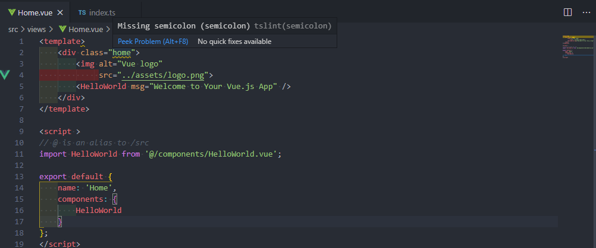
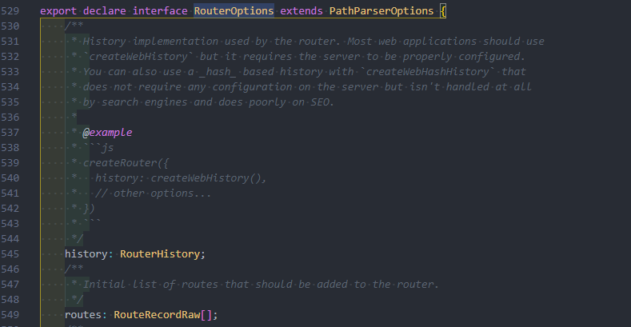
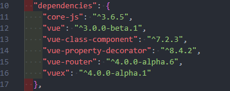
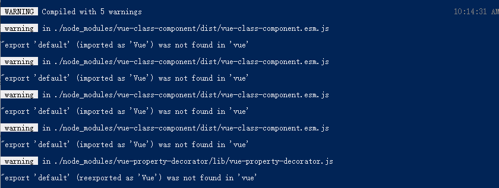

# Vue3.0+vue-cli-plugin-vue-next填坑记

## 📝TODOs

- [x] tslint Missing semicolon (semicolon)
- [ ] Missing trailing comma (trailing-comma)tslint(trailing-comma)
- [x] Module 'node_modules/vue-router' has no exporter member 'RouteConfig'
- [x] Cannot use namespace 'Vue' as a type.
- [x] Property 'createStore' does not exist on type...
- [ ] "export 'default' (imported as 'Vue') was not found in 'vue'

跑项目的时候遇到比较多的坑，后来才去 github 查看[vue-cli-plugin-vue-next](https://github.com/vuejs/vue-cli-plugin-vue-next/issues)的 `issues` ，其实大多数碰到的坑其他人已经提上去了。要是以后碰到类似问题，还是得先去 issues 看看，能节省很多踩坑的时间。

- [vue next cli guidance #18](https://github.com/vuejs/vue-cli-plugin-vue-next/issues/18)


## ❓ Problem Record

这里记录的主要是通过 `vue-cli` 脚手架搭建的项目，并通过命令 `vue add vue-next` 升级为 vue3.0 版本的问题情况。

### tslint Missing semicolon (semicolon)



遇到这种没见过的问题当然是 google 喽

[How to ignore semicolons with “tslint:recomended”](https://stackoverflow.com/questions/56569799/how-to-ignore-semicolons-with-tslintrecomended)

tslint.json

```json
{
    ...
    "rules":{
        ...
        "semicolon":false
    }
}
```

### Missing trailing comma (trailing-comma)tslint(trailing-comma)

### Module 'node_modules/vue-router' has no exporter member 'RouteConfig'

提示说没有导出 RouteConfig,我一脸懵


这不是清清楚楚明明白白的从 vue-router 导入了吗？还是脚手架自己生成的。

route.ts

```typescript
import { RouteConfig, createRouter, createWebHashHistory } from 'vue-router';
import Home from '../views/Home.vue';

const routes: RouteConfig[] = [
  {
    path: '/',
    name: 'Home',
    component: Home,
  },
  {
    path: '/about',
    name: 'About',
    // route level code-splitting
    // this generates a separate chunk (about.[hash].js) for this route
    // which is lazy-loaded when the route is visited.
    component: () =>
      import(/* webpackChunkName: "about" */ '../views/About.vue'),
  },
];

const router = createRouter({
  history: createWebHashHistory(),
  routes,
});

export default router;
```

于是咱又开始了 Google 之旅

呵，好家伙，stack overflow 有人提问，这标题起的不就是我要问的？


很遗憾的是并没有人回答，只能依靠自己勤劳的双手和偶尔不宕机的大脑了了

首先打开`vue-route`,查看`RouterConfig`的定义

全局搜 RouterConfig


???小朋友，你是否很多问号，这根本搜不到这个 RouterConfg 这个东东啊

</img>

改变搜索关键词`createRouter`，看传参是怎么定义的


接着搜索 `RouterOptions`，会发现它是继承`PathParseOptions`



往下看，可以看到`routes:RouteRecordRaw[]`，这才恍然大悟

`RouteConfig`类型根本没有不存在，而我们要使用的应是`RouteRecordRaw`类型


果不其然，将 `RouteConfig` 替换成 `RouteRecordRaw` 后不报错了

到这里还没有结束，打开 github [vue-route-next](https://github.com/vuejs/vue-router-next)


会发现`RouteConfig`是在`vue-router@3`里才有，而在`vue-router@4`中，对应的其实是
`RouteRecordRaw`



瞄了眼，我使用的`vue-router`是`4.0.0-alpha.6`版本

还是比较好奇，`vue add vue-next`升级的时候，为什么`vue-router`并不是最新的语法

来到`vue-cli-plugin-vue-next`的 issues。果然，有人提了这个问题，应该是官方还没有将默认的路由配置更改过来


### Cannot use namespace 'Vue' as a type.

心有点累，这里提示不能使用 Vue 作为类型的命名空间


```typescript
import Vue, { VNode } from 'vue';

declare global {
  namespace JSX {
    // tslint:disable no-empty-interface
    interface Element extends VNode {}
    // tslint:disable no-empty-interface
    interface ElementClass extends Vue {}
    interface IntrinsicElements {
      [elem: string]: any;
    }
  }
}
```

为什么不能呢？这不是脚手架自动生成的吗？

Google 一圈，提示设置`"skipLibCheck": true`

tsconfig.json

```json
{
  "compilerOptions": {
    "skipLibCheck": true
  }
}
```

### Property 'createStore' does not exist on type...

完整报错如下


index.ts

```typescript
import  Vuex from 'vuex';.

export default Vuex.createStore({
  state: {},
  mutations: {},
  actions: {},
  modules: {},
});
```

这回我学聪明了，直接去 github 查官方文档了[vuejs/vuex](https://github.com/vuejs/vuex/tree/4.0)


不同之处就是引入的方式了，虽然感觉没啥差别，但是替换成官方的写法就不报错了

```typescript
import { createStore } from 'vuex';

export default createStore({
  state: {},
  mutations: {},
  actions: {},
  modules: {},
});
```

### "export 'default' (imported as 'Vue') was not found in 'vue'

如图，报了五个警告，都是一样的内容

```
warning in ./node_modules/vue-class-component/dist/vue-class-component.esm.js
```



## 🔗 Related Links

- [Vue + typescript 挖坑记](https://segmentfault.com/a/1190000018372308)

- [Vue3 Router with Typescript: missing RouteConfig](https://stackoverflow.com/questions/62438045/vue3-router-with-typescript-missing-routeconfig)

**Hidden Icon**
✨🐛🔗📦🔨👉🌈🎨✅📝💄🌱🔰🆙🛡⚙️🌍🖥⌨️🤝❤️💚⚡🔌🧳💪🎯❓👬🎁💿📖🧐🤔👽🎉🔧
