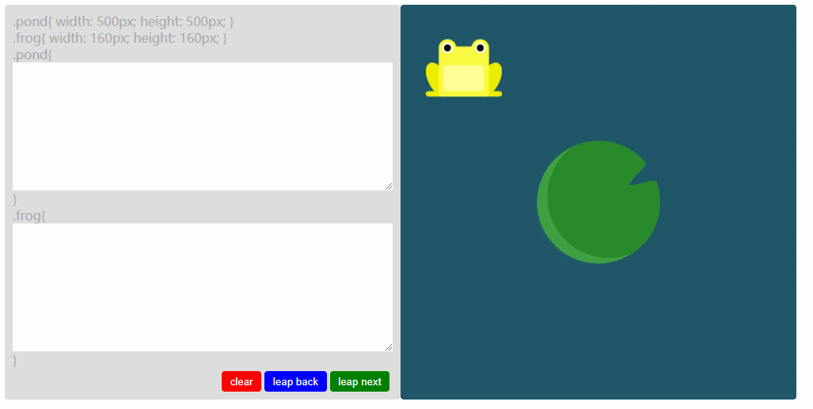
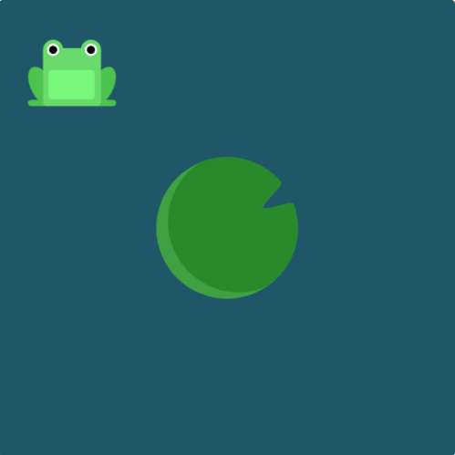

# 002.【水平垂直居中】快来帮助小哇跳到池塘中央的荷叶上吧！

之前学习flexbox发现了一个有趣的网站[FLEXBOX FROGGY](http://flexboxfroggy.com/)。

自己在总结水平垂直居中这块的知识点，写了一个比较简单的版本：



成功跳上荷叶小哇会变绿！失败则变红！

👉小哇真可怜，别拦着我，[我要绿了小哇！](https://63w52.csb.app/)

👉一看这代码写的就烂，[我要调试看看！](https://codesandbox.io/s/63w52)


快来学习如何帮助小哇(frog)跳到池塘(pond)中央的荷叶上吧！



- html

```html
<div class="pond">
  <div class="frog"></div>
</div>
```

- css

```css
.pond {
  width: 500px;
  height: 500px;
}

.frog {
  width: 160px;
  height: 160px;
}
```

## 一、flex

### 1. justify-content + align-items

```css
.pond {
  display: flex;
  justify-content: center;
  align-items: center;
}
```

### 2. align-self + margin：auto

```css
.pond {
  display: flex;
}
.frog {
  align-self: center;
  margin: 0 auto;
}
```

## 二、position:absolute

### 1. 负边距

```css
.pond{
  position:relative;
}
.frog{
  position:absolute;
  top:50%;
  left:50%;
  margin-top: -80px;
  margin-left: -80px;
}
```

### 2. transform

```css
.pond{
  position:relative;
}
.frog{
  position:absolute;
  top:50%;
  left:50%;
  transform:translate(-50%,-50%);
}
```

### 3. margin:auto

```css
.pond{
  position:relative;
}
.frog{
  position:absolute;
  top: 0;
  right: 0;
  bottom: 0;
  left: 0;
  margin: auto;
}
```

### 4. calc

```css
.pond{
  position:relative;
}
.frog{
  position:absolute;
  top: calc(50% - 80px);
  left: calc(50% - 80px);
}
```

## 三、table-cell

```css
.pond{
  display:table-cell;
  text-align:center;
  vertical-align:middle;
}
.frog{
  display:inline-block;
}
```

## 四、grid

```css
.pond{
    display: grid;
}
.frog{
    justify-self: center;
    align-self: center;
}
```

## 五、line-height

```css
.pond{
    line-height: 500px;
    text-align: center;
    font-size: 0px;
}
.frog{
    display: inline-block;
    vertical-align: middle;
    line-height: initial;
}
```

## 六、writing-mode

```css
.pond{
    writing-mode: vertical-lr;
    text-align: center;
}
.frog{
    writing-mode: horizontal-tb;
    display: inline-block;
    text-align: center;
    margin-left: calc(50% - 80px);
}
```

## 相关链接

- [一个学习 css FLEXBOX的游戏](http://flexboxfroggy.com/)

- [CSS实现水平垂直居中的1010种方式](https://yanhaijing.com/css/2018/01/17/horizontal-vertical-center/)
