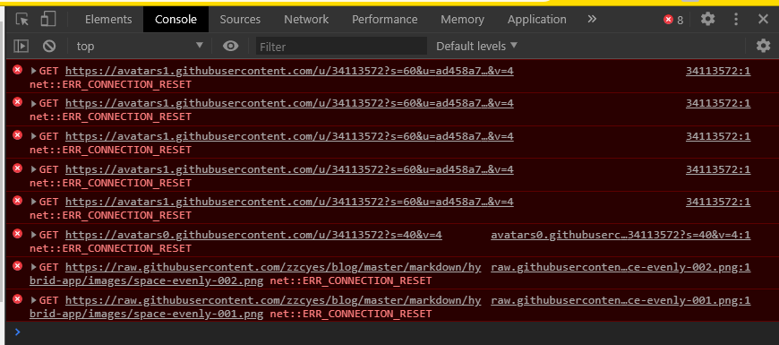

[toc]

# Github访问慢

## 原因
不知道是不是某种不可描述原因，访问GitHub巨慢，上吊的心都有了。看了看网上的解决思路，无非就是修改Hosts文件。

## 准备工作
访问网址[github.com.ipaddress.com](https://github.com.ipaddress.com/)，分别获取`github.com`、`github.global.ssl.fastly.net`对应的IP。


获取的信息如下：

```
192.30.253.113		github.com
151.101.185.194		github.global.ssl.fastly.net
```
## 具体的解决方案

### Windows

Windows的Hosts文件位于C:\Windows\System32\drivers\etc，修改前建议备份一份Hosts文件（看别的大佬是用的switchHost工具切换host）。

1、将下面的信息添加到Hosts文件中，保存

```
192.30.253.113		Build software better, together
151.101.185.194		github.global.ssl.fastly.net
```

2、更新DNS缓存

```
# 打开CMD运行如下命令
ipconfig /flushdns
```

### Linux

1、编辑Hosts文件

```
vi /etc/hosts
```

2、按i进入编辑模式，插入如下文本

```
192.30.253.113		Build software better, together
151.101.185.194		github.global.ssl.fastly.net
```

3、按Esc键退出编辑模式，输入:wq!保存退出。

4、重启机器或者重启服务使Hosts生效，这块我没啥也没重启 ，测试感觉就好了。

## 测试

重新访问[https://github.com](https://github.com)，是不是很快!!!


# Github图片无法访问

## 原因
可以从控制台看到一下报错信息


报错信息主要为`NET::ERR_CONNECTION_RESET`

## 解决方案

### 方法一
[【最新】解决Github网页上图片显示失败的问题](https://blog.csdn.net/qq_38232598/article/details/91346392)

### 方法二

稍等片刻，刷新即可。

## 链接

[chrome 浏览器报 NET::ERR_CERT_COMMON_NAME_INVALID 问题处理方案](https://blog.csdn.net/zerooffdate/article/details/80513730)
