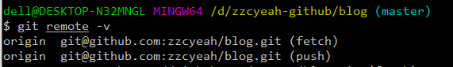
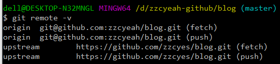
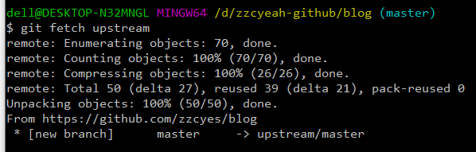

# github上fork的仓库更新

**step 1**
进入到仓库目录

**step 2**
输入命令`git remote -v` 查看远程仓库的路径



路径只有2行，说明未设置 `upstream` （上游代码库）。通常，设置好一次 `upstream` 后无需重复设置。

**step 3**
输入一下命令设置`upstream`

```
git remote add upstream https:// github.com/zzcyes/blog.git
```

`git remote -v`检查是否设置成功



**step 4**
输入命令 `git status` 检查本地是否有未提交的修改。如果有，把本地的有效修改，先从本地仓库推送到你的github仓库。最后再执行一次 git status 检查本地已无未提交的修改。

`git add -A` 或者`git add filename git commit -m "your note" `、 `git push origin master` 、`git status`

**step 5**

输入命令`git fetch upstream`抓取上游代码库的更新



## 相关链接
[Github进行fork后如何与原仓库同步](https://zhuanlan.zhihu.com/p/89607964)
