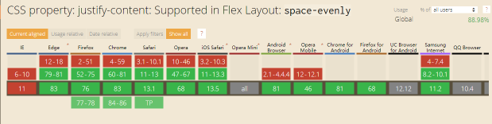
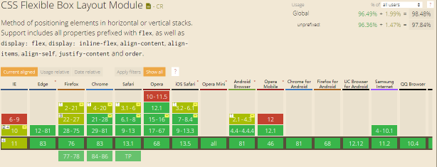

# compatibility

## ui

### Flex Layout "space-evenly"

`justify-content:space-evenly` 在部分 Android、IOS 系统下的兼容性不够好。



相反， `space-between` 兼容绝大多数不同的浏览器。



```css
/* Distributed alignment */
justify-content: space-between; /* 均匀排列每个元素
                                   首个元素放置于起点，末尾元素放置于终点 */
justify-content: space-evenly; /* 均匀排列每个元素
                                   每个元素之间的间隔相等 */
```

我们可以用 `space-between` 的特点来兼容 `space-evenly`。

**CSS Hack**

```css
justify-content: space-between;
/* before形成的块级内容放置于起点，
     after形成的块级内容放置于终点
*/
&:before,
&:after {
  content: '';
  display: block;
}
```

**Link**

[解决 flex 布局的 space-evenly 兼容性问题](https://www.jianshu.com/p/bbd114834c59)

## interaction

## grammar
