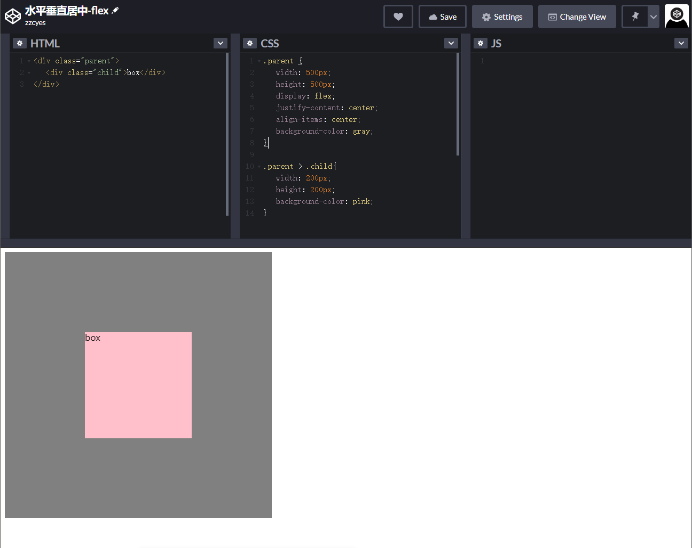

# 004.水平垂直居中

可进入这里调试[code pen](https://codesandbox.io/)

- html

```html
<div class="parent">
  <div class="child">box</div>
</div>
```

- css

```css
.parent {
  width: 500px;
  height: 500px;
  background-color: gray;
}

.child {
  width: 200px;
  height: 200px;
  background-color: pink;
}
```

## 一、水平垂直居中

### 1. flex

定宽高、不定宽高



#### 方法一

```css
.parent {
  display: flex;
  justify-content: center;
  align-items: center;
}
```

#### 方法二

```css
.parent {
  display: flex;
}

.child {
  align-self: center;
  margin: 0 auto;
}
```

### 2. position:absolute

Tips：设置`overflow:auto`防止内容越界溢出

#### 方法一：负边距

```css
.parent{
  position:relative;
}
.child{
  position:absolute;
  top:50%;
  left:50%;
  margin-top:-100px;
  margin-left:-100px;
  overflow:auto;
}
```

#### 方法二：transform

```css
.parent{
  position:relative;
}
.child{
  position:absolute;
  top:50%;
  left:50%;
  transform:translate(-50%,-50%);
  overflow:auto;
}
```

#### 方法三：margin:auto

```css
.parent{
  position:relative;
}
.child{
  position:absolute;
  top:0;
  right: 0;
  bottom:0;
  left: 0;
  margin:0;
  overflow:auto;
}
```

### 3. table

```css
.parent{
  display:table;
}
.child{
 display:table-cell;
 text-align:center;
 vertical-align:middle;
}
```

### 4. line-height


## 二、水平居中

// TODO：待补充

## 三、垂直居中

// TODO：待补充
