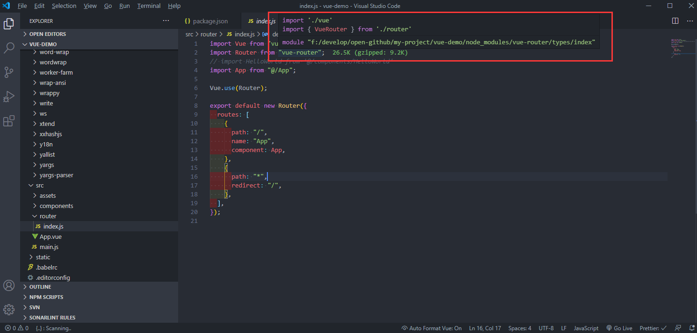
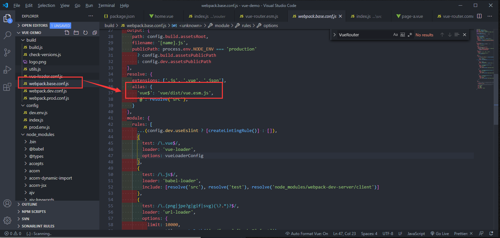
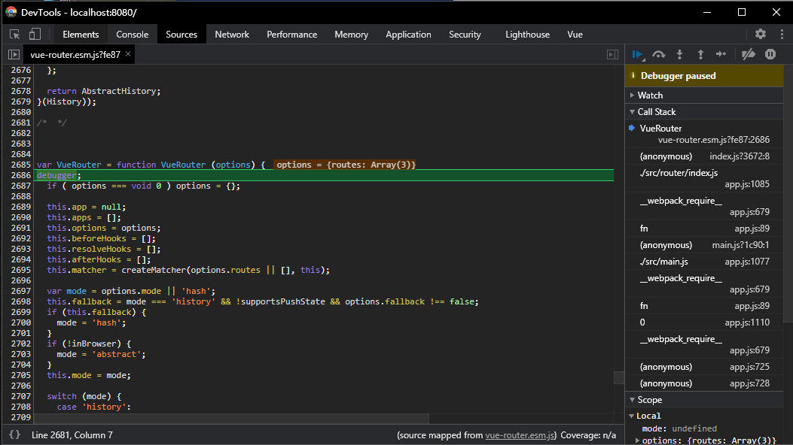

# Vue-Router

## 前言

<!--
回忆

还记得第一次接触`vue`的场景，那是两年前在创业公司实习的经历。时间大概在 18 年 7 月，大三刚结束的我只身(在我姐那住宿)前往深圳寻找实习。

当时找的好几家公司都是需要会用`vue`，可我却一点都没接触过，在学校也没参与过几个项目。

当时的面试官也就是我后来的师傅，在面我时，我说我不会用`vue`。

他很随意的说了句，没事，学呗。他的这句轻描淡写，让我决定推掉了后面的几家公司。

在整个实习阶段，我都很勤奋的去恶补很多知识点，也接触了很多前沿技术。遗憾的是没有深入，可那年的实习经历，却是我这几年最开心的一段时光。大概第一份工作总是印象深刻的吧。 -->

思维导图（来自[biaochenxuying](https://github.com/biaochenxuying/vue-family-mindmap)）：

<!--  -->

## 目标

- 路由注册

- VueRouter 对象

- matcher

- 路径切换

## 源码调试

一般项目中的`vue-router`是通过`npm`包引入的，如果用 `vscode`，可以通过快捷键 `alt` + `click` 直接跳转到包的位置。




可以看到，`dist`目录下除了`vue-router.js`外还有很多其他版本:

- `min` 很容易理解，压缩后的版本。

- `esm` 全称`ES Module(ESM)`,而 `esm `有以下三种实现方式：

  - browser

  - webpack 及类似的构建工具

  - Node

- `common` 全称为`CommonJS`

其实不同版本是不同的 js 模块的区分，查看每个文件最后导出内容的格式也能大概知道这些缩写的含义。

- cjs


- esm


至于 `esm` 和 `esm.browser` 有什么区别呢，对比文件之后，我发现后者将有关的实现替换成了`es6`的相关特性。如：const、解构赋值、class 等等


那么这么多版本，我们的项目里用的是哪一个版本呢。可以到`package.json`里查看`module`的引用，这时就有人会问了，一般不是`main`为才是入口吗？怎么是`module`呢？

我去查了下 `nodejs.cn `官网对于 npm 包`package.json`的，并没有`module`的字段说明，接着就上`stack overflow`查了一圈，最后总结了一下：

-


在这里`module`的引用是`dist/vue-router.esm.js`。

如果是`vue`源码的调试，那么这里还不一定是项目真实的引用，还需要去查看`webpack`的配置,看下依赖的 `vue`的路径到底是什么。



那么，如果想要调试`vue-router`的源码，便可以在`dist/vue-router.esm.js`这个文件下进行。

并且，打完 `debugger` 后并不用重新运行，`webpack`可以热更新。




这时，我们就可以愉快的调试代码了！

## 实现原理

```javascript
export default class VueRouter {
    ...
    constructor(options: RouterOptions = {}) {
        this.app = null
        this.apps = []
        this.options = options
        this.beforeHooks = []
        this.resolveHooks = []
        this.afterHooks = []
        this.matcher = createMatcher(options.routes || [], this)

        let mode = options.mode || 'hash'
        this.fallback = mode === 'history' && !supportsPushState && options.fallback !== false
        if (this.fallback) {
            mode = 'hash'
        }
        if (!inBrowser) {
            mode = 'abstract'
        }
        this.mode = mode
        switch (mode) {
            case 'history':
                this.history = new HTML5History(this, options.base)
                break
            case 'hash':
                this.history = new HashHistory(this, options.base, this.fallback)
                break
            case 'abstract':
                this.history = new AbstractHistory(this, options.base)
                break
            default:
                if (process.env.NODE_ENV !== 'production') {
                    assert(false, `invalid mode: ${mode}`)
                }
        }
    }
    ...
}
```

## 路由模式

- hash

使用 URL hash 值来作路由。支持所有浏览器，包括不支持 HTML5 History Api 的浏览器。

`vue-router` 默认 hash 模式 —— 使用 URL 的 hash 来模拟一个完整的 URL，于是当 URL 改变时，页面不会重新加载。

```javascript
window.addEventLinster('hashchange', () => {
  console.log('hash already change!');
});
```

- history

依赖 HTML5 History API 和服务器配置。

如果不想要很丑的 hash，我们可以用路由的`history模式`，这种模式充分利用 history.pushState API 来完成 URL 跳转而无须重新加载页面。

- abstract

支持所有 JavaScript 运行环境，如 Node.js 服务器端。如果发现没有浏览器的 API，路由会自动强制进入这个模式。

## 模拟实现路由跳转

window.history

## links

- [History 对象](https://javascript.ruanyifeng.com/bom/history.html)

- [JavaScript 标准参考教程（alpha）](https://javascript.ruanyifeng.com/)

- [JavaScript 教程](https://wangdoc.com/javascript/)

- [JS URL()和 URLSearchParams() API 接口详细介绍](https://www.zhangxinxu.com/wordpress/2019/08/js-url-urlsearchparams/)

- [What is the “module” package.json field for?](https://stackoverflow.com/questions/42708484/what-is-the-module-package-json-field-for)

- [创建 library](https://webpack.docschina.org/guides/author-libraries/#final-steps)
