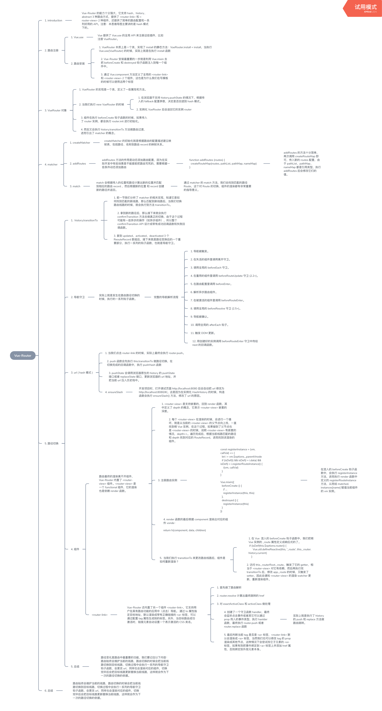

# vue-router

思维导图（来自[biaochenxuying](https://github.com/biaochenxuying/vue-family-mindmap)）：



### 实现原理

```javascript
export default class VueRouter {
    ...
    constructor(options: RouterOptions = {}) {
        this.app = null
        this.apps = []
        this.options = options
        this.beforeHooks = []
        this.resolveHooks = []
        this.afterHooks = []
        this.matcher = createMatcher(options.routes || [], this)

        let mode = options.mode || 'hash'
        this.fallback = mode === 'history' && !supportsPushState && options.fallback !== false
        if (this.fallback) {
            mode = 'hash'
        }
        if (!inBrowser) {
            mode = 'abstract'
        }
        this.mode = mode
        switch (mode) {
            case 'history':
                this.history = new HTML5History(this, options.base)
                break
            case 'hash':
                this.history = new HashHistory(this, options.base, this.fallback)
                break
            case 'abstract':
                this.history = new AbstractHistory(this, options.base)
                break
            default:
                if (process.env.NODE_ENV !== 'production') {
                    assert(false, `invalid mode: ${mode}`)
                }
        }
    }
    ...
}
```

## 路由模式

- hash

使用 URL hash 值来作路由。支持所有浏览器，包括不支持 HTML5 History Api 的浏览器。

`vue-router` 默认 hash 模式 —— 使用 URL 的 hash 来模拟一个完整的 URL，于是当 URL 改变时，页面不会重新加载。

```javascript
window.addEventLinster('hashchange', () => {
  console.log('hash already change!');
});
```

- history

依赖 HTML5 History API 和服务器配置。

如果不想要很丑的 hash，我们可以用路由的`history模式`，这种模式充分利用 history.pushState API 来完成 URL 跳转而无须重新加载页面。

- abstract

支持所有 JavaScript 运行环境，如 Node.js 服务器端。如果发现没有浏览器的 API，路由会自动强制进入这个模式。

## 模拟实现路由跳转

window.history

## links

- [History 对象](https://javascript.ruanyifeng.com/bom/history.html)

- [JavaScript 标准参考教程（alpha）](https://javascript.ruanyifeng.com/)

- [JavaScript 教程](https://wangdoc.com/javascript/)

- [JS URL()和 URLSearchParams() API 接口详细介绍](https://www.zhangxinxu.com/wordpress/2019/08/js-url-urlsearchparams/)
