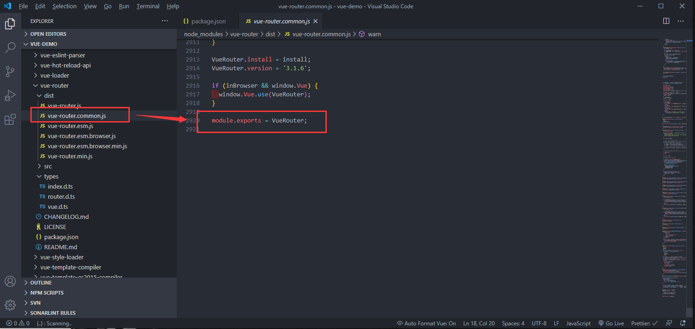
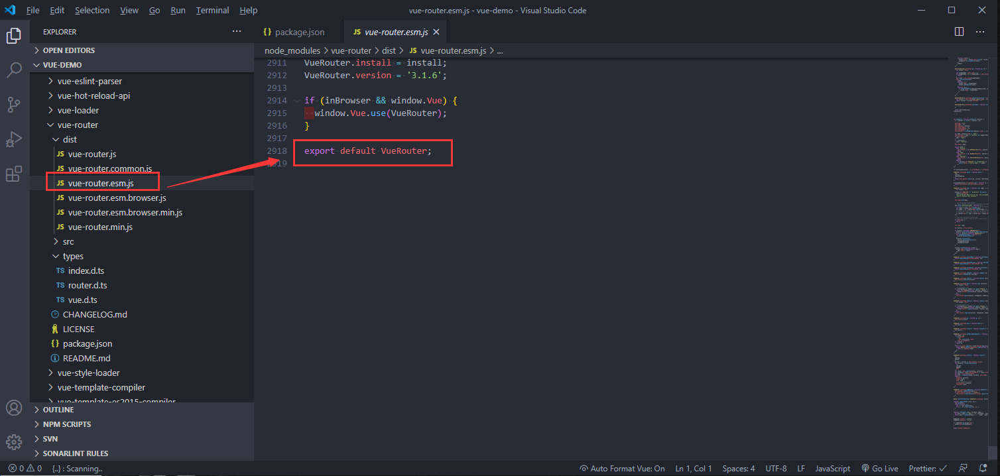
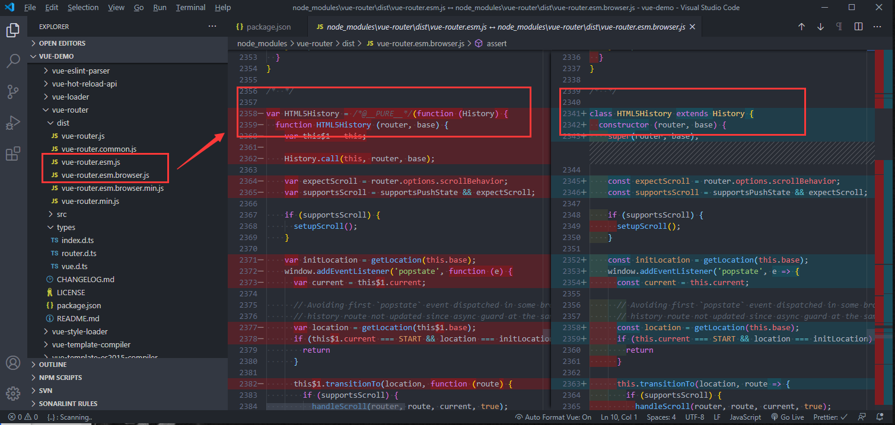
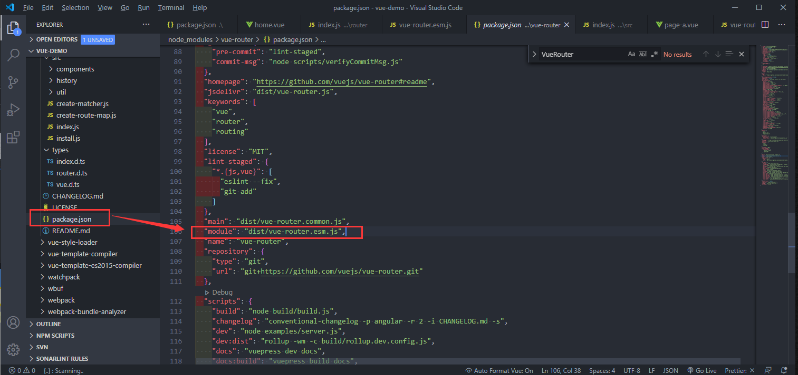
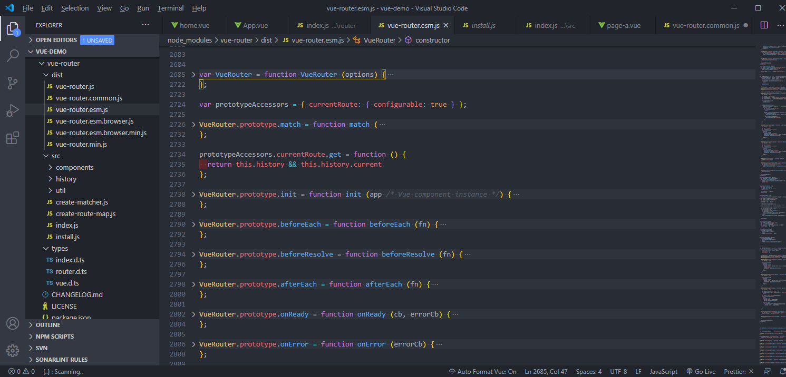
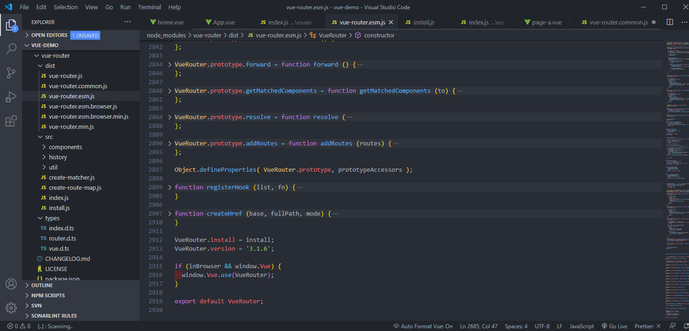

# Vue-Router

## 前言

<!--
回忆

还记得第一次接触`vue`的场景，那是两年前在创业公司实习的经历。时间大概在 18 年 7 月，大三刚结束的我只身(在我姐那住宿)前往深圳寻找实习。

当时找的好几家公司都是需要会用`vue`，可我却一点都没接触过，在学校也没参与过几个项目。

当时的面试官也就是我后来的师傅，在面我时，我说我不会用`vue`。

他很随意的说了句，没事，学呗。他的这句轻描淡写，让我决定推掉了后面的几家公司。

在整个实习阶段，我都很勤奋的去恶补很多知识点，也接触了很多前沿技术。遗憾的是没有深入，可那年的实习经历，却是我这几年最开心的一段时光。大概第一份工作总是印象深刻的吧。 -->

思维导图（来自[biaochenxuying](https://github.com/biaochenxuying/vue-family-mindmap)）：

<!--  -->

## 目标

- 路由注册

- VueRouter 对象

- matcher

- 路径切换

## 源码调试

一般项目中的`vue-router`是通过`npm`包引入的，如果用 `vscode`，可以通过快捷键 `alt` + `click` 直接跳转到包的位置。


可以看到，`dist`目录下除了`vue-router.js`外还有很多其他版本:

- `min` 很容易理解，压缩后的版本。

- `esm` 全称`ES Module(ESM)`

- `common` 全称为`CommonJS`

其实不同版本是不同的 js 模块的区分，查看每个文件最后导出内容的格式也能大概知道这些缩写的含义。

- cjs



- esm



至于 `esm` 和 `esm.browser` 有什么区别呢，对比文件之后，我发现后者将有关的实现替换成了`es6`的相关特性。如：const、解构赋值、class 等等




那么这么多版本，我们的项目里用的是哪一个版本呢。可以到`package.json`里查看`module`的引用，这时就有人会问了，一般不是`main`为才是入口吗？怎么是`module`呢？



我去看了下 `nodejs.cn `官网对于 npm 包`package.json`的说明，其中并没有`module`的字段说明，接着就上[stack overflow](https://stackoverflow.com/questions/42708484/what-is-the-module-package-json-field-for)查了一圈，才知道这个是 `Rollup` 中很早提出的一个[概念](https://github.com/rollup/rollup/wiki/pkg.module)。

`vue-router`使用的是 `Rollup` 打包工具，`Rollup`官网的描述:

- Rollup 编译为 UMD 或 CommonJS 格式，然后在 package.json 文件的 main 属性中指向当前编译的版本。

- 如果你的 package.json 也具有 module 字段，像 Rollup 和 webpack 2 这样的 ES6 感知工具(ES6-aware tools)将会直接导入 ES6 模块版本。

在这里`module`的引用是`dist/vue-router.esm.js`。

如果是`vue`源码的调试，那么这里还不一定是项目真实的引用，还需要去查看`webpack`的配置,看下依赖的 `vue`的路径到底是什么。


调试`vue-router`的源码的话，可以在`dist/vue-router.esm.js`这个文件下进行。打完 `debugger` 后也不用重新运行，`webpack`会热更新。


这时，我们就可以愉快的调试代码了！

## 路由注册

### 目标

- 了解 Vue 插件的注册原理

- 了解路由注册的实现流程

### 注册原理

结合 `demo`来讲讲路由的注册。

可以看到`VueRouter`从 npm 包里边导出，然后再通过`Vue.use()`这个方法去注册。

```javascript
import Vue from 'vue';
import VueRouter from 'vue-router';
import Home from "@/view/home.vue";

Vue.use(VueRouter);
export default new Router({
  routes: [
    {
      path: '/home',
      name: 'home',
      component: Home,
    },
    ...
  ],
});
```

首先看下`Vue.use()`的源码

```javascript
export function initUse(Vue: GlobalAPI) {
  Vue.use = function (plugin: Function | Object) {
    const installedPlugins =
      this._installedPlugins || (this._installedPlugins = []);
    // plugin注册过后不会再重复注册
    if (installedPlugins.indexOf(plugin) > -1) {
      return this;
    }

    // additional parameters
    const args = toArray(arguments, 1);
    args.unshift(this); // Vue添加到参数中，因为插件里并不会再去import Vue
    if (typeof plugin.install === 'function') {
      // plugin是对象且install是函数则直接执行
      plugin.install.apply(plugin, args);
    } else if (typeof plugin === 'function') {
      // plugin本身是函数则直接执行
      plugin.apply(null, args);
    }
    installedPlugins.push(plugin);
    return this;
  };
}
```

了解完`Vue.use()`,我们再来看看`dist/vue-router.esm.js`文件下`VueRouter`的定义。

`VueRouter`是构造函数，在其原型链上挂载了一些方法。

我们平时用到的路由相关的方法如：`push`、`replace`、`go`、`back`等等，就是在这里挂载的。



定义完一系列方法之后，`VueRouter` 通过`VueRouter.install = install`这一行代码，开始进行注册了。



### 实现流程

这时候，我们可以跳转到`install.js`文件，查看注册的实现过程。

```javascript
import View from './components/view';
import Link from './components/link';

export let _Vue; // 保留Vue，可供导出使用

export function install(Vue) {
  if (install.installed && _Vue === Vue) return;
  install.installed = true;

  _Vue = Vue;

  const isDef = (v) => v !== undefined;

  const registerInstance = (vm, callVal) => {
    let i = vm.$options._parentVnode;
    if (
      isDef(i) &&
      isDef((i = i.data)) &&
      isDef((i = i.registerRouteInstance))
    ) {
      i(vm, callVal);
    }
  };

  Vue.mixin({
    beforeCreate() {
      if (isDef(this.$options.router)) {
        this._routerRoot = this;
        this._router = this.$options.router;
        this._router.init(this);
        Vue.util.defineReactive(this, '_route', this._router.history.current); // 响应式
      } else {
        this._routerRoot = (this.$parent && this.$parent._routerRoot) || this;
      }
      registerInstance(this, this);
    },
    destroyed() {
      registerInstance(this);
    },
  });

  Object.defineProperty(Vue.prototype, '$router', {
    get() {
      return this._routerRoot._router;
    },
  });

  Object.defineProperty(Vue.prototype, '$route', {
    get() {
      return this._routerRoot._route;
    },
  });

  Vue.component('RouterView', View);
  Vue.component('RouterLink', Link);

  const strats = Vue.config.optionMergeStrategies;
  // use the same hook merging strategy for route hooks
  strats.beforeRouteEnter = strats.beforeRouteLeave = strats.beforeRouteUpdate =
    strats.created;
}
```

`Vue.mixin()`源码,利用`mergeOptions`合并配置到`Vue.options`上

```javascript
/* @flow */

import { mergeOptions } from '../util/index';

export function initMixin(Vue: GlobalAPI) {
  Vue.mixin = function (mixin: Object) {
    this.options = mergeOptions(this.options, mixin);
    return this;
  };
}
```

`defineReactive`实现响应式

```javascript
export function defineReactive(
  obj: Object,
  key: string,
  val: any,
  customSetter?: ?Function,
  shallow?: boolean
) {
  const dep = new Dep();

  const property = Object.getOwnPropertyDescriptor(obj, key);
  if (property && property.configurable === false) {
    return;
  }

  // cater for pre-defined getter/setters
  const getter = property && property.get;
  const setter = property && property.set;
  if ((!getter || setter) && arguments.length === 2) {
    val = obj[key];
  }

  let childOb = !shallow && observe(val);
  Object.defineProperty(obj, key, {
    enumerable: true,
    configurable: true,
    get: function reactiveGetter() {
      const value = getter ? getter.call(obj) : val;
      if (Dep.target) {
        dep.depend();
        if (childOb) {
          childOb.dep.depend();
          if (Array.isArray(value)) {
            dependArray(value);
          }
        }
      }
      return value;
    },
    set: function reactiveSetter(newVal) {
      const value = getter ? getter.call(obj) : val;
      /* eslint-disable no-self-compare */
      if (newVal === value || (newVal !== newVal && value !== value)) {
        return;
      }
      /* eslint-enable no-self-compare */
      if (process.env.NODE_ENV !== 'production' && customSetter) {
        customSetter();
      }
      // #7981: for accessor properties without setter
      if (getter && !setter) return;
      if (setter) {
        setter.call(obj, newVal);
      } else {
        val = newVal;
      }
      childOb = !shallow && observe(newVal);
      dep.notify();
    },
  });
}
```

### 小结

- `Vue `编写插件的时候通常要提供静态的 `install `方法

- `Vue-Router`的`install`方法会给每一个组件注入 `beforeCreated` 和 `destoryed` 的钩子函数，在`beforeCreated` 做一些私有属性定义和路由初始化工作。

## 路由对象

### 目标

- 了解 VueRouter 对象的一些属性和方法

- 了解 VueRouter 对象的初始化逻辑

### 源码实现

```javascript
var VueRouter = function VueRouter(options) {
  // void 0 返回 undefined。
  if (options === void 0) options = {};

  this.app = null;
  this.apps = [];
  this.options = options;
  this.beforeHooks = [];
  this.resolveHooks = [];
  this.afterHooks = [];
  this.matcher = createMatcher(options.routes || [], this);

  var mode = options.mode || 'hash'; // 默认hash
  this.fallback =
    mode === 'history' && !supportsPushState && options.fallback !== false; // history利用H5属性，有些浏览器不兼容，fallback降级处理
  if (this.fallback) {
    mode = 'hash';
  }
  if (!inBrowser) {
    mode = 'abstract'; // 非web环境
  }
  this.mode = mode;

  switch (mode) {
    case 'history':
      this.history = new HTML5History(this, options.base);
      break;
    case 'hash':
      this.history = new HashHistory(this, options.base, this.fallback);
      break;
    case 'abstract':
      this.history = new AbstractHistory(this, options.base);
      break;
    default:
      if (process.env.NODE_ENV !== 'production') {
        assert(false, 'invalid mode: ' + mode);
      }
  }
};

...

VueRouter.prototype.match = function () {};
VueRouter.prototype.get = function () {};
VueRouter.prototype.init = function () {};
VueRouter.prototype.beforeEach = function () {};
VueRouter.prototype.beforeResolve = function () {};
VueRouter.prototype.afterEach = function () {};
VueRouter.prototype.onReady = function () {};
VueRouter.prototype.onError = function () {};
VueRouter.prototype.push = function () {};
VueRouter.prototype.replace = function () {};
VueRouter.prototype.go = function () {};
VueRouter.prototype.back = function () {};
VueRouter.prototype.forward = function () {};
VueRouter.prototype.getMatchedComponents = function () {};
VueRouter.prototype.resolve = function () {};
VueRouter.prototype.addRoutes = function () {};

...

VueRouter.install = install;
VueRouter.version = '3.1.6';

if (inBrowser && window.Vue) {
  window.Vue.use(VueRouter);
}

export default VueRouter;
```

### VueRouter 的一些属性和方法

在这里暂不讨论原型链上的方法，主要是为了去理解 `VueRouter`中的一些主要的属性和方法。

阅读完`VueRouter` 构造函数的代码实现，我们可以知道：

- 若不指定`mode`，`VueRouter`默认会使用 `hash` 模式。

- 若浏览器不支持`history`模式相关的实现方法，也会自动降级为 `hash` 模式。

- 在非浏览器环境下，会使用`abstract`模式

判断浏览器是否支持相关实现的方法为`supportsPushState`，如下：

```javascript
var supportsPushState =
  inBrowser &&
  (function () {
    var ua = window.navigator.userAgent;

    if (
      (ua.indexOf('Android 2.') !== -1 || ua.indexOf('Android 4.0') !== -1) &&
      ua.indexOf('Mobile Safari') !== -1 &&
      ua.indexOf('Chrome') === -1 &&
      ua.indexOf('Windows Phone') === -1
    ) {
      return false;
    }

    return window.history && 'pushState' in window.history;
  })();
```

根据`supportsPushState`方法，我们可以大概推测到`VueRouter`的`history`模式的主要实现是利用了`window.history`及相关的`pushState`方法。

### 路由模式

`history` 有三种模式，分别对应三个类 `HTML5History`、`HashHistory` 和 `AbstractHistory`，简单介绍下这三种模式：

- hash

使用 URL hash 值来作路由。支持所有浏览器，包括不支持 HTML5 History Api 的浏览器。

`vue-router` 默认 hash 模式 —— 使用 URL 的 hash 来模拟一个完整的 URL，于是当 URL 改变时，页面不会重新加载。

```javascript
window.addEventLinster('hashchange', () => {
  console.log('hash already change!');
});
```

- history

依赖 HTML5 History API 和服务器配置。

如果不想要很丑的 hash，我们可以用路由的`history模式`，这种模式充分利用 history.pushState API 来完成 URL 跳转而无须重新加载页面。

- abstract

支持所有 JavaScript 运行环境，如 Node.js 服务器端。如果发现没有浏览器的 API，路由会自动强制进入这个模式。

### 初始化

看完 `VueRouter`的构造函数，我们再回到 `VueRouter` 注册的地方，也就是`install.js`的实现。

```javascript
...
export function install(Vue) {
  ...
  Vue.mixin({
    beforeCreate() {
      if (isDef(this.$options.router)) {
        this._routerRoot = this;
        this._router = this.$options.router;
        this._router.init(this);
        Vue.util.defineReactive(this, '_route', this._router.history.current);
      } else {
        this._routerRoot = (this.$parent && this.$parent._routerRoot) || this;
      }
      registerInstance(this, this);
    },
    destroyed() {
      registerInstance(this);
    },
  });
  ...
}
```

可以看到`Vue.mixin`在`beforeCreate`方法里，执行了`this._router.init(this)`这一步，对`VueRouter`进行了一个初始化操作。

而这个`init`方法，便是挂载在原型链上的方法:

```javascript
VueRouter.prototype.init = function init(app /* Vue component instance */) {
  var this$1 = this;

  process.env.NODE_ENV !== 'production' &&
    assert(
      install.installed,
      'not installed. Make sure to call `Vue.use(VueRouter)` ' +
        'before creating root instance.'
    );

  this.apps.push(app); // app为vue组件实例，apps为维护其组件实例的一个数组

  // set up app destroyed handler
  // https://github.com/vuejs/vue-router/issues/2639
  app.$once('hook:destroyed', function () {
    // clean out app from this.apps array once destroyed
    var index = this$1.apps.indexOf(app);
    if (index > -1) {
      this$1.apps.splice(index, 1);
    }
    // ensure we still have a main app or null if no apps
    // we do not release the router so it can be reused
    if (this$1.app === app) {
      this$1.app = this$1.apps[0] || null;
    }

    if (!this.app) {
      // clean up event listeners
      // https://github.com/vuejs/vue-router/issues/2341
      this.history.teardownListeners();
    }
  });

  // main app previously initialized
  // return as we don't need to set up new history listener
  if (this.app) {
    return;
  }

  this.app = app;

  var history = this.history;

  if (history instanceof HTML5History) {
    history.transitionTo(history.getCurrentLocation());
  } else if (history instanceof HashHistory) {
    var setupHashListener = function () {
      history.setupListeners();
    };
    history.transitionTo(
      history.getCurrentLocation(),
      setupHashListener,
      setupHashListener
    );
  }

  history.listen(function (route) {
    this$1.apps.forEach(function (app) {
      app._route = route;
    });
  });
};
```

在这里插一下写定时器的方法，通常我们在`vue`项目里清理的定时器有两种方法：

方法一：常规写法

```javascript
export default{
  data(){
    timer:null
  },
  mounted(){
	  this.timer = setInterval(()=>{
	  // TODO
	},1000);
  }
  beforeDestory(){
    clearInterval(this.timer);
    this.timer = null;
  }
}
```

方法二：利用`$once`的特性，在`beforeDestory`时销毁

`$once`：监听一个自定义事件，但是只触发一次。一旦触发之后，监听器就会被移除。

```javascript
export default {
  methods: {
    countdown() {
      const timer = setInterval(() => {
        // TODO
      }, 1000);
      this.$once('hook:beforeDestory', () => {
        clearInterval(timer);
        timer = null;
      });
    },
  },
};
```

`app.$once('hook:destroyed',funiction(){})`这一段是在早期版本是没有的，根据注释去`github`的`issues`上查了一下：

- [[bug] Memory leak with this.\$router.apps array and secondary apps on page being destroyed](https://github.com/vuejs/vue-router/issues/2639)。

大概意思就是原先销毁的 app 引用保留在`$router.apps` 数组中，从而导致内存使用量增加/泄漏。

所以增加了这么一段操作，是为了将已在`$destroyed` 删除的`app`，从`$router.apps` 数组中删除。

- [https://github.com/vuejs/vue-router/issues/2341](https://github.com/vuejs/vue-router/issues/2341)

创建一个 `vue`实例以及一个`VueRouter`实例。然后销毁 `vue` 实例。`VueRouter`实例继续存在并触发,`VueRouter`实例应该能够自行破坏。通过显式调用，或在销毁 vue 实例时。

```javascript
// set up app destroyed handler
// https://github.com/vuejs/vue-router/issues/2639
app.$once('hook:destroyed', function () {
  // clean out app from this.apps array once destroyed
  var index = this$1.apps.indexOf(app);
  if (index > -1) {
    this$1.apps.splice(index, 1);
  }
  // ensure we still have a main app or null if no apps
  // we do not release the router so it can be reused
  if (this$1.app === app) {
    this$1.app = this$1.apps[0] || null;
  }

  if (!this.app) {
    // clean up event listeners
    // https://github.com/vuejs/vue-router/issues/2341
    this.history.teardownListeners();
  }
});
```

`transitionTo`路径切换

## 路由跳转

window.history

## 总结

...

## 查缺补漏

- Tree Shaking

- npm library

- Abstract Syntax Code

- package.json

- Rollup

- Dead Code Elimination

- 模块化

## links

- [What is the “module” package.json field for?](https://stackoverflow.com/questions/42708484/what-is-the-module-package-json-field-for)

- [创建 library](https://webpack.docschina.org/guides/author-libraries/#final-steps)

- [WRT PR #3 - ES module detection](https://github.com/nodejs/node-eps/issues/13)

- [Enable treeShaking import in webpack](https://github.com/airbnb/react-dates/pull/1572)

- [package.json 中的 Module 字段是干嘛的](https://segmentfault.com/a/1190000014286439)

- [History 对象](https://javascript.ruanyifeng.com/bom/history.html)

- [JavaScript 标准参考教程（alpha）](https://javascript.ruanyifeng.com/)

- [JavaScript 教程](https://wangdoc.com/javascript/)

- [JS URL()和 URLSearchParams() API 接口详细介绍](https://www.zhangxinxu.com/wordpress/2019/08/js-url-urlsearchparams/)

- [[bug] Memory leak with this.\$router.apps array and secondary apps on page being destroyed ](https://github.com/vuejs/vue-router/issues/2639)

- [bootstrap-vue](https://bootstrap-vue.js.org/play/)
