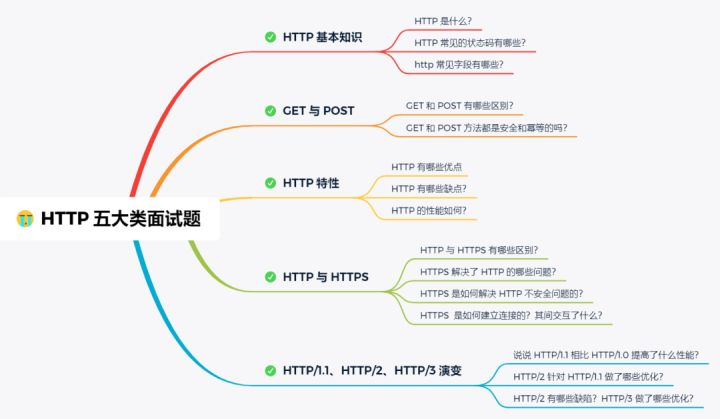

# 001.HTTP

HTTP、HTTPS常考点：

- 交互方法

- HTTP各版本区别

- HTTP与HTTPS区别

- HTTPS加密过程

- TCP三次握手、四次挥手

图源[小林coding](https://zhuanlan.zhihu.com/p/112010468)

## 概述

HTTP

## HTTP方法

HTTP1.0 定义了GET、HEAD和POST方法。

HTTP1.1 新增了PUT、DELETE、CONNECT、OPTIONS、TRACE和PATCH方法。

《HTTP权威指南》：

| 方法 | 描述 | 是否包含主体 |　
| -- | -- | -- |
| GET | 从服务器获取一份文档 | 否 |
| HEAD | 只从服务器获取文档的首部 | 否 |
| POST | 向服务器发送需要处理的数据 | 是 |
| PUT | 将请求的主体部分存储在服务器上 | 是 |
| DELETE | 从服务器上删除一份文档 | 否 |
| CONNECT | xxx | xxx |
| OPTIONS | 决定可以在服务器上执行哪些方法 | 否 |
| TRACE | 对可能经过代理服务器传送到服务器上去的报文进行追踪 | 否 |
| PATCH | xxx | xxx |

### GET

HTTP `GET` 方法请求指定的资源。使用 `GET` 的请求应该只用于获取数据。

| 描述 |   |
| :-- | -- |
| 请求是否有主体 | NO |
| 成功的返回是否有主体 | Yes |
| 安全 | Yes |
| 幂等 | Yes |
| 可缓存 | Yes |
| 可以在HTML forms中使用 | Yes |

### HEAD

HTTP `HEAD` 方法 请求资源的头部信息, 并且这些头部与 HTTP `GET` 方法请求时返回的一致. 该请求方法的一个使用场景是在下载一个大文件前先获取其大小再决定是否要下载, 以此可以节约带宽资源.

`HEAD` 方法的响应不应包含响应正文. 即使包含了正文也必须忽略掉. 虽然描述正文信息的 `entity headers`, 例如 `Content-Length` 可能会包含在响应中, 但它们并不是用来描述 HEAD 响应本身的, 而是用来描述同样情况下的 `GET` 请求应该返回的响应.

如果 `HEAD` 请求的结果显示在上一次 `GET` 请求后缓存的资源已经过期了, 即使没有发出`GET`请求，缓存也会失效

| 描述 |   |
| :-- | -- |
| 请求是否有主体 | NO |
| 成功的返回是否有主体 | NO |
| 安全 | Yes |
| 幂等 | Yes |
| 可缓存 | Yes |
| 可以在HTML forms中使用 | NO |

### POST

| 描述 |   |
| :-- | -- |
| 请求是否有主体 | Yes |
| 成功的返回是否有主体 | Yes |
| 安全 | NO |
| 幂等 | NO |
| 可缓存 | Only if freshness information is included |
| 可以在HTML forms中使用 | Yes |

### PUT

### DELETE

| 描述 |   |
| :-- | -- |
| 请求是否有主体 | May |
| 成功的返回是否有主体 | May |
| 安全 | No |
| 幂等 | Yes |
| 可缓存 | No |
| 可以在HTML forms中使用 | No |

### CONNECT

| 描述 |   |
| :-- | -- |
| 请求是否有主体 | No |
| 成功的返回是否有主体 | Yes |
| 安全 | No |
| 幂等 | No |
| 可缓存 | No |
| 可以在HTML forms中使用 | No |

### OPTIONS

### TRACE

### PATCH

### 扩展方法

## 状态码

| 整体范围 | 已定义范围 | 分类 |
| -- | -- | -- |
| 100 ～ 199 | 100 ～ 101 | 信息提示 |
| 200 ～ 299 | 200 ～ 206 | 成功 |
| 300 ～ 399 | 300 ～ 305 | 重定向 |
| 400 ～ 499 | 400 ～ 415 | 客户端错误 |
| 500 ～ 599 | 500 ～ 505 | 服务器错误 |

### 100~199 信息性状态码

### 200~299 成功状态码

### 300~399 重定向状态码

### 400~499 客户端错误状态码

### 500~599 服务器错误状态码

## HTTP版本区别

- [QUIC网络协议简介](https://cloud.tencent.com/developer/article/1405624)

## HTTP与HTTPS区别

## TCP三次握手、四次挥手

the three way (or three message) handshake.

## links

- [硬核！30 张图解 HTTP 常见的面试题](https://zhuanlan.zhihu.com/p/112010468)

- [（2.6w 字）网络知识点灵魂拷问——前端面试必问](https://juejin.im/post/6864175613209640973)

- [HTTP](https://github.com/LiangJunrong/document-library/blob/master/%E7%B3%BB%E5%88%97-%E9%9D%A2%E8%AF%95%E8%B5%84%E6%96%99/%E8%AE%A1%E7%AE%97%E6%9C%BA%E7%BD%91%E7%BB%9C/HTTP.md)

- [“三次握手，四次挥手”你真的懂吗？](https://zhuanlan.zhihu.com/p/53374516)
