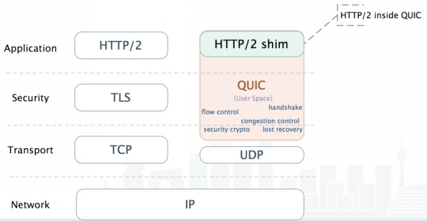

# 004.QUIC

## 概述

>wikipedia：QUIC(Quick UDP Internet Connection)是一种通用的传输层网络协议，最初由Jim Roskind在谷歌设计，2012年实现并部署，2013年作为实验扩展公开宣布，并描述为IETF。虽然这还只是一个互联网的草稿，但在从Chrome浏览器到谷歌服务器的所有连接中，QUIC已经被超过一半的用户使用。2015年6月，QUIC的互联网规范草案提交给IETF进行标准化。2016年成立QUIC工作组。2018年10月，IETF的HTTP和QUIC工作组共同决定将QUIC上的HTTP映射命名为“HTTP/3”，从而使其成为全球标准。

简述：QUIC(Quick UDP Internet Connection), 是 Google 研发的一种基于 UDP 协议的低时延互联网传输协议。在2018年IETF会议中，HTTP-over-QUIC协议被重命名为HTTP/3，并成为 HTTP 协议的第三个正式版本。

## 特性

简单来说，QUIC协议就是基于UDP重新实现了一遍HTTP2的特性。

用一个等式来描述就是 QUIC = UDP + TLS + HTTP2

QUIC与HTTP2的网络层次对比如下图所示：

- 

## links

- [QUIC网络协议简介](https://cloud.tencent.com/developer/article/1405624)

- [QUIC ESnet](https://fasterdata.es.net/data-transfer-tools/quic-quick-udp-internet-connections/)
