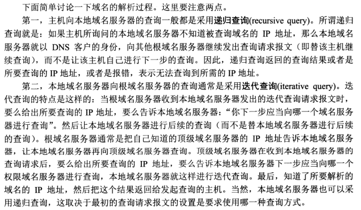

# 005.DNS.md

## 知识点速览

- DNS根服务器

- 根域名服务器

- 顶级域名服务器

- 权限域名服务器

- 标号

## 概述

**域名系统DNS（Domain Name Service）** 是互联网使用的命名系统，用来把便于人们使用的机器名字转化为IP地址。

从理论上讲，整个互联网可以只使用一个域名服务器，使它装入互联网上所有的主机名，并回答所有对IP地址的查询。但是这种做法不可取。因为互联网规模很大，这样的域名服务器肯定会因过负荷而无法正常工作，并且一旦域名服务器出现故障，整个互联网就会瘫痪。

因此，1983年互联网采用层次树状的结构命名方法，并使用分布式的 **域名系统**。DNS的互联网标准是RFC 1034,1035。

域名到IP地址的解析是由分布在互联网上的许多 **域名服务器程序（可简称为域名服务器）** 共同完成的。域名服务器程序在专设的节点上运行，而人们也唱罢运行域名服务器程序的机器称为 **域名服务器**。

域名到IP地址的解析过程的要点如下：当某一个应用进程需要把主机名解析为IP地址时，该应用进程就调用**解析程序（resolver）**，并成为DNS的一个客户，把带解析的域名放在DNS请求报文中，以UDP用户数据报方式发给本地域名服务器（使用UDP是为了减少开销）。本地域名服务器在查找域名后，把对应的IP地址放在回答报文中返回。应用进程获得目的主机的IP地址后即可进行通信。

若本地域名服务器不能回答该请求，则此域名服务器就暂时称为DNS中的另一个客户，并向其他域名服务器发出查询请求。这种过程直至找到能够回答该请求的域名服务器位置。

## 互联网的域名结构

互联网采用了层次树状的命名方法，就像全求邮政系统和电话系统那样。采用这种命名方法，任何一个连接在互联网上的主机或路由器，都有一个**唯一的层次结构的名字**，即**域名（domain name）**。这里，**“域”** 是名字空间中一个可被管理的划分。域还可以划分为子域名，而子域还可继续划分为子域的子域，这样就形成了顶级域、二级域、三级域，等等。

从语法上将，每一个域名都由**标号（label）** 序列组成，而各标号之间用点隔开（请注意，是小数点“.”，不是中文的“。”）

例如下面的域名：


该域名是中央电视台用于收发电子邮件的计算机（即邮件服务器）的域名，它由三个标号组成：

1. 标号com是顶级域名；
2. 标号cctv是二级域名；
3. 标号mail是三级域名。

DNS规定：

- 域名中的标号都有英文字母和数字组成，每一个标号不超过63个字符（为方便记忆不超过12个字符），也**不区分大小写字母**。

- 标号中除连字符（-）外不能使用其他的标点符号。

- 级别最低的域名写在最左边，而级别最高的顶级域名则写在最右边。

- **由多个标号组成的完成域名总共不超过255个字符。**

DNS既不规定一个域名需要包含多少个下级域名，也不规定每一级的域名代表什么意思。各级域名由其上一级的域名管理机构管理，而最高的顶级域名则由ICANN进行管理。用这种方法可使每一个域名在整个互联网范围内是唯一的，并且也容易设计出一种查找域名的机制。

### 顶级域名

顶级域名分为三类：

1. **国家和地区顶级域名**（country code top-level domains,简称ccTLDs）,例如中国是cn，日本是jp等；

2. **通用顶级域名**(generic top-level domains，简称gTLDs)，例如表示工商企业的.com，表示网络提供商的 .net，表示非盈利组织的 .org等。

3. **新顶级域名**(New gTLD)，如通用的.xyz、代表“高端”的.top、代表“红色”的.red、代表“人”的.men等一千多种。


###  域名服务器结构

域名服务器树：


域名树的树叶就是单台计算机的名字，它不能再继续往下划分子域了。


- 根 DNS 服务器 ：返回顶级域 DNS 服务器的 IP 地址

- 顶级域 DNS 服务器：返回权威 DNS 服务器的 IP 地址

- 权威 DNS 服务器 ：返回相应主机的 IP 地址

## DNS 解析流程

为了提高 DNS 的解析性能，很多网络都会就近部署 DNS 缓存服务器。于是，就有了以下的 DNS 解析
流程。

1. 电脑客户端会发出一个 DNS 请求，问 www.163.com 的 IP 是啥啊，并发给本地域名服务器 (本地DNS)。那本地域名服务器 (本地 DNS) 是什么呢？如果是通过 DHCP 配置，本地 DNS 由你的网络服务商（ISP），如电信、移动等自动分配，它通常就在你网络服务商的某个机房。

2. 本地 DNS 收到来自客户端的请求。你可以想象这台服务器上缓存了一张域名与之对应 IP 地址的大表格。如果能找到 www.163.com，它直接就返回 IP 地址。如果没有，本地 DNS 会去问它的根域名服务器：“老大，能告诉我 www.163.com 的 IP 地址吗？”根域名服务器是最高层次的，全球共有 13 套。它不直接用于域名解析，但能指明一条道路。

3. 根 DNS 收到来自本地 DNS 的请求，发现后缀是 .com，说：“哦，www.163.com 啊，这个域名是由.com 区域管理，我给你它的顶级域名服务器的地址，你去问问它吧。”

4. 本地 DNS 转向问顶级域名服务器：“老二，你能告诉我 www.163.com 的 IP 地址吗？”顶级域名服务器就是大名鼎鼎的比如 .com、.net、 .org 这些一级域名，它负责管理二级域名，比如163.com，所以它能提供一条更清晰的方向。

5. 顶级域名服务器说：“我给你负责 www.163.com 区域的权威 DNS 服务器的地址，你去问它应该能问到。”

6. 本地 DNS 转向问权威 DNS 服务器：“您好，www.163.com 对应的 IP 是啥呀？”163.com 的权威 DNS 服务器，它是域名解析结果的原出处。为啥叫权威呢？就是我的域名我做主。

7. 权限 DNS 服务器查询后将对应的 IP 地址 X.X.X.X 告诉本地 DNS。

8. 本地 DNS 再将 IP 地址返回客户端，客户端和目标建立连接。

至此，我们完成了 DNS 的解析过程。

### 查询方式




## 负载均衡

站在客户端角度，这是一次DNS 递归查询过程。因为本地 DNS 全权为它效劳，它只要坐等结果即可。在这个过程中，DNS 除了可以通过名称映射为 IP 地址，它还可以做另外一件事，就是负载均衡。

还是以访问“外婆家”为例，还是我们开头的“外婆家”，但是，它可能有很多地址，因为它在杭州可以有很多家。所以，如果一个人想去吃“外婆家”，他可以就近找一家店，而不用大家都去同一家，这就是负载均衡。

### 内部负载均衡

例如，一个应用要访问数据库，在这个应用里面应该配置这个数据库的 IP 地址，还是应该配置这个数据库的域名呢？显然应该配置域名，因为一旦这个数据库，因为某种原因，换到了另外一台机器上，而如果有多个应用都配置了这台数据库的话，一换 IP 地址，就需要将这些应用全部修改一遍。但是如果配置了域名，则只要在 DNS 服务器里，将域名映射为新的 IP 地址，这个工作就完成了，大大简化了运维。

在这个基础上，我们可以再进一步。例如，某个应用要访问另外一个应用，如果配置另外一个应用的 IP地址，那么这个访问就是一对一的。但是当被访问的应用撑不住的时候，我们其实可以部署多个。但是，访问它的应用，如何在多个之间进行负载均衡？只要配置成为域名就可以了。在域名解析的时候，我们只要配置策略，这次返回第一个 IP，下次返回第二个 IP，就可以实现负载均衡了。

### 全局负载均衡

为了保证我们的应用高可用，往往会部署在多个机房，每个地方都会有自己的 IP 地址。当用户访问某个域名的时候，这个 IP 地址可以轮询访问多个数据中心。如果一个数据中心因为某种原因挂了，只要在DNS 服务器里面，将这个数据中心对应的 IP 地址删除，就可以实现一定的高可用。

另外，我们肯定希望北京的用户访问北京的数据中心，上海的用户访问上海的数据中心，这样，客户体验就会非常好，访问速度就会超快。这就是全局负载均衡的概念。

### DNS 访问数据中心中对象存储上的静态资源

我们通过 DNS 访问数据中心中对象存储上的静态资源为例，看一看整个过程。

假设全国有多个数据中心，托管在多个运营商，每个数据中心三个可用区（Available Zone）。对象存储通过跨可用区部署，实现高可用性。在每个数据中心中，都至少部署两个内部负载均衡器，内部负载均衡器后面对接多个对象存储的前置服务器（Proxy-server）。


1. 当一个客户端要访问 object.yourcompany.com 的时候，需要将域名转换为 IP 地址进行访问，所以它要请求本地 DNS 解析器。

2. 本地 DNS 解析器先查看看本地的缓存是否有这个记录。如果有则直接使用，因为上面的过程太复杂了，如果每次都要递归解析，就太麻烦了。

3. 如果本地无缓存，则需要请求本地的 DNS 服务器。

4. 本地的 DNS 服务器一般部署在你的数据中心或者你所在的运营商的网络中，本地 DNS 服务器也需要看本地是否有缓存，如果有则返回，因为它也不想把上面的递归过程再走一遍。

5. 至 7. 如果本地没有，本地 DNS 才需要递归地从根 DNS 服务器，查到.com 的顶级域名服务器，最终查到 yourcompany.com 的权威 DNS 服务器，给本地 DNS 服务器，权威 DNS 服务器按说会返回真实要访问的 IP 地址。

对于不需要做全局负载均衡的简单应用来讲，yourcompany.com 的权威 DNS 服务器可以直接将object.yourcompany.com 这个域名解析为一个或者多个 IP 地址，然后客户端可以通过多个 IP 地址，进行简单的轮询，实现简单的负载均衡

但是对于复杂的应用，尤其是跨地域跨运营商的大型应用，则需要更加复杂的全局负载均衡机制，因而需要专门的设备或者服务器来做这件事情，这就是全局负载均衡器（GSLB，Global Server Load Balance）。

在 yourcompany.com 的 DNS 服务器中，一般是通过配置 CNAME 的方式，给object.yourcompany.com 起一个别名，例如 object.vip.yourcomany.com，然后告诉本地 DNS 服务器，让它请求 GSLB 解析这个域名，GSLB 就可以在解析这个域名的过程中，通过自己的策略实现负载均衡。

图中画了两层的 GSLB，是因为分运营商和地域。我们希望不同运营商的客户，可以访问相同运营商机房中的资源，这样不跨运营商访问，有利于提高吞吐量，减少时延。

1. 第一层 GSLB，通过查看请求它的本地 DNS 服务器所在的运营商，就知道用户所在的运营商。假设是移动，通过 CNAME 的方式，通过另一个别名 object.yd.yourcompany.com，告诉本地 DNS 服务器去请求第二层的 GSLB。

2. 第二层 GSLB，通过查看请求它的本地 DNS 服务器所在的地址，就知道用户所在的地理位置，然后将距离用户位置比较近的 Region 里面，六个内部负载均衡（SLB，Server Load Balancer）的地址，返回给本地 DNS 服务器。

3. 本地 DNS 服务器将结果返回给本地 DNS 解析器。

4. 本地 DNS 解析器将结果缓存后，返回给客户端。

5. 客户端开始访问属于相同运营商的距离较近的 Region 1 中的对象存储，当然客户端得到了六个 IP地址，它可以通过负载均衡的方式，随机或者轮询选择一个可用区进行访问。对象存储一般会有三个备份，从而可以实现对存储读写的负载均衡。

## DNS刷新

- win10

```shell
ipconfig/flushdns
```


## 问题

Q：为什么机器在处理IP数据报时要使用IP地址而不适用域名呢？

A：这是因为IP地址的长度时固定的32位（IPv6地址，128位），而域名的长度并不是固定的，机器处理起来比较困难。

Q：为什么域名到IP地址的解析过程过称中使用UDP用户数据包方式发给本地域名服务器？

A：使用UDP是为了减少开销。

## links

- [DNS解析](https://imweb.io/topic/55e3ba46771670e207a16bc8)

- [netwrok dns](http://www.sunhao.win/articles/netwrok-dns.html)

- [《DNS》 jsliang](https://github.com/LiangJunrong/document-library/blob/master/%E7%B3%BB%E5%88%97-%E9%9D%A2%E8%AF%95%E8%B5%84%E6%96%99/%E8%AE%A1%E7%AE%97%E6%9C%BA%E7%BD%91%E7%BB%9C/DNS.md)