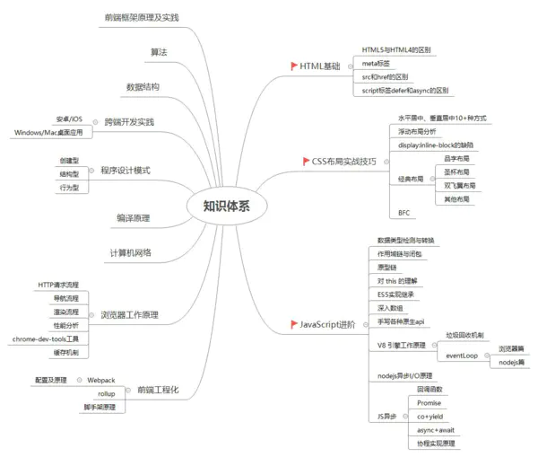

# 前端面试规划

**技术栈掌握程度:**

**「了解」** ⭐

- 会使用/用过

- 了解其思想没有深入了解过

- 简单阅读过该技术的文档或者相关文章，知道这么一个东西

**「熟悉」** ⭐⭐

- 有大量实践

- 有深入了解过原理，甚至阅读过源码

- 遇到复杂问题能够快速想出解决方案

- 他人提出问题时，可以快速想到答案或者思路

**「精通」** ⭐⭐⭐

- 深入理解原理

- 大量复杂场景实践经验

- 大量相关源码经验

- 可以指导他人

（来自[axuebin](https://juejin.im/post/5e91a0a4518825739837bf84)）

## 一、技术

### 1.HTML /CSS

| Title    | Describe                         |
| :------- | :------------------------------- |
| 掌握程度 | ⭐⭐⭐                           |
| 目标要求 | 要懂得透透的，毕竟是基础，扎实点 |

#### 基本布局

#### BFC

#### 语义化

#### 常用属性

#### DOM

#### 动画

#### H5 兼容性

#### less/sass

#### rem/em

#### 移动端布局

#### flex

#### meta/viewport

#### 选择器

### 2.JavaScript

| Title    | Describe                               |
| :------- | :------------------------------------- |
| 掌握程度 | ⭐⭐⭐                                 |
| 目标要求 | 重中之重，多刷红宝书、你不知的 js 系列 |

#### 基本类型、引用类型

#### 闭包

#### 原型、原型链

#### 作用域

#### 拷贝

#### 继承

#### this

#### 对象

#### 数组

#### 字符串

#### bind、apply、call

#### 函数防抖、节流

#### 函数柯里化

#### 异步

#### promise

#### proxy

#### 模块化

#### 正则

#### 垃圾回收

#### cookie/session/localstorage/sessionstorage

#### axios/fetch/ajax

### 3.工具侧

- [vue 核心原理](./vue核心原理.md)

| Title    | Describe                                     |
| :------- | :------------------------------------------- |
| 掌握程度 | ⭐⭐                                         |
| 目标要求 | vue 核心原理：双向绑定、响应式原理等务必掌握 |

#### webpack 核心原理

#### hybrid 原理

#### 性能优化

#### 日志监控

#### yoman 脚手架搭建

#### git

#### typescript

### 4.数据结构与算法

掌握程度：⭐

#### 树/链表/队列/栈/图论

#### 动态规划

#### 回溯

#### 排序算法

#### 分治

#### 尾递归优化/备忘录优化

### 5.计算机网络

掌握程度：⭐

#### http/https

#### tcp/udp

#### 浏览器缓存

#### dns

#### cdn

#### 七层模型

#### 安全

#### 跨域

#### websocket

[Web Worker 文献综述](http://www.alloyteam.com/2020/07/14680/)

### 6.操作系统

掌握程度：⭐

- 进程/线程

### 7.设计模式

掌握程度：⭐

#### 常用设计模式

#### 创建型/结构型/行为型

#### 实际应用

### 8.浏览器原理

掌握程度：⭐

#### 从输入 url 到页面呈现

#### 事件循环/Event loop

#### 强缓存/协商缓存

#### v8 垃圾回收

#### devtools 工具

### 9.Node

掌握程度：⭐

#### express

#### egg

#### nginx

#### mongodb

#### redis

### 10.编译原理

掌握程度：⭐

#### AST 抽象语法树

#### 词法

#### 文法

#### v8

### 11.前沿

| Title    | Describe                             |
| :------- | :----------------------------------- |
| 掌握程度 | ⭐                                   |
| 目标要求 | 可以没用过，但要了解它并知其基本原理 |

#### 微前端

#### webassembly

#### serverles

## 二、项目

### 1.PC

- 区块链 Baas 平台

- 供应链金融平台

- 医药冷链物流监控系统

### 2.webapp

- 感知测试

- 平安校园

## 三、规划

## 四、问题

## 五、文章链接

- [教你如何写初/高级前端简历【赠简历导图】](https://juejin.im/post/5e91a0a4518825739837bf84)
