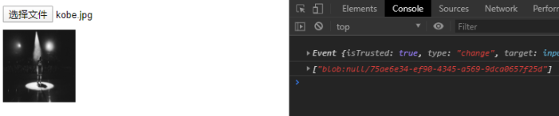
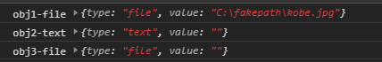
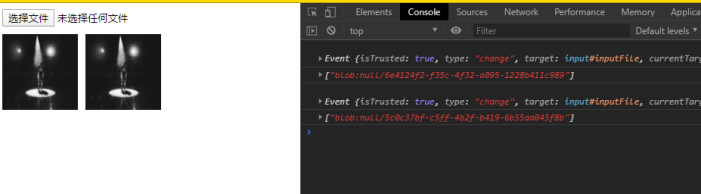

# 003：input 无法连续上传同一文件

## ✨ 问题场景

大部分项目都需要实现文件上传的功能，通常实现都是使用**input 标签**，将其**type 置为 file**，以**监听 change 事件**的方式去获取当前改变的事件源，从而拿到文件。公司项目涉及到的文件类型基本上都是图片类型，因此接下来都以图片类型为例。

先上份可以选择并展示图片的 javascript 代码

```javascript
const input = document.createElement('input');
input.setAttribute('type', 'file');
input.setAttribute('multiple', 'multiple');
input.setAttribute('accept', 'image/*');
document.body.appendChild(input);

input.addEventListener('change', (e) => {
  const files = Array.from(e.target.files);
  const urlList = files.map((item) => {
    return window.webkitURL.createObjectURL(item);
  });
  const frag = document.createDocumentFragment();
  urlList.forEach((url) => {
    const img = document.createElement('img');
    img.setAttribute('src', url);
    frag.appendChild(img);
  });
  document.body.appendChild(frag);
});
```

## 📦 问题原因

代码实现后的效果如下，截图是在选择完一张图片时的界面截图，左侧是展示效果，右侧打印的是图片相关信息。



接下来，我们继续点击选择文件，选择相同的一张图片(kobe.jpg)，操作完后的界面截图如下。


可以看到，再次选择的图片并没有重复出现，右侧控制台也没有任何日志打印。到这里，我们可以发现，input 绑定的`change`事件**是没有被触发。仔细一想，我们**连续两次都是选择的同一张图片，`change事件`当然不会再触发了。问题原因找到了，接下来就是寻找问题的解决办法了。

## 🔨 解决方案

围绕着问题的核心`change事件`，目前发现有以下三种解决方案，方案二、三实现原理是一样的，推荐使用第三种方案，但方案二写的详细点。

### 方案一(每次选择图片创建一个 input 实例)

（tips:据反馈在 IOS 上有兼容性问题，不支持此方式）

这是我最先想到的一个方案，也就是每次选择图片都创建一个的 input 实例，然后立即触发它，接着再监听 onchange 事件。

```javascript
const button = document.createElement('button');
button.textContent = '选择文件';
document.body.appendChild(button);

button.addEventListener('click', (e) => {
  const el = document.createElement('input');
  el.type = 'file';
  el.multiple = 'multiple';
  el.accept = 'image/*';
  el.click();
  el.onchange = () => {
    const { files } = el;
    // do something
  };
});
```

### 方案二(切换 input 的 type 类型，重置 value)

该方案在思路上与方案一有点像，但是解决的方法却完全不同。方案一每次都创建不同的 input 实例。而方案二是根据 input 本身的 type 属性得来的。我们知道，input 的 type 有很多属性，file/button/checkbox/search 等等。那么，当我们改变 input 的 type 时，"change"事件监听的值是不是不一样了。

为什么会这么想呢？我们可以思考一下：当 input 类型为**"text"**类型时，"change"监听的是我们**输入内容**的改变；当 input 类型为 checkbox 时，"change"监听的是我们**选择的值**的改变；那么当 input 类型为**"file"**类型时，"change"事件监听的是我们选择的文件的改变吗?当然不是，监听的是所选择的**文件名的值**的改变。

多说无益，实践出真知。

接下来主要是为了**检测在 input 的 type 类型改变时，input 的值是否改变**。
先放打印内容，代码实现放在图后了。



可以看到上面的控制台输出内容，**在切换 input 的不同 type 类型时,input 的 value 值重置为空字符串了**。

```javascript
const inputFile = document.createElement('input');
inputFile.setAttribute('id', 'inputFile');
document.body.appendChild(inputFile);
inputFile.setAttribute('type', 'file');

inputFile.addEventListener('change', (e) => {
  const obj1 = HTMLElementToObject(inputFile);

  inputFile.setAttribute('type', 'text');
  const obj2 = HTMLElementToObject(inputFile);

  inputFile.setAttribute('type', 'file');
  const obj3 = HTMLElementToObject(inputFile);

  console.log('obj1-file', getTypeAndValue(obj1));
  console.log('obj2-text', getTypeAndValue(obj2));
  console.log('obj3-file', getTypeAndValue(obj3));
});

// 将元素属性存到空对象中，方便打印时查看属性
function HTMLElementToObject(element) {
  const obj = {};
  for (let k in element) {
    obj[k] = element[k];
  }
  return obj;
}
function getTypeAndValue(obj) {
  const { type, value } = obj;
  return { type, value };
}
```

那么，我们便可以通过切换 input 的 type 属性，去初始化 input 的 value 值了。这样，相同图片的连续选择，"change"事件也能监听到了！



**最终实现代码：**

```javascript
const input = document.createElement('input');
input.setAttribute('type', 'file');
input.setAttribute('id', 'inputFile');
document.body.appendChild(input);

input.addEventListener('change', (e) => {
  const files = Array.from(e.target.files);
  const urls = files.map((item) => {
    return window.webkitURL.createObjectURL(item);
  });
  const img = document.createElement('img');

  img.setAttribute('src', urls[0]);
  document.body.appendChild(img);
  input.setAttribute('type', '');
  input.setAttribute('type', 'file');
  console.log(urls);
});
```

### 方案三(直接重置 input 的 value)

想到方案二的时候，并没意识到可以直接重置**input 的 value**。但是方案二也是一种解决的方案嘛！！！
直接上代码。

```javascript
const input = document.createElement('input');
input.setAttribute('type', 'file');
input.setAttribute('id', 'inputFile');
document.body.appendChild(input);

input.addEventListener('change', (e) => {
  const files = Array.from(e.target.files);
  const urls = files.map((item) => {
    return window.webkitURL.createObjectURL(item);
  });
  const img = document.createElement('img');

  img.setAttribute('src', urls[0]);
  document.body.appendChild(img);
  input.value = '';
  console.log(urls);
});
```

## 🔗 Links

[在线简易 DEMO](http://zzcyes.com/input[type=file].html)
