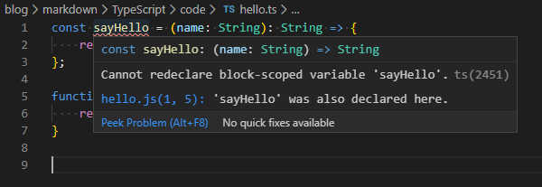

# 004.TypeScript

## Cannot redeclare block-scoped variable 'xxx'.ts(2451)

hello.ts

```typescript
const sayHello = (name: String): String => {
  return 'hello' + name;
};

function sayHi(name: String): String {
  return 'Hi' + name;
}
```

报错信息如下

```
Cannot redeclare block-scoped variable 'sayHello'.ts(2451)
hello.js(1, 5): 'sayHello' was also declared here.
```



大意是 sayHello 已经被申明了，不能再重新定义。

### Reason

经过查资料，typescript 使用 DOM typings 作为全局执行上下文。全局环境下就极有可能随时出现命名问题，所以 typescript 会提示这样的错误。

### Solution

1. 使当前文件被视为模块文件，如果没有中确实不需要 import 或者 export 任何内容。可以直接声明一个 export{};

hello.ts

```typescript
const sayHello = (name: String): String => {
  return 'hello' + name;
};

function sayHi(name: String): String {
  return 'Hi' + name;
}

export default { sayHello, sayHi };
```

2. 在 tsconfig.json 文件中添加如下内容，这样设置使得编译器不包含 DOM typings。(目前不是很清楚这里的原因和理由，这样设置会不会带来其他问题呢？)

```json
{
  "compilerOptions": {
    "lib": ["es2015"]
  }
}
```

### Links

- [Cannot redeclare block-scoped variable 'name' ](https://github.com/Microsoft/vscode/issues/22436)

- [Cannot redeclare block-scoped variable](https://www.cnblogs.com/Jamie1032797633/p/11131835.html)
