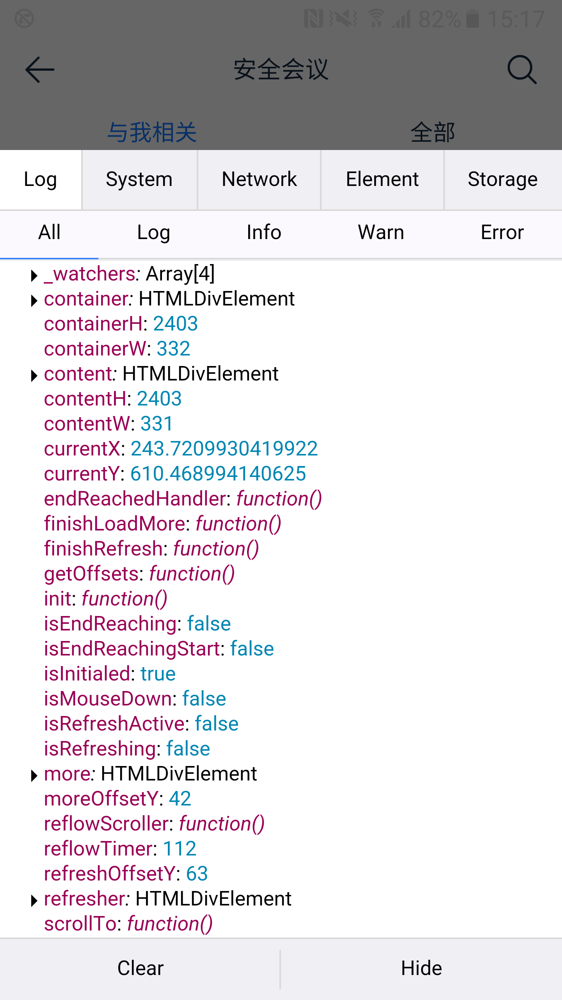

# mand-ui-scroll-view滚动异常

如想在线调试，请点击直达👉[https://codesandbox.io/s/scroll-view-drnvl](https://codesandbox.io/s/scroll-view-drnvl)

## 问题场景

在某些安卓老机型（ios暂未测试）上， `scroll-view` 滚动异常，无法上滑查看更多内容。

直接上代码:
```html
<template>
    <div class="home-wrapper">
        <header>header</header>
        <main>
            <ui-scroll-view :scrolling-x="false"
                            auto-reflow>
                <div v-for="index in 1000"
                     :key="index">{{index}}</div>
            </ui-scroll-view>
        </main>
        <footer>footer</footer>
    </div>
</template>

<script>
import { ScrollView } from 'mtapp-ui';

export default {
    name: 'home',
    components: {
        [ScrollView.name]: ScrollView,
    },
};
</script>

<style lang="less" scoped>
.home-wrapper {
  	@bar-height: 1rem;

    display: flex;
    flex-direction: column;
    height: 100%;
    overflow: hidden;

    header,
    footer {
        height: @bar-height;
        line-height: @bar-height;
        font-size: 0.36rem;
        text-align: center;
    }

    main {
        flex:1;
        padding: 0.22rem 0.3rem;
        overflow-x: hidden;
        background-color: #f6f7f9;
    }
}
</style>

```
## 问题原因

可以看到，页面使用flex布局， `header` 和 `footer` 都是固定高度，其中 `main` 为自适应高度并支持y轴滚动。 `scroll-view` 也放在 `main` 容器内。

我们在部分机型遇到这个问题，分析后大致（资源有限，无法穷尽）得出为老机型会有这个问题。

| **机型** | **操作系统** | **版本号** |
| --- | --- | --- |
| 三星s7 | Android | 6.0.1 |
| 乐视 | Android |  |

[Mand Mobile 官方文档](https://mand-mobile.gitee.io/docs/index.gitee.html#/zh-CN/docs/components/gesture/scroll-view) 提供如下解决方案：

首先，大多数滚动异常的情况是由于容器尺寸（垂直滚动：高度，水平滚动：宽度）的问题导致，容器的高度可以通过**固定尺寸**，**流式布局**，**flex布局**等多种方式控制，当容器尺寸不足时会导致内部[Scroller初始化](https://github.com/didi/mand-mobile/blob/master/components/scroll-view/index.vue#L374)异常。当出现此类情况时，可通过浏览器元素查看器检查容器元素的**`.md-scroll-view`**高度是否正确。

其次，确认是否存在动态变更滚动区域内容，导致滚动区域尺寸变化，此时需调用`reflowScroller`或者直接将`auto-reflow`设置为`true`。

从官方文档提供的解决方案可以判断，滚动异常大概率为容器尺寸的问题导致，因为移动端不便于查看**`.md-scroll-view`**高度。接下来分析[scroll-view 源码](https://github.com/didi/mand-mobile/blob/master/components/scroll-view/index.vue#L374)，发现 `containerH` 、 `contentH` 这两个属性分别 `scroll-view` 的容器高度、内容高度。


于是，在老机型的安卓手机下打印了 `scroll-view` 相关信息，如下截图： 


在滚动异常的容器截图信息中，我们得到  `containerH` 、 `contentH` 均为 `2403` ，即 `scroll-view` 容器和内容高度均为 `2403` 。而此时`main` 高度为 `527` ，很明显  `containerH` 、 `contentH`  是异常高度。


简单的说，这意味着我们使用的**flex布局**在这些老机型下失效了（具体原因，有时间再探究）。

## 解决方案

**给scroll-view容器设置固定高度**

我们常用布局都是 `flex` 布局，基本上 `header` 和 `footer` 固定， `main` 通过设置 `flex:1` 去自适应撑满页面高度。


如果使用 `scroll-view` 出现了滚动异常问题，那么，我们可以通过其他设置高度的方案来替代 `flex:1` ，如：
通过 `calc` 计算 `main` 的高度等等。
```javascript
<style lang="less" scoped>
.home-wrapper {
  	@bar-height: 1rem;

    display: flex;
    flex-direction: column;
    height: 100%;
    overflow: hidden;

    header,
    footer {
        height: @bar-height;
        line-height: @bar-height;
        font-size: 0.36rem;
        text-align: center;
    }

    main {
        // 写在flex前面，正常情况会被flex覆盖，低版本下flex:1不生效。
        height: calc(100% - 2*@bar-height);
        flex:1;
        padding: 0.22rem 0.3rem;
        overflow-x: hidden;
        background-color: #f6f7f9;
    }
}
</style>
```
