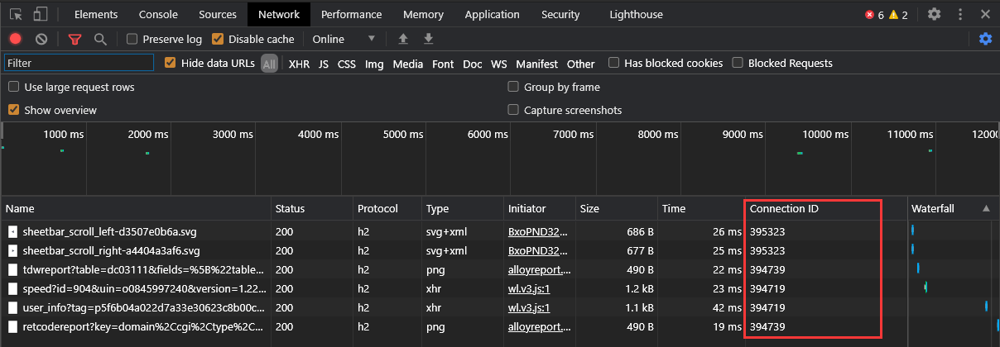

# 007.Chrome Developer Tools Connection ID

## 问题

Chrome Developer Tools 中 Network 选项卡中的列表，`Connetion ID` 一列的含义及作用分别是什么？

如图：



## 解答

HTTP在幕后使用称为TCP的网络协议。 浏览器维护 `pools of TCP sockets and connections`。DevTools中的`Connection ID`指的是特定的TCP连接。

- 在第一次看到一个特定连接ID，一个新的连接将（可能）需要通过一个所谓的建立TCP握手。由于性能原因，这一点很重要，因为TCP握手会产生较大的网络开销。我们正在创建一个新的连接，因此需要更长的时间才能获得HTTP响应。

- 然而，对于随后的时间，你看到的是同一个ID，这个开销不会发生。也就是说，浏览器不需要执行TCP握手，而是可以重用相同的连接。这里我们说TCP连接仍然是“开放的”。已经建立的连接可以更快地获取HTTP响应数据。

因此，这些数字基本上可以帮助检查/调试TCP握手是否导致网络开销。

For example:

```
Name      Connection ID    (TCP Handshake / Reused Connection)
foo.jpg   72218            Handshake
bar.jpg   72218            Reused
cat.jpg   79146            Handshake
baz.jpg   72218            Reused
dog.jpg   79146            Reused
```

在这里，下载`foo.jpg`和`cat.jpg`会带来开销，因为TCP握手需要分别设置连接`72218`和`79146`。但是`bar.jpg`、`baz.jpg`和`dog.jpg`没有开销，因为它们在重用各自的TCP连接。

Note 1: 这种重用TCP连接以避免重复的TCP握手的想法是HTTP 1.1的一个特性，称为[Persistent Connections](https://en.wikipedia.org/wiki/HTTP_persistent_connection) **^[1]^**。默认情况下，所有HTTP 1.1连接都使用持久连接，所有现代浏览器都使用HTTP 1.1。有关更多信息，可以阅读[High Performance Browser Networking](https://hpbn.co/)**^[2]^** 的第11章和第14章。

Note 2：如果HTTP请求需要进行TCP握手，则您会在DevTools waterfall中看到一个橙色条，如果将鼠标悬停在该栏中，则会看到“Initial connection”——这告诉您握手花费了多长时间以毫秒为单位。


TCP连接可能会在选项卡和窗口之间重复使用，因此请当心——您可能会第一次看到一个ID，但可能没有TCP握手！


这可能是因为您以前访问过该页面并打开了与该主机的连接。也可能是因为Chrome浏览器从主机中预取了资源。

例如，当您在栏中键入地址时，Chrome浏览器会预取了一个网站图标。


## links

- [《Chrome Developer Tools Connection ID》 stackoverflow](https://stackoverflow.com/questions/34184994/chrome-developer-tools-connection-id)

- [1] [《HTTP persistent connection》 wikipedia](https://en.wikipedia.org/wiki/HTTP_persistent_connection)

- [2] [High Performance Browser Networking](https://hpbn.co/)
