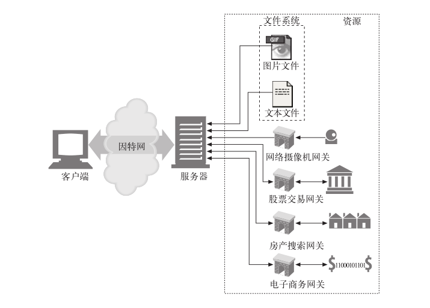

# 003.HTTP权威指南

## 一、HTTP:Web的基础

### 1. HTTP概述

#### 1.3 资源

Web 服务器是 Web 资源（Web resource）的宿主。Web 资源是 Web 内容的源头。
最简单的 Web 资源就是 Web 服务器文件系统中的静态文件。

但资源不一定非得是静态文件。资源还可以是根据需要生成内容的软件程序。这些
动态内容资源可以根据你的身份、所请求的信息或每天的不同时段来产生内容。

总之，所有类型的内容来源都是资源。

##### 1.3.1 媒体类型

因特网上有数千种不同的数据类型，HTTP 仔细地给每种要通过 Web 传输的对
象都打上了名为 MIME 类型（MIME type）的数据格式标签。最初设计 MIME
（Multipurpose Internet Mail Extension，多用途因特网邮件扩展）是为了解决在不同的电子邮件系统之间搬移报文时存在的问题。MIME 在电子邮件系统中工作得非常好，因此 HTTP 也采纳了它，用它来描述并标记多媒体内容。

Web 服务器会为所有 HTTP 对象数据附加一个 MIME 类型。当 Web浏览器从服务器中取回一个对象时，会去查看相关的 MIME 类型，看看它是否知道应该如何处理这个对象。大多数浏览器都可以处理数百种常见的对象类型：显示图片文件、解析并格式化 HTML 文件、通过计算机声卡播放音频文件，或者运行外部插件软件来处理特殊格式的数据。

MIME 类型是一种文本标记，表示一种主要的对象类型和一个特定的子类型，中间由一条斜杠来分隔。

- HTML 格式的文本文档由 `text/html` 类型来标记。

- 普通的 ASCII 文本文档由 `text/plain` 类型来标记。

- JPEG 格式的图片为 `image/jpeg` 类型。

- GIF 格式的图片为 `image/gif` 类型。

- Apple 的 QuickTime 电影为 `video/quicktime` 类型。

- 微软的 PowerPoint 演示文件为 `application/vnd.ms-powerpoint` 类型。

常见的 MIME 类型有数百个，实验性或用途有限的 MIME 类型则更多。[附录D(page 579)](../../pdf/http-the-definitive-guide.pdf)提供了一个非常完整的 MIME 类型列表。

##### 1.3.2 URI

##### 1.3.3 URL

##### 1.3.4 URN 

#### 事务

#### 报文

#### 连接

#### 协议版本

#### web的结构组件

### 2. URL与资源

### 3. HTTP报文

### 4. 连接管理

## 二、HTTP结构

## 三、识别、认证与安全

## 四、实体、编码和国际化

## 五、内容发布与分发