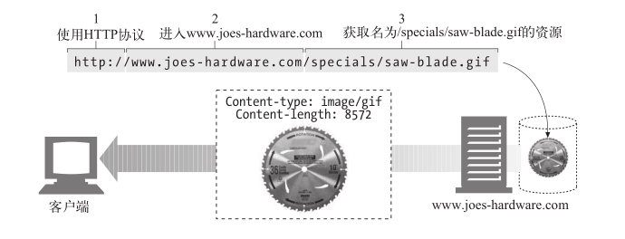
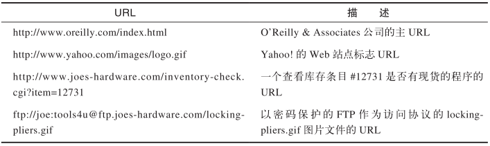
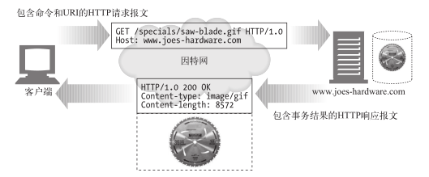
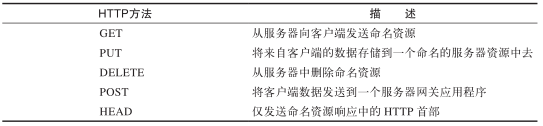
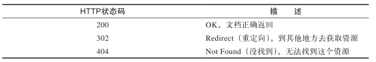
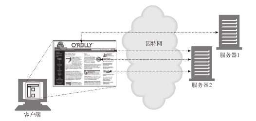
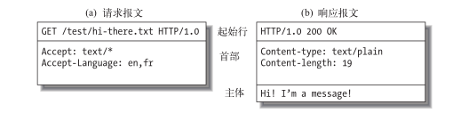

# 003.HTTP权威指南

## 一、HTTP:Web的基础

### 1. HTTP概述

#### 1.3 资源

Web 服务器是 Web 资源（Web resource）的宿主。Web 资源是 Web 内容的源头。最简单的 Web 资源就是 Web 服务器文件系统中的静态文件。

但资源不一定非得是静态文件。资源还可以是根据需要生成内容的软件程序。这些动态内容资源可以根据你的身份、所请求的信息或每天的不同时段来产生内容。

总之，所有类型的内容来源都是资源。

##### 1.3.1 媒体类型

因特网上有数千种不同的数据类型，HTTP 仔细地给每种要通过 Web 传输的对象都打上了名为 MIME 类型（MIME type）的数据格式标签。最初设计 MIME（Multipurpose Internet Mail Extension，多用途因特网邮件扩展）是为了解决在不同的电子邮件系统之间搬移报文时存在的问题。MIME 在电子邮件系统中工作得非常好，因此 HTTP 也采纳了它，用它来描述并标记多媒体内容。

Web 服务器会为所有 HTTP 对象数据附加一个 MIME 类型。当 Web浏览器从服务器中取回一个对象时，会去查看相关的 MIME 类型，看看它是否知道应该如何处理这个对象。大多数浏览器都可以处理数百种常见的对象类型：显示图片文件、解析并格式化 HTML 文件、通过计算机声卡播放音频文件，或者运行外部插件软件来处理特殊格式的数据。

MIME 类型是一种文本标记，表示一种主要的对象类型和一个特定的子类型，中间由一条斜杠来分隔。

- HTML 格式的文本文档由 `text/html` 类型来标记。

- 普通的 ASCII 文本文档由 `text/plain` 类型来标记。

- JPEG 格式的图片为 `image/jpeg` 类型。

- GIF 格式的图片为 `image/gif` 类型。

- Apple 的 QuickTime 电影为 `video/quicktime` 类型。

- 微软的 PowerPoint 演示文件为 `application/vnd.ms-powerpoint` 类型。

常见的 MIME 类型有数百个，实验性或用途有限的 MIME 类型则更多。[附录D(page 579)](../../pdf/http-the-definitive-guide.pdf)提供了一个非常完整的 MIME 类型列表。

##### 1.3.2 URI

每个 Web 服务器资源都有一个名字，这样客户端就可以说明它们感兴趣的资源是什么了。服务器资源名被称为**统一资源标识符**（Uniform Resource Identifier，URI）。

URI 就像因特网上的邮政地址一样，在世界范围内唯一标识并定位信息资源。这是 Joe 的五金商店的 Web 服务器上一个图片资源的 URI：
http://www.joes-hardware.com/specials/saw-blade.gif

下图显示了 URI 是怎样指示 HTTP 协议去访问 Joe 商店服务器上的图片资源的。

给定了 URI，HTTP 就可以解析出对象。URI 有两种形式，分别称为 URL 和 URN。现在我们分别来看看这些资源标识符类型。

>WiKi: 自2005年RFC 3986起，在技术标准中已不赞成使用术语“统一资源名称（URN）”和“统一资源定位符(URL)”，而是使用术语“统一资源标识符（URI）”，该术语将两者都包含在内。

##### 1.3.3 URL

**统一资源定位符**（Uniform Resource Locator）是资源标识符最常见的形式。URL 描述了一台特定服务器上某资源的特定位置。它们可以明确说明如何从一个精确、固定的位置获取资源。

URL实例:

大部分 URL 都遵循一种标准格式，这种格式包含三个部分。

- URL 的第一部分被称为方案（scheme），说明了访问资源所使用的协议类型。这
部分通常就是 HTTP 协议（http://）。

- 第二部分给出了服务器的因特网地址（比如，www.joes-hardware.com）。 

- 其余部分指定了 Web 服务器上的某个资源（比如，/specials/saw-blade.gif）。 

现在，几乎所有的 URI 都是 URL。

##### 1.3.4 URN 

URI 的第二种形式就是**统一资源名**（Uniform Resource Name）。URN 是作为特定内容的唯一名称使用的，与目前的资源所在地无关。使用这些与位置无关的 URN，就可以将资源四处搬移。通过URN，还可以用同一个名字通过多种网络访问协议来访问资源。

#### 1.4 事务

我们来更仔细地看看客户端是怎样通过 HTTP 与 Web 服务器及其资源进行事务处理
的。一个 HTTP 事务由一条（从客户端发往服务器的）请求命令和一个（从服务器
发回客户端的）响应结果组成。这种通信是通过名为 HTTP 报文（HTTP message）
的格式化数据块进行的，如图所示：

#### 1.4.1 方法

HTTP 支持几种不同的请求命令，这些命令被称为 HTTP 方法（HTTP method）。每
条 HTTP 请求报文都包含一个方法。这个方法会告诉服务器要执行什么动作（获取
一个 Web 页面、运行一个网关程序、删除一个文件等）。

常见HTTP方法：

#### 1.4.2 状态码

每条 HTTP 响应报文返回时都会携带一个状态码。状态码是一个三位数字的代码，告知客户端请求是否成功，或者是否需要采取其他动作。

常见的状态码：

伴随着每个数字状态码，HTTP 还会发送一条解释性的“原因短语”文本。包含文本短语主要是为了进行描述，所有的处理过程使用的都
是数字码。

HTTP 软件处理下列状态码和原因短语的方式是一样的。

200 OK
200 Document attached
200 Success
200 All’s cool, dude

#### 1.4.3 Web页面中可以包含多个对象

应用程序完成一项任务时通常会发布多个 HTTP 事务。比如，Web 浏览器会发布一系列 HTTP 事务来获取并显示一个包含了丰富图片的 Web 页面。浏览器会执行一个事务来获取描述页面布局的 HTML“框架”，然后发布另外的 HTTP 事务来获取每个嵌入式图片、图像面板、Java 小程序等。这些嵌入式资源甚至可能位于不同的服务器上。

因此，一个“Web 页面”通常并不是单个资源，而是一组资源的集合。

#### 1.5 报文

现在我们来快速浏览一下 HTTP 请求和响应报文的结构。第 3 章会深入研究 HTTP
报文。
HTTP 报文是由一行一行的简单字符串组成的。HTTP 报文都是纯文本，不是二进
制代码，所以人们可以很方便地对其进行读写
1 。图 1-7 显示了一个简单事务所使用
的 HTTP 报文。

#### 1.6 连接

##### 1.6.1 TCP/IP

HTTP 是个应用层协议。HTTP 无需操心网络通信的具体细节；它把联网的细节都
交给了通用、可靠的因特网传输协议 TCP/IP。
TCP 提供了：

- 无差错的数据传输； 

- 按序传输（数据总是会按照发送的顺序到达）； 

- 未分段的数据流（可以在任意时刻以任意尺寸将数据发送出去）。 

因特网自身就是基于 TCP/IP 的，TCP/IP 是全世界的计算机和网络设备常用的层次
化分组交换网络协议集。TCP/IP 隐藏了各种网络和硬件的特点及弱点，使各种类型
的计算机和网络都能够进行可靠地通信。

只要建立了 TCP 连接，客户端和服务器之间的报文交换就不会丢失、不会被破坏，
也不会在接收时出现错序了。

用网络术语来说，HTTP 协议位于 TCP 的上层。HTTP 使用 TCP 来传输其报文数
据。与之类似，TCP 则位于 IP 的上层。

##### 1.6.2 连接、IP地址及端口号

##### 1.6.3 使用Telnet实例

#### 协议版本

#### web的结构组件

### 2. URL与资源

### 3. HTTP报文

### 4. 连接管理

## 二、HTTP结构

## 三、识别、认证与安全

## 四、实体、编码和国际化

## 五、内容发布与分发