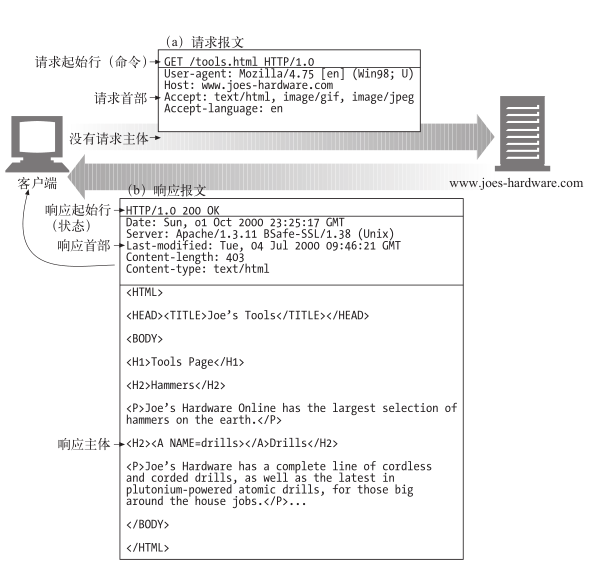
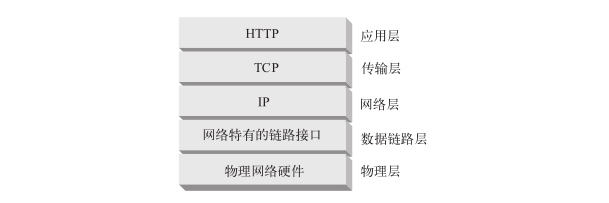
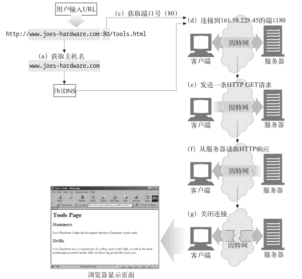

# 003.HTTP权威指南

## 一、HTTP:Web的基础

### 1. HTTP概述

#### 1.3 资源

Web 服务器是 Web 资源（Web resource）的宿主。Web 资源是 Web 内容的源头。最简单的 Web 资源就是 Web 服务器文件系统中的静态文件。

但资源不一定非得是静态文件。资源还可以是根据需要生成内容的软件程序。这些动态内容资源可以根据你的身份、所请求的信息或每天的不同时段来产生内容。

总之，所有类型的内容来源都是资源。

##### 1.3.1 媒体类型

因特网上有数千种不同的数据类型，HTTP 仔细地给每种要通过 Web 传输的对象都打上了名为 MIME 类型（MIME type）的数据格式标签。最初设计 MIME（Multipurpose Internet Mail Extension，多用途因特网邮件扩展）是为了解决在不同的电子邮件系统之间搬移报文时存在的问题。MIME 在电子邮件系统中工作得非常好，因此 HTTP 也采纳了它，用它来描述并标记多媒体内容。

Web 服务器会为所有 HTTP 对象数据附加一个 MIME 类型。当 Web浏览器从服务器中取回一个对象时，会去查看相关的 MIME 类型，看看它是否知道应该如何处理这个对象。大多数浏览器都可以处理数百种常见的对象类型：显示图片文件、解析并格式化 HTML 文件、通过计算机声卡播放音频文件，或者运行外部插件软件来处理特殊格式的数据。

MIME 类型是一种文本标记，表示一种主要的对象类型和一个特定的子类型，中间由一条斜杠来分隔。

- HTML 格式的文本文档由 `text/html` 类型来标记。

- 普通的 ASCII 文本文档由 `text/plain` 类型来标记。

- JPEG 格式的图片为 `image/jpeg` 类型。

- GIF 格式的图片为 `image/gif` 类型。

- Apple 的 QuickTime 电影为 `video/quicktime` 类型。

- 微软的 PowerPoint 演示文件为 `application/vnd.ms-powerpoint` 类型。

常见的 MIME 类型有数百个，实验性或用途有限的 MIME 类型则更多。[附录D(page 579)](../../pdf/http-the-definitive-guide.pdf)提供了一个非常完整的 MIME 类型列表。

##### 1.3.2 URI

每个 Web 服务器资源都有一个名字，这样客户端就可以说明它们感兴趣的资源是什么了。服务器资源名被称为**统一资源标识符**（Uniform Resource Identifier，URI）。

URI 就像因特网上的邮政地址一样，在世界范围内唯一标识并定位信息资源。这是 Joe 的五金商店的 Web 服务器上一个图片资源的 URI：
http://www.joes-hardware.com/specials/saw-blade.gif

下图显示了 URI 是怎样指示 HTTP 协议去访问 Joe 商店服务器上的图片资源的。

给定了 URI，HTTP 就可以解析出对象。URI 有两种形式，分别称为 URL 和 URN。现在我们分别来看看这些资源标识符类型。

>WiKi: 自2005年RFC 3986起，在技术标准中已不赞成使用术语“统一资源名称（URN）”和“统一资源定位符(URL)”，而是使用术语“统一资源标识符（URI）”，该术语将两者都包含在内。

##### 1.3.3 URL

**统一资源定位符**（Uniform Resource Locator）是资源标识符最常见的形式。URL 描述了一台特定服务器上某资源的特定位置。它们可以明确说明如何从一个精确、固定的位置获取资源。

URL实例:

大部分 URL 都遵循一种标准格式，这种格式包含三个部分。

- URL 的第一部分被称为方案（scheme），说明了访问资源所使用的协议类型。这
部分通常就是 HTTP 协议（http://）。

- 第二部分给出了服务器的因特网地址（比如，www.joes-hardware.com）。

- 其余部分指定了 Web 服务器上的某个资源（比如，/specials/saw-blade.gif）。

现在，几乎所有的 URI 都是 URL。

##### 1.3.4 URN

URI 的第二种形式就是**统一资源名**（Uniform Resource Name）。URN 是作为特定内容的唯一名称使用的，与目前的资源所在地无关。使用这些与位置无关的 URN，就可以将资源四处搬移。通过URN，还可以用同一个名字通过多种网络访问协议来访问资源。

#### 1.4 事务

我们来更仔细地看看客户端是怎样通过 HTTP 与 Web 服务器及其资源进行事务处理的。一个 HTTP 事务由一条（从客户端发往服务器的）请求命令和一个（从服务器发回客户端的）响应结果组成。这种通信是通过名为 HTTP 报文（HTTP message）的格式化数据块进行的，如图所示：

#### 1.4.1 方法

HTTP 支持几种不同的请求命令，这些命令被称为 HTTP 方法（HTTP method）。每条 HTTP 请求报文都包含一个方法。这个方法会告诉服务器要执行什么动作（获取一个 Web 页面、运行一个网关程序、删除一个文件等）。

常见HTTP方法：

#### 1.4.2 状态码

每条 HTTP 响应报文返回时都会携带一个状态码。状态码是一个三位数字的代码，告知客户端请求是否成功，或者是否需要采取其他动作。

常见的状态码：

伴随着每个数字状态码，HTTP 还会发送一条解释性的“原因短语”文本。包含文本短语主要是为了进行描述，所有的处理过程使用的都是数字码。

HTTP 软件处理下列状态码和原因短语的方式是一样的。

200 OK
200 Document attached
200 Success
200 All’s cool, dude

#### 1.4.3 Web页面中可以包含多个对象

应用程序完成一项任务时通常会发布多个 HTTP 事务。比如，Web 浏览器会发布一系列 HTTP 事务来获取并显示一个包含了丰富图片的 Web 页面。浏览器会执行一个事务来获取描述页面布局的 HTML“框架”，然后发布另外的 HTTP 事务来获取每个嵌入式图片、图像面板、Java 小程序等。这些嵌入式资源甚至可能位于不同的服务器上。

因此，一个“Web 页面”通常并不是单个资源，而是一组资源的集合。

#### 1.5 报文

现在我们来快速浏览一下 HTTP 请求和响应报文的结构。第 3 章会深入研究 HTTP报文。

HTTP 报文是由一行一行的简单字符串组成的。HTTP 报文都是纯文本，不是二进制代码1，所以人们可以很方便地对其进行读写。下图显示了一个简单事务所使用的 HTTP 报文。

注1：有些程序员会抱怨 HTTP 的语法解析太困难了，这项工作需要很多技巧，而且很容易出错，尤其是在设计高速软件的时候更是如此。二进制格式或更严格的文本格式可能更容易处理，但大多数 HTTP 程序员都很欣赏 HTTP 的可扩展性以及可调试性。

从 Web 客户端发往 Web 服务器的 HTTP 报文称为请求报文（request message）。从服务器发往客户端的报文称为响应报文（response message），此外没有其他类型的HTTP 报文。HTTP 请求和响应报文的格式很类似。

HTTP 报文包括以下三个部分:

- 起始行

报文的第一行就是起始行，在请求报文中用来说明要做些什么，在响应报文中说明出现了什么情况。

- 首部字段

起始行后面有零个或多个首部字段。每个首部字段都包含一个名字和一个值，为了便于解析，两者之间用冒号（:）来分隔。首部以一个空行结束。添加一个首部字段和添加新行一样简单。

- 主体

空行之后就是可选的报文主体了，其中包含了所有类型的数据。请求主体中包括了要发送给 Web 服务器的数据；响应主体中装载了要返回给客户端的数据。起始行和首部都是文本形式且都是结构化的，而主体则不同，主体中可以包含任意的二进制数据（比如图片、视频、音轨、软件程序）。当然，主体中也可以包含文本。

简单的报文实例:

下图显示了可能会作为某个简单事务的一部分发送的 HTTP 报文。浏览器请求资源 http://www.joes-hardware.com/tools.html。
在图中，浏览器发送了一条 HTTP 请求报文。这条请求的起始行中有一个 GET命令，且本地资源为 /tools.html。这条请求说明它使用的是 1.0 版的 HTTP 协议。请求报文没有主体，因为从服务器上 GET 一个简单的文档不需要请求数据。服务器会回送一条 HTTP 响应报文。这条响应中包含了 HTTP 的版本号（HTTP/1.0）、一个成功状态码（200）、一个描述性的原因短语（OK），以及一块响应首部字段，在所有这些内容之后跟着包含了所请求文档的响应主体。 Content-Length 首部说明了响应主体的长度， Content-Type 首部说明了文档的 MIME 类型。

#### 1.6 连接

##### 1.6.1 TCP/IP

HTTP 是个应用层协议。HTTP 无需操心网络通信的具体细节；它把联网的细节都交给了通用、可靠的因特网传输协议 TCP/IP。

TCP 提供了：

- 无差错的数据传输；

- 按序传输（数据总是会按照发送的顺序到达）；

- 未分段的数据流（可以在任意时刻以任意尺寸将数据发送出去）。

因特网自身就是基于 TCP/IP 的，TCP/IP 是全世界的计算机和网络设备常用的层次化分组交换网络协议集。TCP/IP 隐藏了各种网络和硬件的特点及弱点，使各种类型的计算机和网络都能够进行可靠地通信。

只要建立了 TCP 连接，客户端和服务器之间的报文交换就不会丢失、不会被破坏，也不会在接收时出现错序了。

用网络术语来说，HTTP 协议位于 TCP 的上层。HTTP 使用 TCP 来传输其报文数据。与之类似，TCP 则位于 IP 的上层。

HTTP 网络协议栈：

##### 1.6.2 连接、IP地址及端口号

在 HTTP 客户端向服务器发送报文之前，需要用网际协议（Internet Protocol，IP）地址和端口号在客户端和服务器之间建立一条 TCP/IP 连接。

在 TCP 中，你需要知道服务器的 IP 地址，以及与服务器上运行的特定软件相关的TCP 端口号。

这就行了，但最初怎么获得 HTTP 服务器的 IP 地址和端口号呢？当然是通过 URL了！我们前面曾提到过，URL 就是资源的地址，所以自然能够为我们提供存储资源的机器的 IP 地址。我们来看几个 URL：

http://207.200.83.29:80/index.html

http://www.netscape.com:80/index.html

http://www.netscape.com/index.html

第一个 URL 使用了机器的 IP 地址，207.200.83.29 以及端口号 80。

第二个 URL 没有使用数字形式的 IP 地址，它使用的是文本形式的域名，或者称为主机名（www.netscape.com）。主机名就是 IP 地址比较人性化的别称。可以通过一种称为域名服务（Domain Name Service，DNS）的机制方便地将主机名转换为 IP地址，这样所有问题就都解决了。第 2 章会介绍更多有关 DNS 和 URL 的内容。

最后一个 URL 没有端口号。HTTP 的 URL 中没有端口号时，可以假设默认端口号是 80。有了 IP 地址和端口号，客户端就可以很方便地通过 TCP/IP 进行通信了。下图显示了浏览器是怎样通过 HTTP 显示位于远端服务器中的某个简单 HTML 资源的。

步骤如下：
(a) 浏览器从 URL 中解析出服务器的主机名；
(b) 浏览器将服务器的主机名转换成服务器的 IP 地址；
(c) 浏览器将端口号（如果有的话）从 URL 中解析出来；
(d) 浏览器建立一条与 Web 服务器的 TCP 连接；
(e) 浏览器向服务器发送一条 HTTP 请求报文；
(f) 服务器向浏览器回送一条 HTTP 响应报文；
(g) 关闭连接，浏览器显示文档。

#### 1.7 协议版本

现在使用的 HTTP 协议有几个版本。HTTP 应用程序要尽量强健地处理各种不同的
HTTP 协议变体。目前仍在使用的版本如下。

- HTTP/0.9

HTTP 的 1991 原型版本称为 HTTP/0.9。这个协议有很多严重的设计缺陷，只应该用于与老客户端的交互。HTTP/0.9 只支持 GET 方法，不支持多媒体内容的MIME 类型、各种 HTTP 首部，或者版本号。HTTP/0.9 定义的初衷是为了获取
简单的 HTML 对象，它很快就被 HTTP/1.0 取代了。

- HTTP/1.0

1.0 是第一个得到广泛使用的 HTTP 版本。HTTP/1.0 添加了版本号、各种 HTTP首部、一些额外的方法，以及对多媒体对象的处理。HTTP/1.0 使得包含生动图片的 Web 页面和交互式表格成为可能，而这些页面和表格促使万维网为人们广泛地接受。这个规范从未得到良好地说明。在这个 HTTP 协议的商业演进和学术研究都在快速进行的时代，它集合了一系列的最佳实践。

- HTTP/1.0+

在 20 世纪 90 年代中叶，很多流行的 Web 客户端和服务器都在飞快地向 HTTP
中添加各种特性，以满足快速扩张且在商业上十分成功的万维网的需要。其中很
多特性，包括持久的 keep-alive 连接、虚拟主机支持，以及代理连接支持都被加
入到 HTTP 之中，并成为非官方的事实标准。这种非正式的 HTTP 扩展版本通常
称为 HTTP/1.0+。

- HTTP/1.1

HTTP/1.1 重点关注的是校正 HTTP 设计中的结构性缺陷，明确语义，引入重要的性能优化措施，并删除一些不好的特性。HTTP/1.1 还包含了对 20 世纪 90 年代末正在发展中的更复杂的 Web 应用程序和部署方式的支持。HTTP/1.1 是当前
使用的 HTTP 版本。

- HTTP-NG（又名 HTTP/2.0）

HTTP-NG 是 HTTP/1.1 后继结构的原型建议，它重点关注的是性能的大幅优化，以及更强大的服务逻辑远程执行框架。HTTP-NG 的研究工作终止于 1998 年，编写本书时，还没有任何要用此建议取代 HTTP/1.1 的推广计划。

#### web的结构组件

### 2. URL与资源

### 3. HTTP报文

### 4. 连接管理

## 二、HTTP结构

## 三、识别、认证与安全

## 四、实体、编码和国际化

## 五、内容发布与分发
