# 002.Vue-Router

## 前言

思维导图（来自[biaochenxuying](https://github.com/biaochenxuying/vue-family-mindmap)）：

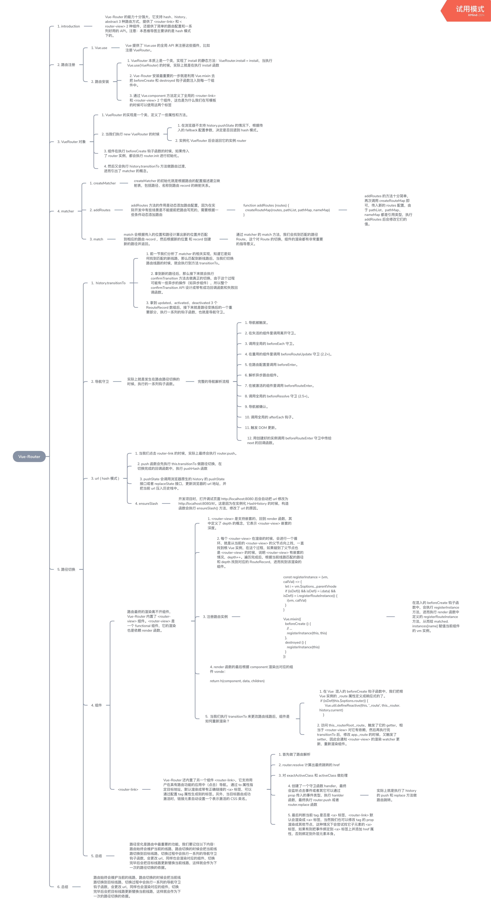

## 目标

- 路由注册

- VueRouter 对象

- matcher

- 路径切换

## 源码调试

一般项目中的`vue-router`是通过`npm`包引入的，如果用 `vscode`，可以通过快捷键 `alt` + `click` 直接跳转到包的位置。

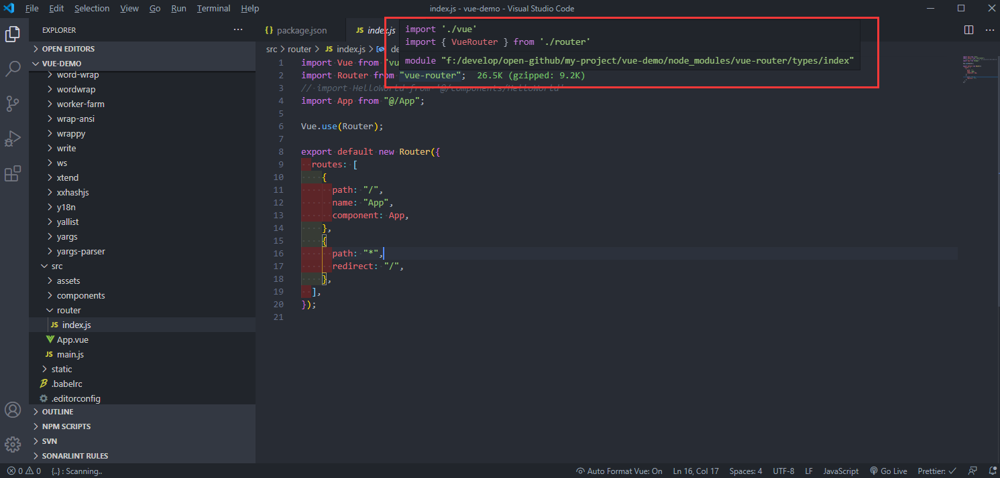

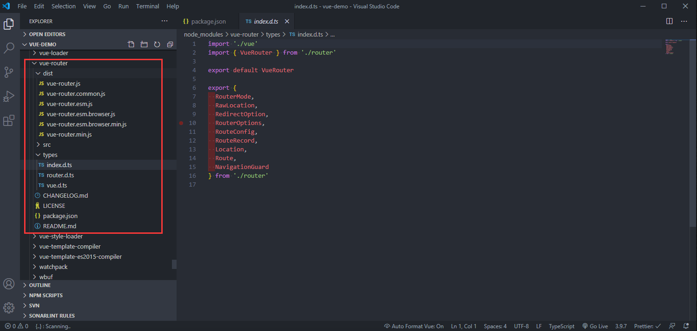

可以看到，`dist`目录下除了`vue-router.js`外还有很多其他版本:

- `min` 很容易理解，压缩后的版本。

- `esm` 全称`ES Module(ESM)`

- `common` 全称为`CommonJS`

其实不同版本是不同的 js 模块的区分，查看每个文件最后导出内容的格式也能大概知道这些缩写的含义。

- cjs


- esm

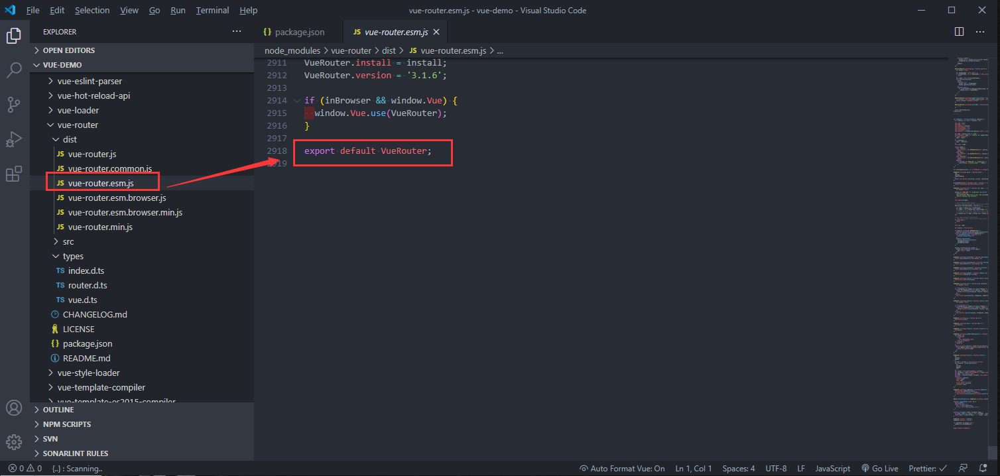

至于 `esm` 和 `esm.browser` 有什么区别呢，对比文件之后，我发现后者将有关的实现替换成了`es6`的相关特性。如：const、解构赋值、class 等等

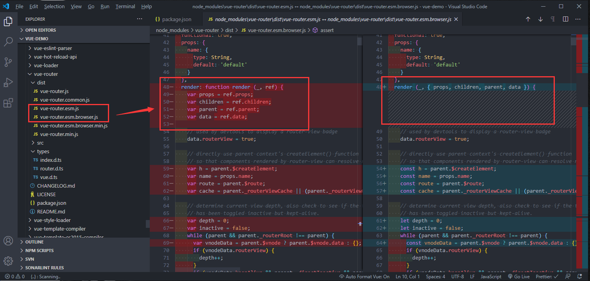

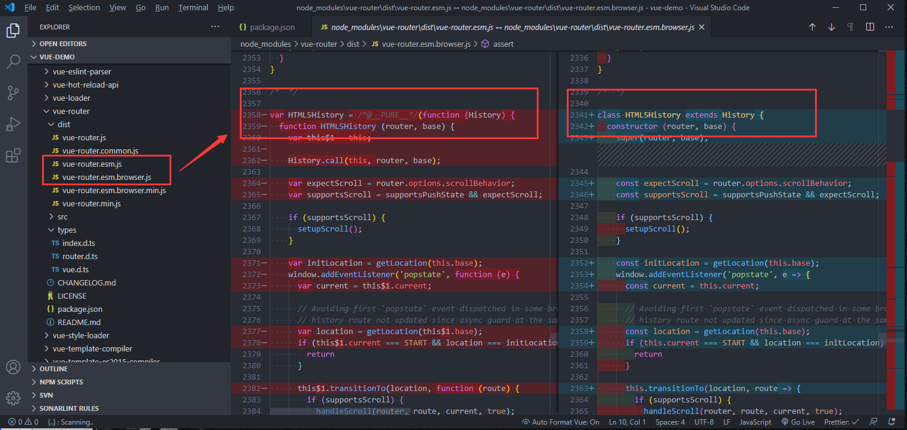

那么这么多版本，我们的项目里用的是哪一个版本呢。可以到`package.json`里查看`module`的引用，这时就有人会问了，一般不是`main`为才是入口吗？怎么是`module`呢？

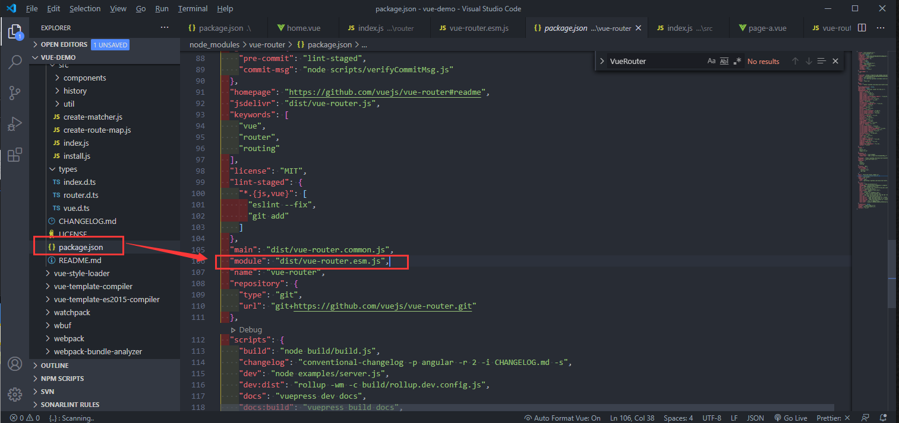

我去看了下 `nodejs.cn `官网对于 npm 包`package.json`的说明，其中并没有`module`的字段说明，接着就上[stack overflow](https://stackoverflow.com/questions/42708484/what-is-the-module-package-json-field-for)查了一圈，才知道这个是 `Rollup` 中很早提出的一个[概念](https://github.com/rollup/rollup/wiki/pkg.module)。

`vue-router`使用的是 `Rollup` 打包工具，`Rollup`官网的描述:

- Rollup 编译为 UMD 或 CommonJS 格式，然后在 package.json 文件的 main 属性中指向当前编译的版本。

- 如果你的 package.json 也具有 module 字段，像 Rollup 和 webpack 2 这样的 ES6 感知工具(ES6-aware tools)将会直接导入 ES6 模块版本。

在这里`module`的引用是`dist/vue-router.esm.js`。

如果是`vue`源码的调试，那么这里还不一定是项目真实的引用，还需要去查看`webpack`的配置,看下依赖的 `vue`的路径到底是什么。

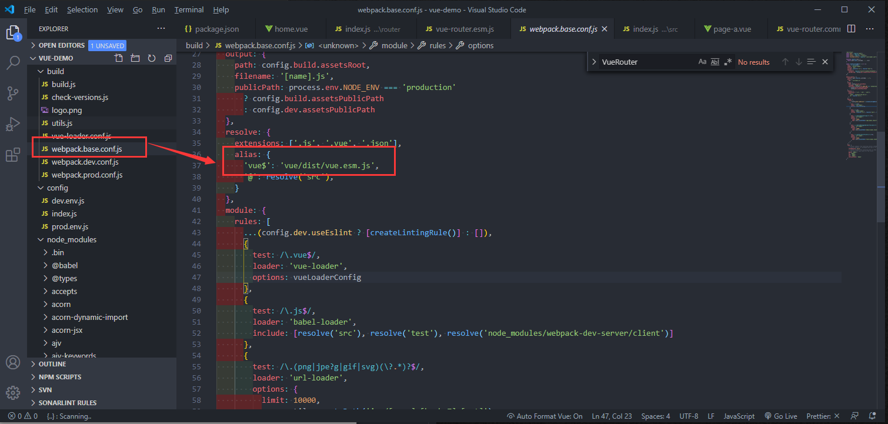

调试`vue-router`的源码的话，可以在`dist/vue-router.esm.js`这个文件下进行。打完 `debugger` 后也不用重新运行，`webpack`会热更新。

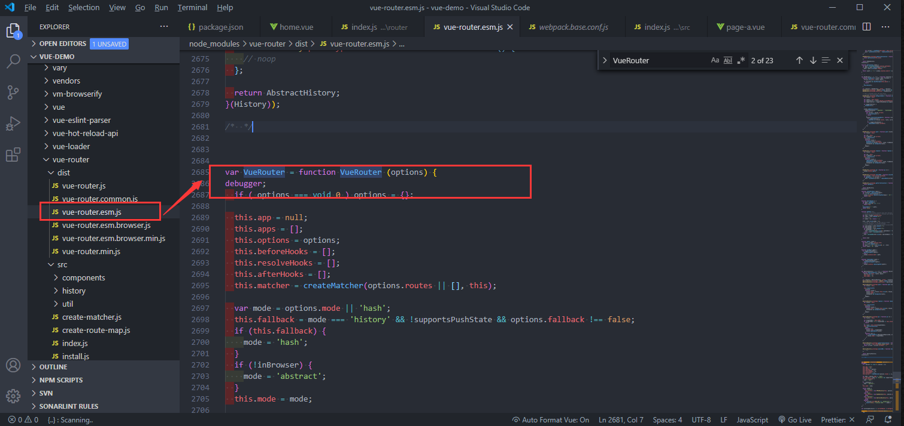

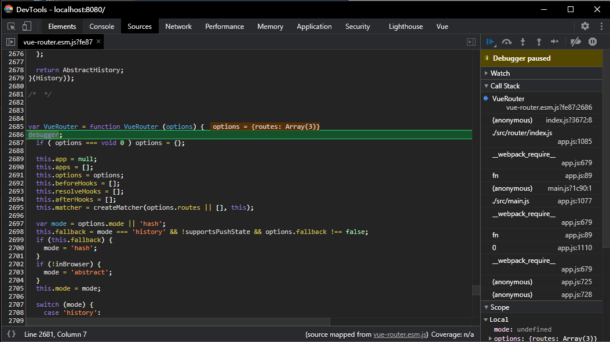

这时，我们就可以愉快的调试代码了！

## 路由注册

### 目标

- 了解 Vue 插件的注册原理

- 了解路由模式

- 了解路由注册的实现流程

### 注册原理

结合 `demo`来讲讲路由的注册。

可以看到`VueRouter`从 npm 包里边导出，然后再通过`Vue.use()`这个方法去注册。

```javascript
import Vue from 'vue';
import VueRouter from 'vue-router';
import Home from "@/view/home.vue";

Vue.use(VueRouter);
export default new VueRouter({
  routes: [
    {
      path: '/home',
      name: 'home',
      component: Home,
    },
    ...
  ],
});
```

首先看下`Vue.use()`的源码

```javascript
export function initUse(Vue: GlobalAPI) {
  Vue.use = function (plugin: Function | Object) {
    const installedPlugins =
      this._installedPlugins || (this._installedPlugins = []);
    // plugin注册过后不会再重复注册
    if (installedPlugins.indexOf(plugin) > -1) {
      return this;
    }

    // additional parameters
    const args = toArray(arguments, 1);
    args.unshift(this); // Vue添加到参数中，因为插件里并不会再去import Vue
    if (typeof plugin.install === 'function') {
      // plugin是对象且install是函数则直接执行
      plugin.install.apply(plugin, args);
    } else if (typeof plugin === 'function') {
      // plugin本身是函数则直接执行
      plugin.apply(null, args);
    }
    installedPlugins.push(plugin);
    return this;
  };
}
```

了解完`Vue.use()`,我们再来看看`dist/vue-router.esm.js`文件下`VueRouter`的定义。

`VueRouter`是构造函数，在其原型链上挂载了一些方法。

我们平时用到的路由相关的方法如：`push`、`replace`、`go`、`back`等等，就是在这里挂载的。

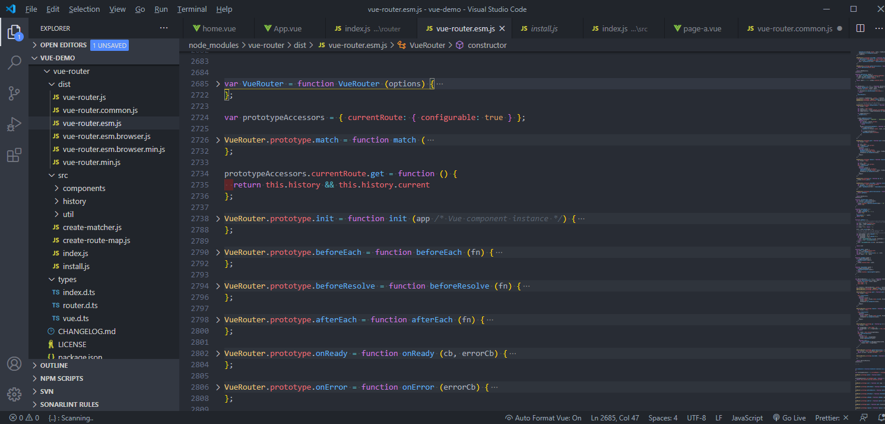

定义完一系列方法之后，`VueRouter` 通过`VueRouter.install = install`这一行代码，开始进行注册了。

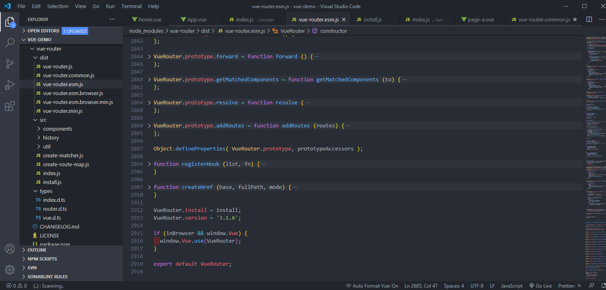

### 实现流程

这时候，我们可以跳转到`install`方法，查看注册的实现过程。

```javascript
var _Vue;

function install (Vue) {
  if (install.installed && _Vue === Vue) { return }
  install.installed = true;

  _Vue = Vue;

  var isDef = function (v) { return v !== undefined; };

  var registerInstance = function (vm, callVal) {
    var i = vm.$options._parentVnode;
    if (isDef(i) && isDef(i = i.data) && isDef(i = i.registerRouteInstance)) {
      i(vm, callVal);
    }
  };

  Vue.mixin({
    beforeCreate: function beforeCreate () {
      if (isDef(this.$options.router)) {
        this._routerRoot = this;
        this._router = this.$options.router;
        this._router.init(this);
        Vue.util.defineReactive(this, '_route', this._router.history.current);
      } else {
        this._routerRoot = (this.$parent && this.$parent._routerRoot) || this;
      }
      registerInstance(this, this);
    },
    destroyed: function destroyed () {
      registerInstance(this);
    }
  });

  Object.defineProperty(Vue.prototype, '$router', {
    get: function get () { return this._routerRoot._router }
  });

  Object.defineProperty(Vue.prototype, '$route', {
    get: function get () { return this._routerRoot._route }
  });

  Vue.component('RouterView', View);
  Vue.component('RouterLink', Link);

  var strats = Vue.config.optionMergeStrategies;
  // use the same hook merging strategy for route hooks
  strats.beforeRouteEnter = strats.beforeRouteLeave = strats.beforeRouteUpdate = strats.created;
}
}
```

`Vue.mixin()`源码,利用`mergeOptions`合并配置到`Vue.options`上

```javascript
/* @flow */

import { mergeOptions } from '../util/index';

export function initMixin(Vue: GlobalAPI) {
  Vue.mixin = function (mixin: Object) {
    this.options = mergeOptions(this.options, mixin);
    return this;
  };
}
```

通过打`debugger`看看`this._routerRoot`

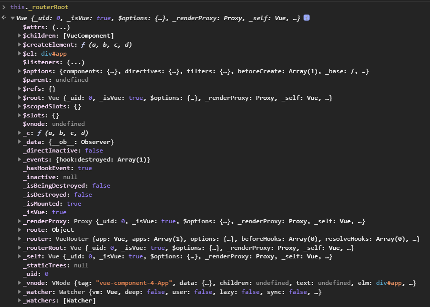

`this._route`和`this._router`

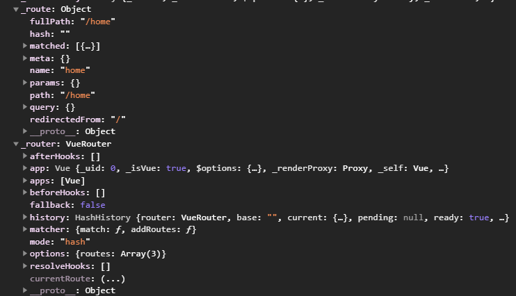

### 小结

- `Vue `编写插件的时候通常要提供静态的 `install `方法

- `Vue-Router`的`install`方法会给每一个组件注入 `beforeCreated` 和 `destoryed` 的钩子函数，在`beforeCreated` 做一些私有属性定义和路由初始化工作。

## 路由对象

### 目标

- 了解 VueRouter 对象的一些属性和方法

- 了解 VueRouter 对象的初始化逻辑

### VueRouter 的一些属性和方法

```javascript
var VueRouter = function VueRouter(options) {
  // void 0 返回 undefined。
  if (options === void 0) options = {};

  this.app = null; // 根Vue实例
  this.apps = []; // 保存子组件的Vue实例
  this.options = options; // 保存传入的路由配置
  this.beforeHooks = []; // 钩子函数
  this.resolveHooks = [];
  this.afterHooks = [];
  this.matcher = createMatcher(options.routes || [], this); // 路由匹配器

  var mode = options.mode || 'hash'; // 默认hash
  this.fallback =
    mode === 'history' && !supportsPushState && options.fallback !== false; // history利用H5属性，有些浏览器不兼容，fallback降级处理
  if (this.fallback) {
    mode = 'hash';
  }
  if (!inBrowser) {
    // 非web环境
    mode = 'abstract';
  }
  this.mode = mode;

  // this.history表示路由历史的具体的实现实例，它有  History  基类，然后不同的  history  实现都是继承  History
  switch (mode) {
    case 'history':
      this.history = new HTML5History(this, options.base);
      break;
    case 'hash':
      this.history = new HashHistory(this, options.base, this.fallback);
      break;
    case 'abstract':
      this.history = new AbstractHistory(this, options.base);
      break;
    default:
      if (process.env.NODE_ENV !== 'production') {
        assert(false, 'invalid mode: ' + mode);
      }
  }
};

// ...

VueRouter.prototype.match = function () {};
VueRouter.prototype.get = function () {};
VueRouter.prototype.init = function () {};
VueRouter.prototype.beforeEach = function () {};
VueRouter.prototype.beforeResolve = function () {};
VueRouter.prototype.afterEach = function () {};
VueRouter.prototype.onReady = function () {};
VueRouter.prototype.onError = function () {};
VueRouter.prototype.push = function () {};
VueRouter.prototype.replace = function () {};
VueRouter.prototype.go = function () {};
VueRouter.prototype.back = function () {};
VueRouter.prototype.forward = function () {};
VueRouter.prototype.getMatchedComponents = function () {};
VueRouter.prototype.resolve = function () {};
VueRouter.prototype.addRoutes = function () {};

// ...

VueRouter.install = install;
VueRouter.version = '3.1.6';

if (inBrowser && window.Vue) {
  window.Vue.use(VueRouter);
}

export default VueRouter;
```

在这里暂不讨论原型链上的方法，主要是为了去理解 `VueRouter`中的一些主要的属性和方法。

阅读完`VueRouter` 构造函数的代码实现，我们可以知道：

- 若不指定`mode`，`VueRouter`默认会使用 `hash` 模式。

- 若浏览器不支持`history`模式相关的实现方法，也会自动降级为 `hash` 模式。

- 在非浏览器环境下，会使用`abstract`模式

判断浏览器是否支持相关实现的方法为`supportsPushState`，如下：

```javascript
var supportsPushState =
  inBrowser &&
  (function () {
    var ua = window.navigator.userAgent;

    if (
      (ua.indexOf('Android 2.') !== -1 || ua.indexOf('Android 4.0') !== -1) &&
      ua.indexOf('Mobile Safari') !== -1 &&
      ua.indexOf('Chrome') === -1 &&
      ua.indexOf('Windows Phone') === -1
    ) {
      return false;
    }

    return window.history && 'pushState' in window.history;
  })();
```

根据`supportsPushState`方法，我们可以大概推测到`VueRouter`的`history`模式的主要实现是利用了`window.history`及相关的`pushState`方法。

### 路由模式

`history` 有三种模式，分别对应三个类 `HTML5History`、`HashHistory` 和 `AbstractHistory`，简单介绍下这三种模式：

- hash

使用 URL hash 值来作路由。支持所有浏览器，包括不支持 HTML5 History Api 的浏览器。

`vue-router` 默认 hash 模式 —— 使用 URL 的 hash 来模拟一个完整的 URL，于是当 URL 改变时，页面不会重新加载。

```javascript
window.addEventLinster('hashchange', () => {
  console.log('hash already change!');
});
```

- history

依赖 HTML5 History API 和服务器配置。

如果不想要很丑的 hash，我们可以用路由的`history模式`，这种模式充分利用 history.pushState API 来完成 URL 跳转而无须重新加载页面。

- abstract

支持所有 JavaScript 运行环境，如 Node.js 服务器端。如果发现没有浏览器的 API，路由会自动强制进入这个模式。

### 初始化

看完 `VueRouter`的构造函数，我们再回到 `VueRouter` 注册的地方，也就是`install.js`的实现。

```javascript
...
export function install(Vue) {
  // ...
  Vue.mixin({
    beforeCreate() {
      if (isDef(this.$options.router)) {
        // ...
        this._router = this.$options.router;
        this._router.init(this);
        // ...
      }
  });
  // ...
}
```

可以看到`Vue.mixin`在`beforeCreate`方法里，执行了`this._router.init(this)`这一步，对`VueRouter`进行了一个初始化操作。

而这个`init`方法，便是挂载在原型链上的方法:

```javascript
VueRouter.prototype.init = function init(app /* Vue component instance */) {
  var this$1 = this;

  process.env.NODE_ENV !== 'production' &&
    assert(
      install.installed,
      'not installed. Make sure to call `Vue.use(VueRouter)` ' +
        'before creating root instance.'
    );

  this.apps.push(app); // app为vue组件实例，apps为维护其组件实例的一个数组

  // set up app destroyed handler
  // https://github.com/vuejs/vue-router/issues/2639
  app.$once('hook:destroyed', function () {
    // clean out app from this.apps array once destroyed
    var index = this$1.apps.indexOf(app);
    if (index > -1) {
      this$1.apps.splice(index, 1);
    }
    // ensure we still have a main app or null if no apps
    // we do not release the router so it can be reused
    if (this$1.app === app) {
      this$1.app = this$1.apps[0] || null;
    }

    if (!this.app) {
      // clean up event listeners
      // https://github.com/vuejs/vue-router/issues/2341
      this.history.teardownListeners();
    }
  });

  // main app previously initialized
  // return as we don't need to set up new history listener
  if (this.app) {
    return;
  }

  this.app = app;

  var history = this.history;

  if (history instanceof HTML5History) {
    history.transitionTo(history.getCurrentLocation());
  } else if (history instanceof HashHistory) {
    var setupHashListener = function () {
      history.setupListeners();
    };
    history.transitionTo(
      history.getCurrentLocation(),
      setupHashListener,
      setupHashListener
    );
  }

  history.listen(function (route) {
    this$1.apps.forEach(function (app) {
      app._route = route;
    });
  });
};
```

在这里插一下写定时器的方法，通常我们在`vue`项目里清理的定时器有两种方法：

方法一：常规写法

```javascript
export default{
  data(){
    timer:null
  },
  mounted(){
	  this.timer = setInterval(()=>{
	  // TODO
	},1000);
  }
  beforeDestory(){
    clearInterval(this.timer);
    this.timer = null;
  }
}
```

方法二：利用`$once`的特性，在`beforeDestory`时销毁

`$once`：监听一个自定义事件，但是只触发一次。一旦触发之后，监听器就会被移除。

```javascript
export default {
  methods: {
    countdown() {
      const timer = setInterval(() => {
        // TODO
      }, 1000);
      this.$once('hook:beforeDestory', () => {
        clearInterval(timer);
        timer = null;
      });
    },
  },
};
```

`app.$once('hook:destroyed',funiction(){})`这一段是在早期版本是没有的，根据注释去`github`的`issues`上查了一下：

- [[bug] Memory leak with this.\$router.apps array and secondary apps on page being destroyed](https://github.com/vuejs/vue-router/issues/2639)。

大概意思就是原先销毁的 app 引用保留在`$router.apps` 数组中，从而导致内存使用量增加/泄漏。

所以增加了这么一段操作，是为了将已在`$destroyed` 删除的`app`，从`$router.apps` 数组中删除。

- [https://github.com/vuejs/vue-router/issues/2341](https://github.com/vuejs/vue-router/issues/2341)

创建一个 `vue`实例以及一个`VueRouter`实例。然后销毁 `vue` 实例。`VueRouter`实例继续存在并触发,`VueRouter`实例应该能够自行破坏。通过显式调用，或在销毁 vue 实例时。

```javascript
// set up app destroyed handler
// https://github.com/vuejs/vue-router/issues/2639
app.$once('hook:destroyed', function () {
  // clean out app from this.apps array once destroyed
  var index = this$1.apps.indexOf(app);
  if (index > -1) {
    this$1.apps.splice(index, 1);
  }
  // ensure we still have a main app or null if no apps
  // we do not release the router so it can be reused
  if (this$1.app === app) {
    this$1.app = this$1.apps[0] || null;
  }

  if (!this.app) {
    // clean up event listeners
    // https://github.com/vuejs/vue-router/issues/2341
    this.history.teardownListeners();
  }
});
```

`setupListeners`函数

```javascript
HashHistory.prototype.setupListeners = function setupListeners() {
  var this$1 = this;

  var router = this.router;
  var expectScroll = router.options.scrollBehavior;
  var supportsScroll = supportsPushState && expectScroll;

  if (supportsScroll) {
    setupScroll();
  }

  window.addEventListener(
    supportsPushState ? 'popstate' : 'hashchange',
    function () {
      var current = this$1.current;
      if (!ensureSlash()) {
        return;
      }
      this$1.transitionTo(getHash(), function (route) {
        if (supportsScroll) {
          handleScroll(this$1.router, route, current, true);
        }
        if (!supportsPushState) {
          replaceHash(route.fullPath);
        }
      });
    }
  );
};

function ensureSlash() {
  var path = getHash();
  if (path.charAt(0) === '/') {
    return true;
  }
  replaceHash('/' + path);
  return false;
}

function replaceHash(path) {
  if (supportsPushState) {
    replaceState(getUrl(path));
  } else {
    window.location.replace(getUrl(path));
  }
}

function getUrl(path) {
  var href = window.location.href;
  var i = href.indexOf('#');
  var base = i >= 0 ? href.slice(0, i) : href;
  return base + '#' + path;
}
```

`transitionTo`定义在 基类`History`的原型链上

```javascript
History.prototype.transitionTo = function transitionTo(
  location,
  onComplete,
  onAbort
) {
  var this$1 = this;

  var route = this.router.match(location, this.current); // 匹配路由
    // ...
  );
};

function match (
raw: RawLocation,
current?: Route,
redirectedFrom?: Location
): Route {
    return this.matcher.match(raw, current, redirectedFrom)
}
```

### 小结

- 路由初始化的时机实在组件的初始化阶段，执行到`beforeCreate`钩子函数的时候会执行`router.init`方法，其中又会执行`history.transitionTo`方法做路由过渡。

## matcher

### 目标

- 了解 `createMatcher` 的初始化逻辑

- 了解 `match` 的匹配过程

### createMatcher

可以看到`matcher`数据结构, 返回了 2 个⽅法， `match` 和 `addRoutes`

```javascript
export type Matcher = {
  match: (
    raw: RawLocation,
    current?: Route,
    redirectedFrom?: Location
  ) => Route,
  addRoutes: (routes: Array<RouteConfig>) => void,
};
```

在这里我们去`types/router.d.ts`文件下`Loaction` 和 `Route`两个概念:

- Loaction

```javascript
export interface Location {
  name?: string
  path?: string
  hash?: string
  query?: Dictionary<string | (string | null)[] | null | undefined>
  params?: Dictionary<string>
  append?: boolean
  replace?: boolean
}
```

与`window.location`结构有点类似，两者都是对`url`的结构化描述，

```javascript
window.location = {
  hash: '#/home',
  host: 'localhost:8080',
  hostname: 'localhost',
  href: 'http://localhost:8080/#/home',
  origin: 'http://localhost:8080',
  pathname: '/',
  port: '8080',
  protocol: 'http:',
  //...
};
```

- Route

`Route`表⽰的是路由中的⼀条线路，它除了描述了类似 `Loctaion` 的 `path` 、 `query` 、 `hash` 这
些概念，还有 `matched` 表⽰匹配到的所有的 `RouteRecord` 。

```javascript
export interface Route {
  path: string
  name?: string | null
  hash: string
  query: Dictionary<string | (string | null)[]>
  params: Dictionary<string>
  fullPath: string
  matched: RouteRecord[]
  redirectedFrom?: string
  meta?: any
}
```

了解到`Location`和`Route`后，来看下`match`的创建过程:

```javascript
function createMatcher(routes, router) {
  // routes为用户定义的路由配置，router为new VueRouter返回的实例
  var ref = createRouteMap(routes);
  var pathList = ref.pathList;
  var pathMap = ref.pathMap;
  var nameMap = ref.nameMap;

  function addRoutes(routes) {
    createRouteMap(routes, pathList, pathMap, nameMap);
  }

  function match(raw, currentRoute, redirectedFrom) {
    var location = normalizeLocation(raw, currentRoute, false, router);
    var name = location.name;

    if (name) {
      var record = nameMap[name];
      if (process.env.NODE_ENV !== 'production') {
        warn(record, "Route with name '" + name + "' does not exist");
      }
      if (!record) {
        return _createRoute(null, location);
      }
      var paramNames = record.regex.keys
        .filter(function (key) {
          return !key.optional;
        })
        .map(function (key) {
          return key.name;
        });

      if (typeof location.params !== 'object') {
        location.params = {};
      }

      if (currentRoute && typeof currentRoute.params === 'object') {
        for (var key in currentRoute.params) {
          if (!(key in location.params) && paramNames.indexOf(key) > -1) {
            location.params[key] = currentRoute.params[key];
          }
        }
      }

      location.path = fillParams(
        record.path,
        location.params,
        'named route "' + name + '"'
      );
      return _createRoute(record, location, redirectedFrom);
    } else if (location.path) {
      location.params = {};
      for (var i = 0; i < pathList.length; i++) {
        var path = pathList[i];
        var record$1 = pathMap[path];
        if (matchRoute(record$1.regex, location.path, location.params)) {
          return _createRoute(record$1, location, redirectedFrom);
        }
      }
    }
    // no match
    return _createRoute(null, location);
  }

  // ...
  function _createRoute(record, location, redirectedFrom) {
    if (record && record.redirect) {
      return redirect(record, redirectedFrom || location);
    }
    if (record && record.matchAs) {
      return alias(record, location, record.matchAs);
    }
    return createRoute(record, location, redirectedFrom, router);
  }

  return {
    match: match,
    addRoutes: addRoutes,
  };
}
```

- createRouteMap

```javascript
function createRouteMap(routes, oldPathList, oldPathMap, oldNameMap) {
  // the path list is used to control path matching priority
  var pathList = oldPathList || [];
  // $flow-disable-line
  var pathMap = oldPathMap || Object.create(null);
  // $flow-disable-line
  var nameMap = oldNameMap || Object.create(null);

  routes.forEach(function (route) {
    addRouteRecord(pathList, pathMap, nameMap, route);
  });

  // ensure wildcard routes are always at the end
  for (var i = 0, l = pathList.length; i < l; i++) {
    if (pathList[i] === '*') {
      pathList.push(pathList.splice(i, 1)[0]);
      l--;
      i--;
    }
  }

  if (process.env.NODE_ENV === 'development') {
    // warn if routes do not include leading slashes
    var found = pathList
      // check for missing leading slash
      .filter(function (path) {
        return path && path.charAt(0) !== '*' && path.charAt(0) !== '/';
      });

    if (found.length > 0) {
      var pathNames = found
        .map(function (path) {
          return '- ' + path;
        })
        .join('\n');
      warn(
        false,
        'Non-nested routes must include a leading slash character. Fix the following routes: \n' +
          pathNames
      );
    }
  }

  return {
    pathList: pathList,
    pathMap: pathMap,
    nameMap: nameMap,
  };
}
```

`createRouteMap` 函数的⽬标是把⽤户的路由配置转换成⼀张路由映射表，它包含 3 个部
分，`pathList` 存储所有的`path`， `pathMap` 表⽰⼀个`path`到`RouteRecord`的映射关系，⽽
`nameMap`表⽰`name `到`RouteRecord `的映射关系

- RouteRecord

```javascript
export interface RouteRecord {
  path: string
  regex: RegExp
  components: Dictionary<Component>
  instances: Dictionary<Vue>
  name?: string
  parent?: RouteRecord
  redirect?: RedirectOption
  matchAs?: string
  meta: any
  beforeEnter?: (
    route: Route,
    redirect: (location: RawLocation) => void,
    next: () => void
  ) => any
  props:
    | boolean
    | Object
    | RoutePropsFunction
    | Dictionary<boolean | Object | RoutePropsFunction>
}
```

- addRouteRecord

```javascript
function addRouteRecord(pathList, pathMap, nameMap, route, parent, matchAs) {
  var path = route.path;
  var name = route.name;
  // ...
  var record = {
    path: normalizedPath, // 规范后的路径
    regex: compileRouteRegex(normalizedPath, pathToRegexpOptions),
    components: route.components || { default: route.component },
    instances: {},
    name: name,
    parent: parent,
    matchAs: matchAs,
    redirect: route.redirect,
    beforeEnter: route.beforeEnter,
    meta: route.meta || {},
    props:
      route.props == null
        ? {}
        : route.components
        ? route.props
        : { default: route.props },
  };
  //如果配置了  children  ，那么递归执⾏  addRouteRecord  ⽅法，并把当前的  record  作为
  //parent  传⼊，通过这样的深度遍历，我们就可以拿到⼀个  route  下的完整记录。
  if (route.children) {
    // ...
    route.children.forEach(function (child) {
      var childMatchAs = matchAs
        ? cleanPath(matchAs + '/' + child.path)
        : undefined;
      addRouteRecord(pathList, pathMap, nameMap, child, record, childMatchAs);
    });
  }
  //为  pathList  和  pathMap  各添加⼀条记录。
  if (!pathMap[record.path]) {
    pathList.push(record.path);
    pathMap[record.path] = record;
  }

  if (route.alias !== undefined) {
    var aliases = Array.isArray(route.alias) ? route.alias : [route.alias];
    for (var i = 0; i < aliases.length; ++i) {
      var alias = aliases[i];
      // ...
      var aliasRoute = {
        path: alias,
        children: route.children,
      };
      addRouteRecord(
        pathList,
        pathMap,
        nameMap,
        aliasRoute,
        parent,
        record.path || '/' // matchAs
      );
    }
  }
  //如果我们在路由配置中配置了  name  ，则给  nameMap  添加⼀条记录
  if (name) {
    if (!nameMap[name]) {
      nameMap[name] = record;
    }
    // ...
  }
}
```

由于 `pathList` 、 `pathMap` 、 `nameMap` 都是引⽤类型，所以在遍历整个 `routes` 过程中去执⾏
`addRouteRecord` ⽅法，会不断给他们添加数据。那么经过整个 `createRouteMap` ⽅法的执⾏，我
们得到的就是 `pathList` 、 `pathMap` 和 `nameMap` 。其中`pathList`是为了记录路由配置中的所有
`path` ，⽽`pathMap` 和`nameMap` 都是为了通过`path` 和`name`能快速查到对应的`RouteRecord`。
RouteRecord 。

再回到 `createMather` 函数，接下来就定义了⼀系列⽅法，最后返回了⼀个对象。

```javascript
return {
  match,
  addRoutes,
};
```

也就是说， `matcher` 是⼀个对象，它对外暴露了 `match` 和 `addRoutes` ⽅法。

- addRoutes

`addRoutes` ⽅法的作⽤是动态添加路由配置，因为在实际开发中有些场景是不能提前把路由写死
的，需要根据⼀些条件动态添加路由，所以 `Vue-Router` 也提供了这⼀接⼝：

```javascript
function addRoutes(routes) {
  createRouteMap(routes, pathList, pathMap, nameMap);
}
```

`addRoutes`的⽅法⼗分简单，再次调⽤`createRouteMap`即可，传⼊新的`routes`配置，由于
`pathList` 、 `pathMap` 、 `nameMap` 都是引⽤类型，执⾏ `addRoutes` 后会修改它们的值。

### match

```javascript
function match(raw, currentRoute, redirectedFrom) {
  var location = normalizeLocation(raw, currentRoute, false, router);
  var name = location.name;

  if (name) {
    var record = nameMap[name];
    if (process.env.NODE_ENV !== 'production') {
      warn(record, "Route with name '" + name + "' does not exist");
    }
    if (!record) {
      return _createRoute(null, location);
    }
    var paramNames = record.regex.keys
      .filter(function (key) {
        return !key.optional;
      })
      .map(function (key) {
        return key.name;
      });

    if (typeof location.params !== 'object') {
      location.params = {};
    }

    if (currentRoute && typeof currentRoute.params === 'object') {
      for (var key in currentRoute.params) {
        if (!(key in location.params) && paramNames.indexOf(key) > -1) {
          location.params[key] = currentRoute.params[key];
        }
      }
    }

    location.path = fillParams(
      record.path,
      location.params,
      'named route "' + name + '"'
    );
    return _createRoute(record, location, redirectedFrom);
  } else if (location.path) {
    location.params = {};
    for (var i = 0; i < pathList.length; i++) {
      var path = pathList[i];
      var record$1 = pathMap[path];
      if (matchRoute(record$1.regex, location.path, location.params)) {
        return _createRoute(record$1, location, redirectedFrom);
      }
    }
  }
  // no match
  return _createRoute(null, location);
}
```

`match`⽅法接收 3 个参数，其中`raw`是 `RawLocation` 类型，它可以是⼀个 `url` 字符串，也可
以是⼀个 `Location` 对象； `currentRoute` 是 `Route` 类型，它表⽰当前的路
径； `redirectedFrom` 和重定向相关，这⾥先忽略。 `match` ⽅法返回的是⼀个路径，它的作⽤是根
据传⼊的 `raw` 和当前的路径 `currentRoute` 计算出⼀个新的路径并返回。

- normalizeLocation

```javascript
function normalizeLocation(raw, current, append, router) {
  var next = typeof raw === 'string' ? { path: raw } : raw;
  // named target
  if (next._normalized) {
    return next;
  } else if (next.name) {
    next = extend({}, raw);
    var params = next.params;
    if (params && typeof params === 'object') {
      next.params = extend({}, params);
    }
    return next;
  }

  // relative params
  if (!next.path && next.params && current) {
    next = extend({}, next);
    next._normalized = true;
    var params$1 = extend(extend({}, current.params), next.params);
    if (current.name) {
      next.name = current.name;
      next.params = params$1;
    } else if (current.matched.length) {
      var rawPath = current.matched[current.matched.length - 1].path;
      next.path = fillParams(rawPath, params$1, 'path ' + current.path);
    } else if (process.env.NODE_ENV !== 'production') {
      warn(false, 'relative params navigation requires a current route.');
    }
    return next;
  }

  var parsedPath = parsePath(next.path || '');
  var basePath = (current && current.path) || '/';
  var path = parsedPath.path
    ? resolvePath(parsedPath.path, basePath, append || next.append)
    : basePath;

  var query = resolveQuery(
    parsedPath.query,
    next.query,
    router && router.options.parseQuery
  );

  var hash = next.hash || parsedPath.hash;
  if (hash && hash.charAt(0) !== '#') {
    hash = '#' + hash;
  }

  return {
    _normalized: true,
    path: path,
    query: query,
    hash: hash,
  };
}
```

## 总结

## 查缺补漏

- Tree Shaking

- npm library

- Abstract Syntax Code

- package.json

- Rollup

- Dead Code Elimination

- 模块化

## links

- [What is the “module” package.json field for?](https://stackoverflow.com/questions/42708484/what-is-the-module-package-json-field-for)

- [创建 library](https://webpack.docschina.org/guides/author-libraries/#final-steps)

- [WRT PR #3 - ES module detection](https://github.com/nodejs/node-eps/issues/13)

- [Enable treeShaking import in webpack](https://github.com/airbnb/react-dates/pull/1572)

- [package.json 中的 Module 字段是干嘛的](https://segmentfault.com/a/1190000014286439)

- [History 对象](https://javascript.ruanyifeng.com/bom/history.html)

- [JavaScript 标准参考教程（alpha）](https://javascript.ruanyifeng.com/)

- [JavaScript 教程](https://wangdoc.com/javascript/)

- [JS URL()和 URLSearchParams() API 接口详细介绍](https://www.zhangxinxu.com/wordpress/2019/08/js-url-urlsearchparams/)

- [[bug] Memory leak with this.\$router.apps array and secondary apps on page being destroyed ](https://github.com/vuejs/vue-router/issues/2639)

- [bootstrap-vue](https://bootstrap-vue.js.org/play/)
