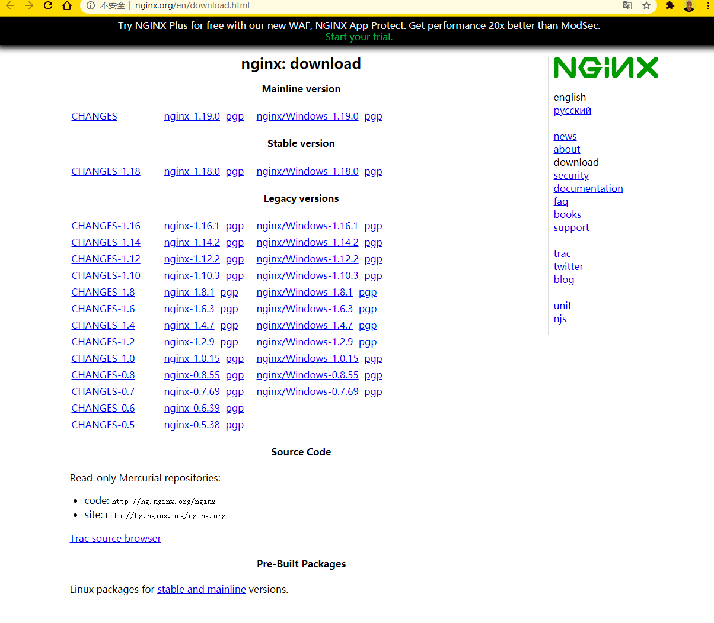
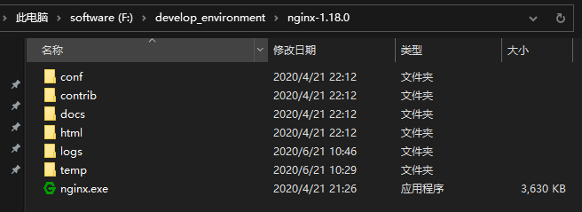
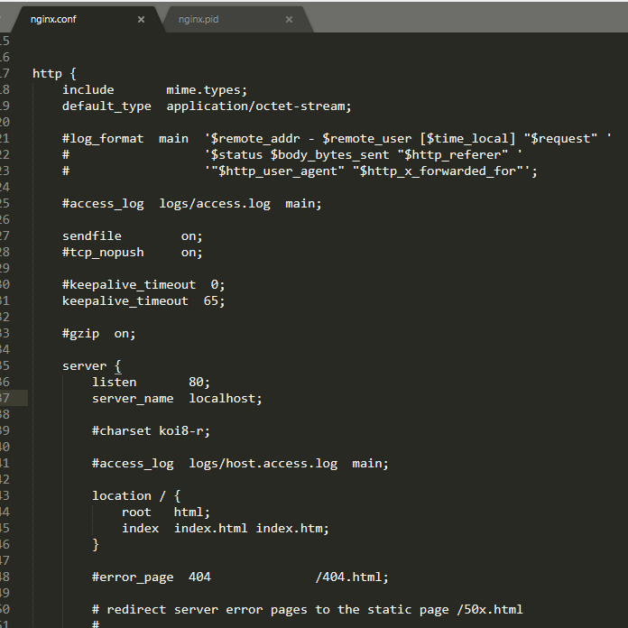
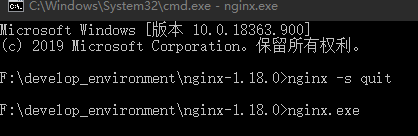
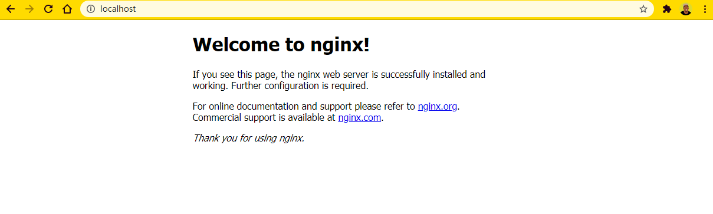

# 001.nginx的安装与使用

## 下载 nginx

[nginx 下载地址](http://nginx.org/en/download.html)

首先下载稳定版本，这里下载的是 nginx-1.18.0，下载完解压即可



执行`nginx.exe`应用程序

## 启动 nginx



若闪退，首先查看 logs 日志。一般情况下可能是端口被占用了（默认为 80），这时可以打开`conf/nginx.conf`文件修改 listen 端口号，重新执行应用程序即可。



修改端口号仍然闪退，说明不是端口占用问题，此时可以在 cmd 通过命令`start nginx`或`nginx.exe`启动



直接打开http://localhost:80 ，若成功的话会看到一下界面



## 常用命令

`tasklist /fi "imagename eq nginx.exe"` 查看 nginx 是否启动成功

`netstat -ano | findstr 0.0.0.0:80 或 netstat -ano | findstr "80"` 检查 80 端口是否占用

### 关闭 nginx

如果使用 cmd 命令窗口启动 nginx，关闭 cmd 窗口不能结束 nginx 进程的，可使用两种方法关闭 nginx

#### 方法一

`nginx -s stop` 快速停止 nginx 或 `nginx -s quit` 完整有序的停止 nginx

#### 方法二

`taskkill taskkill /f /t /im nginx.exe`

## 问题记录

### 403 Forbidden

nginx.conf

```
 server {
        listen       80;
        server_name  localhost;

 		autoindex on;

        location / {
            root   html/blog;
            index  index.html index.htm;
        }

        error_page   500 502 503 504  /50x.html;
        location = /50x.html {
            root   html;
        }
    }
```

该配置本意是像设置 html/blog/index.html 为默认访问地址，但是一直报`403 forbidden`
