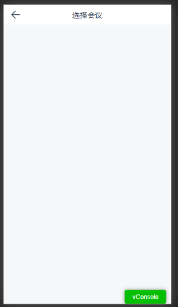

# 003.vscode code-snippets

## 背景

项目里新建模块是通过`yeoman`脚手架命令去一键生成的，但是对于不同项目，其相关依赖、组件等个性化的场景不太适用。其实应该根据不同项目，通过配置去实现不同的模块内容。由于种种原因，这个方案并没有实现。项目里新建模块基本上是先通过`yeoman`生成基本骨架，然后再改改改。

除此外，还有一个场景：在新写一个页面时，通常做法是新建一个`.vue`文件，然后触发`vscode`自带默认的`.vue`模板格式，但是结构太基础，还是需要手动敲些重复的代码。

对于H5项目（针对公司），大部分页面有着相似的结构和固定的组件。这时，我们可以借助`vscode`的`code-snippets`去配置一些常用的代码模板，减少重复劳动。

## 案例

在项目里常用的一个模板如下：



在`vscode`打开 file->preferences->User Snippets，配置如下：

`$TM_FILENAME_BASE` 是一个变量，指的是当前的文件名。

- vue.code-snipets

```json
{
    "Print to vue": {
        "scope": "vue,javascript,typescript",
        "prefix": "vt",
        "body": [
            "<template>",
            "    <div class=\"$TM_FILENAME_BASE-wrapper\">",
            "        <header>",
            "            <cs-header-bar has-route-title></cs-header-bar>",
            "        </header>",
            "        <main></main>",
            "        <footer></footer>",
            "    </div>",
            "</template> ",
            "",
            "<script>",
            "export default {",
            "    name: '$TM_FILENAME_BASE',",
            "};",
            "</script>",
            "",
            "<style lang=\"less\" scoped>",
            ".$TM_FILENAME_BASE-wrapper {",
            "    display: flex;",
            "    flex-direction: column;",
            "    height: 100%;",
            "    display: flex;",
            "",
            "    main {",
            "        flex: 1;",
            "        overflow-x: hidden;",
            "    }",
            "}",
            "</style>",
            "",
        ],
        "description": "vue template"
    }
}
```

在`meeting-choose.vue`文件下通过触发自定义的命令vt即可生成我们所需要的模板

- meeting-choose.vue

```vue
<template>
    <div class="meeting-choose-wrapper">
        <header>
            <cs-header-bar has-route-title></cs-header-bar>
        </header>
        <main></main>
        <footer></footer>
    </div>
</template>
<script>
export default {
    name: 'meeting-choose',
};
</script>
<style lang="less" scoped>
.time-scale-wrapper {
    display: flex;
    flex-direction: column;
    height: 100%;
    display: flex;

    main {
        flex: 1;
        overflow-x: hidden;
    }
}
</style>
```

## 变量

### 常用

- `TM_SELECTED_TEXT` 当前选中内容或空字符串
- `TM_CURRENT_LINE` 当前行内容
- `TM_CURRENT_WORD` 光标处字符或空字符串
- `TM_LINE_INDEX` 从0开始的行号
- `TM_LINE_NUMBER` 从1开始的行号
- `TM_FILENAME` 当前被编辑文档名
- `TM_FILENAME_BASE` 当前被编辑文档名，没有后缀
- `TM_DIRECTORY` 当前被编辑文档目录
- `TM_FILEPATH` 当前被编辑文档全路径
- `CLIPBOARD` 当前剪切板内容

### 时间

- `CURRENT_YEAR` 当前年
- `CURRENT_YEAR_SHORT` 当前年后两位
- `CURRENT_MONTH` 月份，两位数字表示，例如02
- `CURRENT_MONTH_NAME` 月份全称，例如 'July'
- `CURRENT_MONTH_NAME_SHORT` 月份简写 ，例如'Jul
- `CURRENT_DATE` 某天
- `CURRENT_DAY_NAME` 星期几， 例如'Monday')
- `CURRENT_DAY_NAME_SHORT` 星期几的简写， 'Mon'
- `CURRENT_HOUR` 小时，24小时制
- `CURRENT_MINUTE` 分钟
- `CURRENT_SECOND` 秒数

## links

- [VSCode 添加代码模板](https://www.jianshu.com/p/07a7fd95954f)
